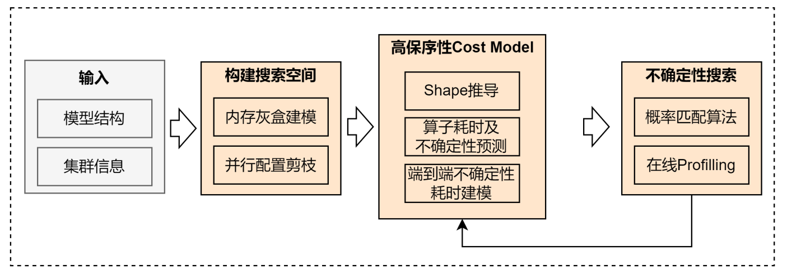
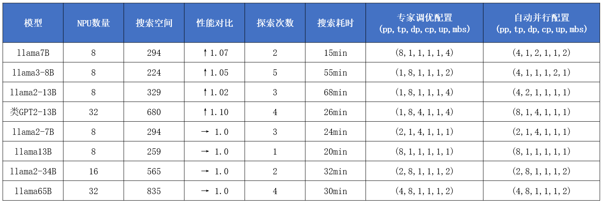

# Automatic Parallelism

## Background and Challenges

Current mainstream parallel training methods for large models include PP, TP, DP, SP, CP, Ulysses Parallel (UP), VPP, EP, etc., each offering different optimizations in terms of memory, computation, and communication, and they are directly stacked together. The end-to-end training performance of a large model is jointly determined by factors such as model structure, cluster size, parallel configuration, and `batch_size`, all of which must be considered comprehensively during tuning. Currently, manual tuning of parallel configurations requires extensive expert experience, manual analysis, and experimental tuning, which is estimated to take days to weeks and incurs high experimental costs. The optimal parallel configuration for similar models is not necessarily the same and still requires time to optimize. As the search space expands, relying on manual tuning becomes infeasible. For example, for the llama65B model on a 4*8 cluster, considering only the six dimensions of PP, TP, DP, SP, VPP, and mbs, there are 812 configuration combinations, making the time cost of manual tuning prohibitively high. Therefore, it is necessary to build an automatic parallel system that automatically recommends a high-performance parallel configuration strategy to users based on the model structure and cluster size.

## Solution

To address this problem scenario, a multi-dimensional parallel configuration automatic optimization algorithm is proposed. Given the model structure and cluster configuration, users only need to configure relevant parameters in the startup script to initiate multi-dimensional parallel configuration automatic optimization, which will find a superior parallel configuration within a specified time and recommend it to the user. The algorithm schematic diagram is as follows:

* **Memory-adaptive search space construction**: Considering model structure and cluster information constraints, a memory gray-box model is used to exclude out-of-memory (OOM) parallel configurations, thereby narrowing the search space;
* **High-fidelity cost model modeling method based on operator uncertainty estimation**: Low-fidelity data (single operator invocation) is introduced as prior information, combined with operator full-network performance data to construct an uncertainty model for operator execution time. This is then synthesized with communication time based on the parallel strategy to obtain a probabilistic distribution model of end-to-end performance.
* **Efficient search algorithm based on probability matching**: The Thompson Sampling method is used to explore parallel strategies, exploring high-value parallel configurations with high probability to improve exploration efficiency. It flexibly supports early stopping of exploration, enhancing ease of use.



**Supported parallel configurations:**

Supported parallel configuration dimensions for search:

* [x] PP
* [x] TP
* [x] DP
* [x] CP
* [x] DeepSpeed-Ulysses
* [x] Megatron-SP
* [x] mbs

Parallel configuration dimensions being supported:

* [ ] MOE
* [ ] VPP
* [ ] Adaptive recomputation

## Usage

When using the multi-dimensional automatic parallel feature, **you must use Python as the script launcher to start the script on all nodes** and configure the parameters related to multi-dimensional automatic parallelism. The relevant parameters and their functions are shown in the following table:

| Name           | Description                                          |
| ---------------- | ------------------------------------------------- |
| --auto-parallel  | Master switch for the multi-dimensional automatic parallel feature                            |
| --nnodes          | Number of nodes in the cluster                                  |
| --nproc-per-node | Number of compute devices per node                               |
| --master-addr    | IP address of the master node in the cluster                              |
| --master-port    | Port number used for communication; all nodes must be configured with the same port number      |
| --node-rank      | Rank of the node in the cluster; the master node is 0, and other nodes are 1, 2, ... |

Note: The maximum search time of the algorithm is 8 hours, and it supports flexible early exit without manual intervention.

The following is a configuration example based on the llama7B model:

```shell
#!/bin/bash
export CUDA_DEVICE_MAX_CONNECTIONS=1
export NPU_ASD_ENABLE=0
source /usr/local/Ascend/ascend-toolkit/set_env.sh

MASTER_ADDR=localhost
MASTER_PORT=6001
GPUS_PER_NODE=8
NNODES=1
NODE_RANK=0

LOAD_CHECKPOINT_PATH=./ckpt
SAVE_CHECKPOINT_PATH=./ckpt
DATA_PATH={your dataset path}
TOKENIZER_MODEL={your tokenizer model path}
TP=1
PP=8

DISTRIBUTED_ARGS="
    --nproc_per_node $GPUS_PER_NODE \
    --nnodes $NNODES \
    --node_rank $NODE_RANK \
    --master_addr $MASTER_ADDR \
    --master_port $MASTER_PORT
"

GPT_ARGS="
    --tensor-model-parallel-size ${TP} \
    --pipeline-model-parallel-size ${PP} \
    --sequence-parallel \
    --num-layers 32 \
    --hidden-size 4096 \
    --ffn-hidden-size 11008 \
    --num-attention-heads 32 \
    --tokenizer-type Llama2Tokenizer \
    --tokenizer-model ${TOKENIZER_MODEL} \
    --seq-length 2048 \
    --max-position-embeddings 2048 \
    --micro-batch-size 4 \
    --global-batch-size 256 \
    --make-vocab-size-divisible-by 1 \
    --lr 1.0e-6 \
    --train-iters 5000 \
    --lr-decay-style cosine \
    --untie-embeddings-and-output-weights \
    --disable-bias-linear \
    --attention-dropout 0.0 \
    --init-method-std 0.01 \
    --hidden-dropout 0.0 \
    --position-embedding-type rope \
    --normalization RMSNorm \
    --use-fused-rmsnorm \
    --swiglu \
    --use-flash-attn \
    --no-masked-softmax-fusion \
    --attention-softmax-in-fp32 \
    --min-lr 1.0e-7 \
    --weight-decay 1e-1 \
    --lr-warmup-fraction 0.01 \
    --clip-grad 1.0 \
    --adam-beta1 0.9 \
    --initial-loss-scale 65536 \
    --adam-beta2 0.95 \
    --no-gradient-accumulation-fusion \
    --load ${LOAD_CHECKPOINT_PATH}  \
    --no-load-optim \
    --no-load-rng \
    --fp16
"

DATA_ARGS="
    --data-path $DATA_PATH \
    --split 100,0,0
"

OUTPUT_ARGS="
    --log-interval 1 \
    --save-interval 10000 \
    --eval-interval 1000 \
    --eval-iters 0 \
"

SEARCH_ARGS="
    --auto-parallel \
    --nnodes $NNODES \
    --nproc-per-node $GPUS_PER_NODE \
    --master-addr $MASTER_ADDR \
    --master-port $MASTER_PORT \
    --node-rank $NODE_RANK \
"

python pretrain_gpt.py \
     $GPT_ARGS \
     $DATA_ARGS \
     $OUTPUT_ARGS \
     $SEARCH_ARGS \
     --distributed-backend nccl \
     | tee logs/search_llama_7b.txt
```

## Usage Effects


