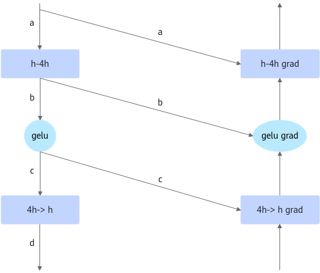

# Activation Function Recomputation

<!-- md-trans-meta sourceCommit=unknown translatedAt=2026-06-25T08:15:18.253Z pushedAt=2026-06-29T10:30:31.631Z -->

## Background and Challenges

In large model training scenarios, mixed-precision training has become a standard practice, requiring the persistent storage of both compute weights and state weights. However, the lifecycle of these two weight types do not overlap, meaning they can share memory space rather than occupying it separately. Through numerical transformation techniques, this redundancy can be eliminated, enabling efficient resource utilization.

In existing large model training frameworks, recomputation and backward computation are scheduled in a tightly coupled manner, which severely limits the flexibility of recomputation. In some scenarios, this restricts the potential for performance optimization through recomputation.

Consider the following computation flow within a model:

* Forward pass: GELU activation → subsequent module A

* Backward pass: Backward of module A (which depends on the GELU output activations) → GELU backward (which is tightly coupled with recomputation)

The GELU activation function is computationally lightweight but produces a large amount of data. Recomputing it would reduce memory usage with minimal performance cost. However, in the existing recomputation framework, this approach is not feasible for the GELU module: during the backward pass, the activation values required by module A become available before the GELU recomputation takes place. As a result, the forward pass is forced to retain the GELU outputs, making them unsaveable.

## Solution

The activation recomputation feature introduces a redesigned framework that allows recomputation to be flexibly inserted at any point prior to the backward pass. For example, under the new framework, the recomputation flow becomes:

GELU recomputation → backward of module A

Since the GELU outputs are now generated before module A's backward pass, there is no need to retain them during the forward pass.

In contrast, traditional recomputation frameworks only save the optimizer state for a single computation and still require keeping the output activations.

To address this, we design a mechanism that accepts a recomputation function for each module. It discards the physical storage of the recomputed module's output at the appropriate time while retaining only a logical view. During the backward pass, `register_hook` inserts the recomputation logic at the right moment, and the provided function is called to re-execute the computation and retrieve the results.

### Figure 1 Recomputation and backward binding



For example, the position of GELU in the MLP is shown in Figure 1. Backward computation requires a, b, c, and d generated during the forward pass. Among them, the shapes of b and c are (`batch`, `seq`, `4hidden_size`), and GELU is an activation function with minimal computation. Therefore, tensor c can be released, and recomputed before the backward pass of `4h->h`.

#### Figure 2 Flexible insertion of recomputation


After the forward `4h->h` computation is completed, c is released while retaining the logical view. Before the `4h->h` grad, c needs to be recomputed. As shown in Figure 2, the recomputation is inserted by attaching a `tensor_hook` to d.

## Application Scenario

Primarily used in training scenarios. When users encounter insufficient memory or want to save memory, they can enable activation function recomputation to save the output activation values of activation functions.

## Usage

Add `--recompute-activation-function` to the script to enable activation function recomputation.

Add `--recompute-activation-function-num-layers ${num}` to specify the number of layers for activation function recomputation.

### Notes

Activation function recomputation can be enabled simultaneously with full recomputation:

* When both are enabled, only `--recompute-method block` is supported.

* When both are enabled, the specified numbers of layers for full recomputation and activation function recomputation will each undergo their respective type of recomputation. That is, no layer will undergo both full recomputation and activation function recomputation.

The execution priority is to compute the full recomputation layers first, followed by the activation function recomputation layers. When pipeline parallelism is not enabled, the sum of the number of full recomputation layers and the number of activation function recomputation layers should equal the total number of layers.

* Currently not compatible with the adaptive recomputation feature.

## Application Effects

After enabling activation function recomputation, the output activation values of activation functions no longer need to be saved, reducing memory usage. At the same time, since the computation cost of activation functions is very small, training performance only degrades slightly.

In the llama2-7B scenario, the benefit of activation function recomputation varies depending on the model configuration.
Under different parameter scenarios, the memory benefit of activation function recomputation is as follows:

| Model Parameters | Number of Devices | Memory Benefit |
| --- | --- | --- |
| seq-length=12288, micro-batch-size=2, TP=4, DP=2 | 8 cards (single machine) | 8.05G |
| seq-length=8096, micro-batch-size=2, TP=4, DP=2 | 8 cards (single machine) | 5.31G |
| seq-length=16384, micro-batch-size=2, TP=4, DP=2 | 8 cards (single machine) | 12.49G |
| seq-length=12288, micro-batch-size=1, TP=4, DP=2 | 8 cards (single machine) | 4.04G |
| seq-length=12288, micro-batch-size=2, TP=8, DP=1 | 8 cards (single machine) | 4.02G |

## Extended Usage

The `CheckpointWithoutOutput` class introduced by this feature allows you to customize recomputation for any module and perform recomputation recovery at the appropriate time.

Here is an example of flexibly using `CheckpointWithoutOutput` to perform recomputation on a custom function:

(Note: To use `register_hook`, ensure that the tensor has a gradient.)

```python
from mindspeed.core.tensor_parallel.random import CheckpointWithoutOutput


class CustomModule(torch.nn.Module):
    def __init__(self):
        ......

    def forward(self, input):
        self.activation_checkpoint_manager = CheckpointWithoutOutput()
        function_output = self.activation_checkpoint_manager.checkpoint(self.custom_function, False, function_input1, function_input2, ...)
        ...(after used output)
        self.activation_checkpoint_manager.discard_output()
        if module_output.requires_grad:
            module_output.register_hook(self.activation_checkpoint_manager.recompute)

        return module_output
```
