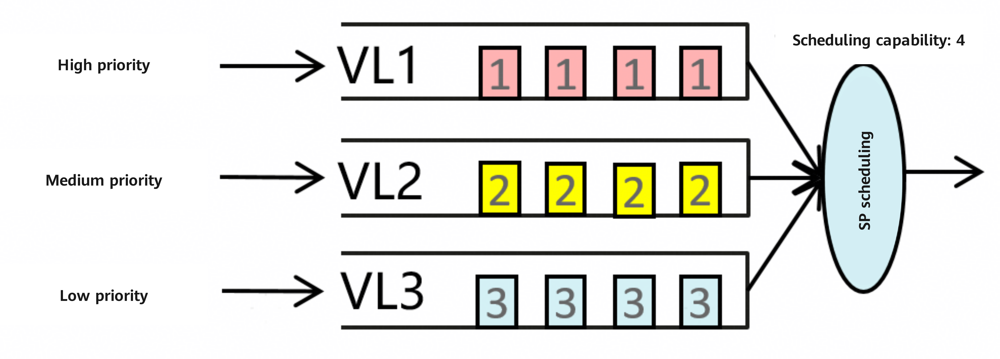
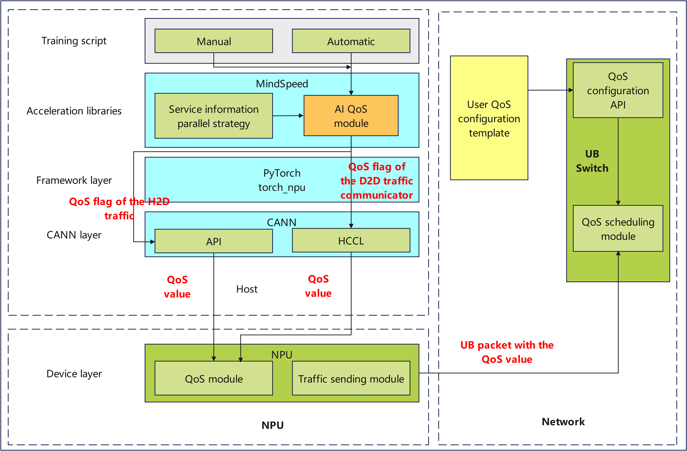

# AI QoS Differentiated Scheduling Feature Description

## 1 Technical Background

For AI large model training, hybrid parallel methods are commonly used for distributed training. Taking the MoE large model as an example, a hybrid parallel strategy combining TP (Tensor Parallel), EP (Expert Parallel), DP (Data Parallel), and PP (Pipeline Parallel) is adopted. Traffic from the parallel strategy undergoes NPU-to-NPU (D2D) communication within the super node through the UB network.
Under different model sharding and model configurations, various types of traffic conflicts exist within the super node, including conflicts between D2D (such as TP and EP) traffic, as well as between H2D traffic (such as Swap) and D2D traffic. As shown in Figure 1, incast network conflicts occur at the UB Switch, causing network congestion and affecting overall communication performance.

<div align="center">

Figure 1 Traffic conflicts of different traffic types

</div>

Since different types of traffic contribute differently to computing efficiency, some communication traffic can achieve effective computation-communication overlap through upper-layer mechanisms, such as H2D Swap traffic or D2D DP traffic, while other traffic is difficult to overlap or can only be partially overlapped. Therefore, differentiated QoS scheduling can be applied to different traffic types to achieve a QoS mapping that optimizes computing efficiency.
When different types of traffic conflict, virtual channels (VLs) can be used at the UB Switch to isolate traffic, and differentiated scheduling can be performed between VLs to achieve:

1. VL isolation between different traffic types to prevent congestion spreading

2. Differentiated scheduling between different traffic types



<div align="center">
Figure 2 A typical QoS scheduling method — SP scheduling
</div>

As shown in Figure 2, different types of traffic are mapped to different VLs to achieve traffic isolation, and priorities are set for different VLs. Strict priority (SP) scheduling is adopted. When different types of traffic arrive at the UB Switch simultaneously, the high-priority VL is scheduled and drained first, followed by the next-level queue, and so on, thereby achieving differentiated scheduling for different types of traffic.

## 2 Solution Introduction

Based on the above background, this feature provides an AI QoS differentiated scheduling solution that achieves the following:

   1. Different types of traffic are mapped to different VLs;
   2. Differentiated scheduling is performed between VLs, thereby improving overall compute efficiency.

This feature provides two enablement methods:

   1. Automatic method: AI QoS perceives the traffic types, communication domains, communication volumes, and compute efficiency contributions of AI large model training, and designs a compute-efficiency-first priority mapping and scheduling algorithm. It implements VL mapping that minimizes conflicts between different traffic types and differentiated QoS scheduling that prioritizes compute efficiency.
   2. Manual method: You can manually specify the QoS priorities for different parallel strategies. AI QoS follows the user-specified priorities, and through multi-layer transmission and QoS semantic mapping, converts task-level QoS semantics into UB protocol QoS semantics. The QoS value is set in the UB packet and mapped to the corresponding VL on the UB Switch, enabling differentiated scheduling between VLs. m suppomethodthree QoS priority levels: Low, Middle, and High.

Note: Due to underlying capabilities, H2D traffic only supports channel-level overall QoS priority and does not yet support operator-level QoS priority. That is, it only supports QoS priority differentiation between H2D traffic and other traffic such as D2D, and does not support QoS priority differentiation between different operators within H2D traffic.
The overall solution architecture is shown in Figure 3:


<div align="center">
Figure 3 AI QoS differentiated scheduling solution architecture
</div>

D2D traffic uses parallel strategy as the granularity. When creating a Group, QoS marking is delivered to torch_npu, transmitted to the NPU via CANN, and finally encapsulated into the UB packet according to the packet format. H2D traffic only supports global QoS priority setting at the channel-level granularity (excluding H2D traffic delivered by operators), and does not yet support QoS priority setting for H2D traffic at the operator granularity.
The UB switch has built-in QoS templates, including the mapping from QoS values to VLs and the scheduling policy between VLs. It also supports open QoS configuration templates, allowing you to manually specify the mapping from QoS values to VLs and the scheduling policy between VLs through configuration templates.

## 3 Usage

### 3.1 Automatic Method

Add the following to the training script:
--aiqos     # AI QoS feature switch
--aiqos-mode auto       # Configure AI QoS mode to automatic method
The automatic method currently supports the typical parallel strategies: TP, PP, DP, EP, and CP.

### 3.2 Manual Method

Add the following to the training script:
--aiqos     # AI QoS feature switch
--aiqos-mode manual     # Configure AI QoS mode to manual method
--aiqos-schedule {tp:high,pp:middle,dp:low}     # Configure QoS priorities for different parallel strategies
As shown in the example above, the TP priority is set to high, the PP priority is set to middle, and the DP priority is set to low.
Manual method currently supports the following parallel strategies: dp, dp-cp, intra-dp-cp, inter-dp-cp, cp, mp, tp, pp, embd, pos-embd, tp-dp-cp, tp-dp, tp-cp, ep, ep-tp, tp-ep-mp, tp-ep-pp, ep-dp, and hcp.

## 4 Usage Instructions for the DCMI

### 4.1 DCMI Usage Principles

Purpose: The A3 generation NPU adopts a QoS fusion strategy to implement the QoS function of the bus domain NPU. This strategy obtains the final QoS value by fusing the control plane QoS value (mpam QoS delivered through the DCMI) with the fine-grained QoS value delivered along the path (the in-band QoS delivered through the training script). The AI QoS feature calls the DCMI to ensure that the QoS value ultimately accepted by the NPU is the in-band QoS value specified by the automatic method or manual method of the AI QoS feature. In addition, this interface is also used to deliver the QoS values for H2D/D2H traffic.
Principle Introduction: The specified fusion strategy is to take the maximum value of the control plane QoS value and the in-band QoS value, and by setting the watermark of mpam QoS so that mpam QoS is lower than the in-band QoS, the final QoS value generated by the fusion strategy is the in-band QoS.
Parameter Description (fusion_qos): In fusion_qos, bw_low is the lower watermark limit, bw_high is the upper watermark limit, target is the mpamid value, which can only be 0, and hardlimit is 0, indicating no hardware limit on bandwidth.
Parameter Description (set_h2d_qos): set_h2d_qos is used to adjust the QoS value of H2D traffic. The qos value parameter is compatible with the Lingqu switching network, supporting low priority and medium priority, with corresponding Lingqu network QoS values of 2 and 4. The mpamid value ranges from 0 to 31, and the default bitmap value is [0x1, 0, 0, 0], indicating the traffic channel where H2D traffic resides.

### 4.2 SO Compilation Method

Enter the `mindspeed/ops/csrc/qos` directory, manually compile pybind11, modify `pybind11_install_dir` in the `CMakeLists.txt` file in the directory to the pybind11 installation directory, and execute the following commands. The SO will be generated in the output directory:

    ```shell
    mkdir build
    cd build
    cmake ..
    make -j
    ```

### 4.3 so Usage Example

```python
import aiQos

CARD_ID_LIST = [0, 1, 2, 3, 4, 5, 6, 7]
DEVICE_ID_LIST = [0, 1]

def fusion_qos(bw_low=10, bw_high=50, target=0, hardlimit=0):
    """
    Set MPAM QoS bandwidth limit
    Parameters:
        bw_low (int): Minimum bandwidth, default value 10
        bw_high (int): Maximum bandwidth, default value 50
        target (int): Target bandwidth, default value 0
        hardlimit (int): Hard bandwidth limit, default value 0
    """
    aiQos.init()
    for card_id in CARD_ID_LIST:
        for device_id in DEVICE_ID_LIST:
            aiQos.set_gbl_qos(card_id=card_id, device_id=device_id, mode=1)
            aiQos.set_bw(
                target=target,
                bw_low=bw_low,
                bw_high=bw_high,
                hardlimit=hardlimit,
                card_id=card_id,
                device_id=device_id
            )

def set_h2d_qos(qos, mpamid, bitmap=[0x1, 0, 0, 0]):
    """
    Set QoS (Quality of Service) parameters for H2D (Host to Device) direction

    Parameters:
        qos (str): QoS level (required, string only)
                   - Only supports "low" (mapped to 2) and "middle" (mapped to 4)
                   - No integer values are allowed
        mpamid (int): MPAM (Memory Partitioning and Monitoring) ID (required, no default value)
                      Range: 0-31 (MPAM ID is a hardware resource identifier; values outside this range throw ValueError)
        bitmap (list): Bitmap parameter for QoS configuration, default value [0x1, 0, 0, 0]
                       Format: List of 4 integers, each element represents QoS control bits for different dimensions

    Raises:
        ValueError: 1. mpamid out of 0-31 range; 2. QoS string not "low"/"middle"
        TypeError: 1. mpamid not integer; 2. QoS not string type
        RuntimeError: Failed to initialize QoS module or apply QoS configuration
    """
    if not isinstance(mpamid, int):
        raise TypeError(f"mpamid must be an integer (0-31). Got type: {type(mpamid).__name__}")
    if mpamid < 0 or mpamid > 31:
        raise ValueError(f"mpamid must be between 0 and 31. Got: {mpamid}")
    if not isinstance(qos, str):
        raise TypeError(f"QoS must be a string ('low'/'middle'). Got type: {type(qos).__name__}")

    qos_lower = qos.lower()
    if qos_lower == "low":
        qos_numeric = 2
        print(f"Info: Mapped QoS string '{qos}' to numeric value {qos_numeric}")
    elif qos_lower == "middle":
        qos_numeric = 4
        print(f"Info: Mapped QoS string '{qos}' to numeric value {qos_numeric}")
    else:
        raise ValueError(f"QoS string only supports 'low' or 'middle'. Got: '{qos}'")

    try:
        aiQos.init()
        for card_id in CARD_ID_LIST:
            for device_id in DEVICE_ID_LIST:
                aiQos.set_gbl_qos(card_id=card_id, device_id=device_id, mode=1)
                aiQos.set_h2d_qos(
                    card_id=card_id,
                    device_id=device_id,
                    mpamid=mpamid,
                    qos=qos_numeric,
                    bitmap=bitmap
                )
    except Exception as e:
        raise RuntimeError(f"Failed to configure H2D QoS: {str(e)}") from e

fusion_qos()
set_h2d_qos('low', 20)
```

## 5 Usage Scenarios and Version Compatibility

The AI QoS feature supports Atlas 800T A3 super node servers and Atlas 900 A3 SuperPoD clusters, and requires the following software version compatibility:

| Software        | Compatible Version                          |
| :---------- | :-------------------------------- |
| torch_npu   | 7.3.RC1*                          |
| CANN        | CANN 8.6*                         |
| UB Switch   | LingQu Computing Network 1.6.0*   |

*Expected compatible versions. The specific versions will be updated after the relevant components are officially released.
