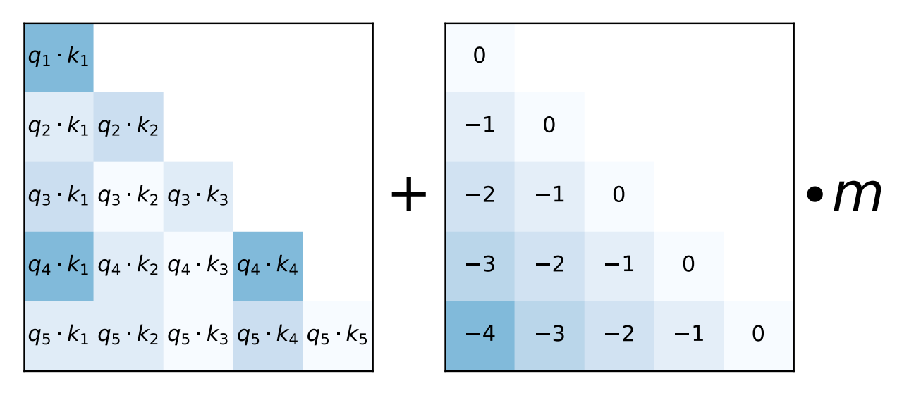

# Alibi Positional Encoding

## Background and Challenges

When the input lengths during training and inference of a large model are inconsistent, the model's generalization ability degrades. If the extrapolation ability is poor, the performance of large models when processing long texts or multi-turn dialogues will be limited. The extrapolation ability of sinusoidal positional encoding is relatively weak, and while RoPE (Rotary Position Embedding) offers some improvement, it remains limited.

## Solution

Alibi positional encoding is supported to improve the model's extrapolation ability.

### Approach

The Alibi algorithm adds a preset linear bias matrix to the attention score (as shown in the figure below), enabling the model to understand the relative positional relationships between inputs. Since the positional information acts directly on the attention score, positional differences are highlighted, giving the model strong extrapolation ability.

 

[Original link](https://arxiv.org/pdf/2108.12409)

## Usage

1. The alibi feature only supports flash attention v2. Ensure that `--use-fusion-attn-v2` is enabled.

2. When the `--use-fusion-attn-v2` feature is enabled, you need to set `--position-embedding-type alibi` and `--alibi-fusion-attn-type 2`. `--alibi-fusion-attn-type` only supports values of 0 or 2. 0 means the alibi is generated and then passed in, 1 is not yet available, and 2 means in-kernel generation. If you want to set alibi to be diagonally symmetric negation, you need to set `alibi_diagonal_opposite`; otherwise (which is also the default case and consistent with in-kernel generation when set to 2), no setting is required.

3. The alibi positional encoding supports ring-attention long sequence parallelism, but only for scenarios where the mask is causal and `--alibi-fusion-attn-type` is set to the compressed mode of 2. It does not yet support ulysses long sequence parallelism or hybrid long sequence parallelism.

4. When the `--use-fusion-attn-v2` feature and long sequence parallelism are enabled, alibi encoding does not support enabling dropout.

## Application Effect

The model's extrapolation ability is improved.
