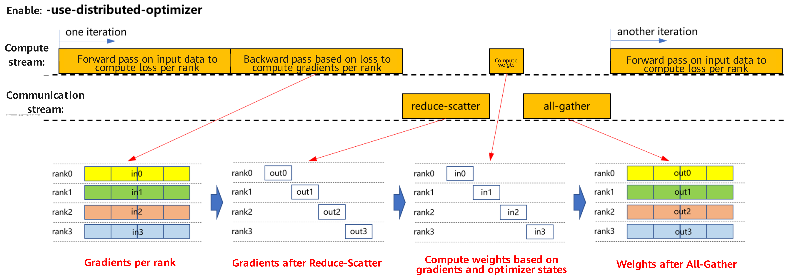
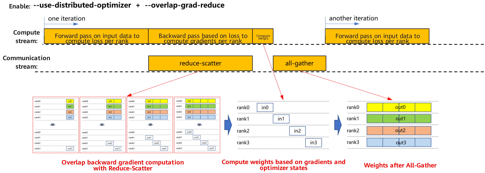
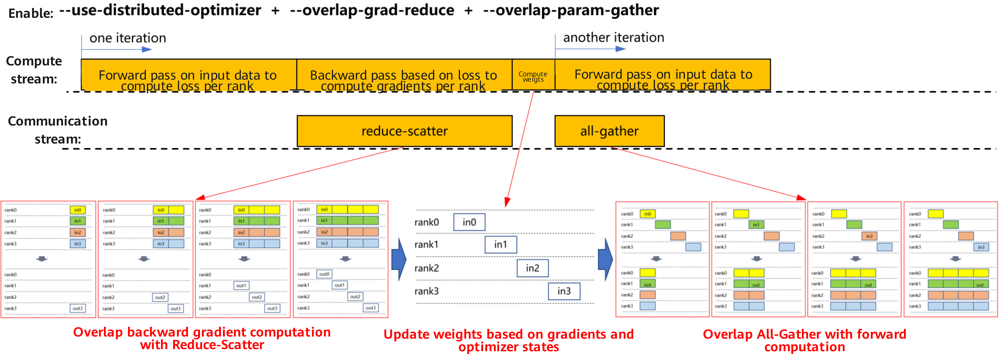

# Megatron Weight Update Communication Overlap

## Background and Challenges

Large-model training widely adopts data parallelism. In the gradient update phase, traditional approaches require that communication within the data parallel group only starts after the entire backward pass completes. This serial execution creates significant idle time in the computation–communication pipeline, reducing overall efficiency.

## Solution

To address this issue, we introduce a parallel execution strategy that overlaps computation and communication using pipelining. This approach significantly improves resource utilization.

### a. Enable only the distributed optimizer `--use-distributed-optimizer`

After the forward and backward computations are completed, an independent communication phase will take place, including gradient reduce-scatter, weight computation, and weight all-gather, as shown in the figure below. After obtaining the updated weights, the system will enter the next round of forward computation.

 

### b. Enable both the distributed optimizer and gradient communication overlapping, `--use-distributed-optimizer` and `--overlap-grad-reduce`

When enabling `--use-distributed-optimizer` and `--overlap-grad-reduce` simultaneously, the execution flow is shown in the figure below. The gradient reduce-scatter process is parallelized with the backward computation process, thereby avoiding additional reduce-scatter time and significantly improving the parallel efficiency of computation and communication, as shown in the figure below.

 

### c. Enable the distributed optimizer, gradient communication overlapping, and parameter aggregation overlapping, `--use-distributed-optimizer`, `--overlap-grad-reduce`, and `--overlap-param-gather`

With `--use-distributed-optimizer` and `--overlap-grad-reduce` enabled, further enabling `--overlap-param-gather` results in the execution flow shown below. The all-gather process for weights is parallelized with the forward computation of the next iteration, thereby saving the time of a separate all-gather process.

 

A comparison of the above flows reveals that after enabling --overlap-param-gather, communication and computation are fully parallelized, greatly improving computation-communication parallel efficiency and thus enhancing model training efficiency.

## Application Scenario

This feature is designed for data-parallel training scenarios, particularly where communication overhead is non-negligible. By reducing the impact of communication latency, it significantly accelerates model training.

## Usage

* To enable weight update communication overlap, add the following parameters to the training configuration:
    `--overlap-param-gather`
* Ensure the following two parameters are also enabled.
    `--use-distributed-optimizer`
    `--overlap-grad-reduce`

## Application Effects

Weight update communication overlap improves resource utilization and training efficiency in large-scale model training by enabling parallel execution of computation and communication tasks. This is reflected in the following aspects:

* Increased throughput
Weight update communication overlap eliminates unnecessary waiting time in traditional synchronous modes. This optimization allows the system to process more data per unit of time, thereby significantly improving the overall system throughput.

* Reduced latency
The time required for a single iteration is reduced because computation and communication are no longer fully serialized but partially overlapped. This not only reduces the latency of individual training steps but also shortens the entire training cycle, increasing the speed from the start of training to deployment completion.

* Optimized resource usage
Ensures that computing resources and communication bandwidth are utilized more efficiently. Traditional synchronization methods may leave computing nodes idle while waiting for other nodes to complete communication; this technique keeps hardware resources almost constantly active, greatly reducing idle waste caused by synchronization barriers.

According to actual test data, when training a large language model such a llama-2-70b, applying the weight update communication overlap technique improved end-to-end performance by 3.4%.

## Notes

* The native Megatron version has an issue with incorrect generation order, which causes the next round of forward computation to start early. After enabling this feature, to fix this issue, the initialization order of the attention layer is corrected to create `linear_qkv` first and then `linear_proj`.
* In legacy mode, `--overlap-param-gather` does not currently support being used together with `reuse_fp32_param`.
