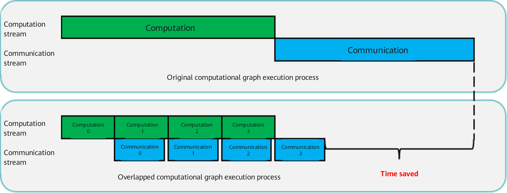

# Megatron Asynchronous DDP

## Background and Challenges

In large-model training, traditional [Megatron data parallelism](./data-parallel.md) typically executes in a serial fashion: gradient communication within each data parallel group only starts after the backward pass completes — AllReduce if the distributed optimizer is disabled, or ReduceScatter if enabled. This sequential execution introduces idle time between computation and communication, reducing resource utilization and overall training efficiency.

## Solution

To overcome this bottleneck, we introduce an asynchronous distributed data parallel (DDP) optimization mechanism. It decomposes computation and communication into finer-grained subtasks, enabling pipelined overlap of the two and significantly improving resource utilization. The core principle is illustrated below:

Figure 1 Asynchronous DDP computation

 

Bucket mechanism: A temporary storage area (bucket) is set up to hold the gradients generated by backpropagation. Once the bucket reaches a preset capacity, the communication task for the internal gradients is triggered immediately, without waiting for all backward computations to complete. This mechanism allows subsequent backward computations to run in parallel with the current communication task, significantly improving the utilization of both computational and communication resources.

## Use Scenario

* The model has data parallelism and a distributed optimizer enabled (`--use-distributed-optimizer`).
* Environments that require efficient utilization of cluster resources for large-scale deep learning model training.
* Research and development work that requires rapid iteration of model parameters and shorter experiment cycles.

## Usage

Add the following parameters to the training script to activate the asynchronous DDP optimization algorithm.
`--use-distributed-optimizer`
`--overlap-grad-reduce`

## Application Effects

Asynchronous DDP significantly improves resource utilization and training efficiency in large model training by overlapping computation and communication tasks. For the LLaMA2-70B model, it achieves an end-to-end performance improvement of approximately 2-3%.
