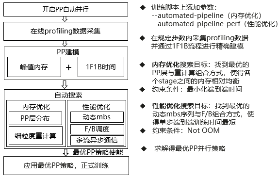

# Automated Pipeline Parallelism

## Background and challenges

Pipeline parallelism (PP) partitions the model network layers into multiple stages and maps these stages to different devices, enabling different devices to compute different parts of the neural network in parallel. Pipeline parallelism significantly alleviates the memory bottleneck of a single card and improves hardware utilization through pipelined training across multiple cards. Pipeline parallelism has become one of the most commonly used parallelism approaches for large model training. However, current pipeline parallelism is not optimal in terms of memory consumption and performance, with two major issues:

1. Memory imbalance: Under the commonly used scheduling mode (1F1B) in current pipeline parallelism, the memory usage of pipeline stages closer to the front layers of the model is far greater than that of the later stages, with a difference of 2 to 3 times. Overall, the trainable model scale is limited by the memory consumption of PP-Stage 0.
2. Pipeline bubble: The pipeline 1F1B scheduling strategy alternately performs forward and backward computation of micro-batch data on each device. Due to imbalanced computational loads among pipeline devices or fluctuations in network communication, waiting occurs between devices (pipeline bubble), which affects training performance.

## Solution

This system is based on online profiling and PP modeling search. By enabling the memory optimization module and the performance optimization module, it maximizes the memory and performance of pipeline parallelism training, respectively. The memory optimization module aims to automatically find the optimal layer distribution for stages in pipeline parallelism and a fine-grained recomputation module, evenly distributing the memory on each card, optimizing PP-Stages with memory bottlenecks, and achieving peak reduction. The performance optimization module employs automatic optimization of the mbs sequence and forward-backward scheduling sequence, along with a multi-stream asynchronous communication mechanism, to compress pipeline bubbles and improve training performance.

### Memory Optimization Module

Based on online profiling and PP modeling search, it automatically constructs an optimal memory layout scheme to balance memory overhead across stages, achieving peak reduction while minimizing end-to-end training time, with good ease of use and generalizability. Specifically, it automatically optimizes the memory layout scheme within the joint search space of layer distribution and fine-grained recomputation:

1. PP layer distribution partitioning: An uneven layer partitioning strategy is adopted to automatically search for the optimal layer partitioning method, balancing the memory consumed by each card, thereby optimizing PP-Stages with memory bottlenecks and achieving peak reduction.
2. Fine-grained recomputation: Pipeline bubble time is utilized for recomputation to ensure no performance degradation. By automatically optimizing a fine-grained recomputation strategy, peak memory is further reduced.

### Performance Optimization Module

Under the condition that the peak training memory overhead does not exceed the maximum memory capacity of the device, the end-to-end training time is minimized by automatically finding the optimal mbs sequence and forward-backward scheduling sequence in pipeline parallelism.

1. Dynamic mbs: Under a given gbs, the optimal mbs sequence is automatically searched. A small mbs is used to accelerate the startup and cool down of the pipeline, compressing the bubble time. During the steady phase, the most efficient mbs is automatically found for computation, shortening the steady-phase computation time and improving end-to-end training performance.
2. Forward-backward scheduling: By adjusting the order of forward and backward computations during pipeline parallelism and combining it with a multi-stream asynchronous communication mechanism, the steady-phase bubble of the pipeline is compressed, thereby improving training performance.

The PP automatic parallelism system is illustrated in the following figure:

 

## Use Scenario

This system is primarily used in training scenarios where pipeline parallelism is enabled. Using the PP automatic parallelism system can effectively optimize issues of insufficient memory or an excessively large proportion of pipeline bubbles.
**Usage Conditions:**

1. `--pipeline-model-parallel-size >= 2`;
2. The memory optimization and performance optimization modules cannot be used simultaneously.

## Usage

1. When memory is insufficient, the PP automatic parallelism memory optimization module can be enabled. First, add the `--automated-pipeline` flag to the training script to enable the feature.
2. When the pipeline bubble is too large, resulting in suboptimal training performance, the PP automatic parallelism performance optimization module can be enabled. First, add the `--automated-pipeline-perf` flag to the training script to enable the feature.

## Application Effects

Benefits of the PP automatic parallelism memory optimization module: For models such as LLaMA2-7B, LLaMA-13B, and LLaMA2-70B trained with PP configurations, the average peak memory is reduced by 11.5% after applying this algorithm, with an average performance degradation of less than 1%. Benefits of the performance optimization module: For models such as LLaMA2-7B, LLaMA-13B, and LLaMA3-8B trained with PP configurations, the average performance is improved by 7.6% after applying this algorithm.
