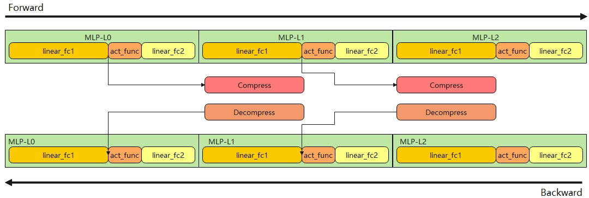
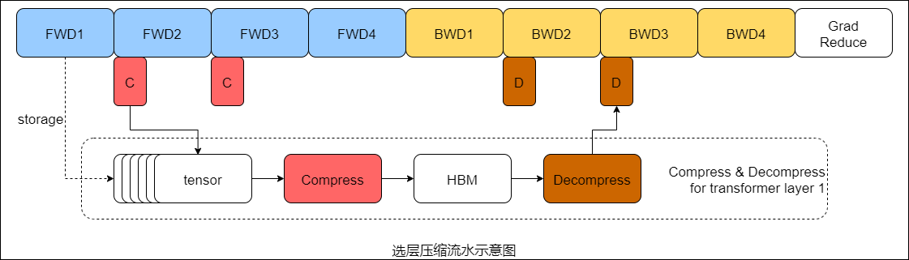

# compress-activation

## Background and Challenges

As the sequence length increases, the proportion of video memory occupied by activations gradually grows, leading to excessively high peak memory per card.

Therefore, we developed a memory compression feature based on the self-developed Ascend lossless compression operator to compress the memory occupied by activations, with no loss in precision. When there is a need to reduce peak memory, you can enable the following three switches to activate the memory compression feature.

- Feature 1: `--compress-dense` compresses the activations generated by the first linear layer in the MLP module.
- Feature 2: `--compress-activation` compresses the activation generated by the selected transformer layer.
- Feature 3: `--compress-optimizer` compresses the first/second-order momentum of the optimizer.

## Solution

- Feature 1:
Record the MLP execution order of the first node, and use a multi-stream asynchronous method to call the Ascend lossless compression operator to compress the activation generated by the MLP module in the Dense layer. Since this operator uses vector computing power, it can overlap with cube computation and communication, so the compression and decompression processes themselves generally do not cause performance degradation. The specific method is shown in the following figure:

- Feature 2:
Records the execution order of the transformer layer on each device and performs lossless compression on the activations generated within the layer. The Ascend lossless compression operator is called asynchronously through a multi-stream approach to compress memory. Since this operator uses vector computing power, it can overlap with cube computation and communication, meaning the compression and decompression processes themselves cause almost no performance degradation. The specific process is shown in the following figure:

- Feature 3:
Directly calls the Ascend lossless compression operator to perform unhidden compression on the first-order and second-order momentum of the AdamW optimizer, which introduces a slight performance degradation.

## Application Scenario

Applicable to scenarios for training large models with insufficient training memory.

## Usage

- Feature 1:
    `--compress-dense level0` performs only vector compression, saving less space with minimal performance overhead.
    `--compress-dense level1` performs vector compression while swapping some results to the CPU, saving more space but incurring additional performance overhead.
- Feature 2:
`--compress-activation` indicates which layers' generated activations to compress. It can be configured as `1-3` or `1,2,3`, indicating compression of activations generated by layers 1/2/3. It can be configured as `1-3,5-8,10`, indicating compression of activations generated by layers 1/2/3/5/6/7/8/10. It can also be configured as `0` to indicate compression of all layers. The default value is NULL.
- Feature 3:
`--compress-optimizer` Whether to compress the first/second-order momentum of the optimizer. The default value is False.

## Application Effects

Using the activation compression feature reduces peak memory. Using the optimizer first/second-order momentum compression feature introduces a slight additional performance degradation because the compression/decompression process is not overlapped. For typical models such as Llama and Qwen, enabling Feature 1/Feature 2 yields average memory savings of 3%/7%. For example, with the Qwen3-8b model at a sequence length of 8192 and a parallel configuration of PP4TP2CP1, enabling Feature 2 achieves a memory saving of 6.2%.

## Usage Constraints

- Feature 2 is an iterative version of Feature 1, and the two cannot be enabled simultaneously. Feature 3 can be enabled simultaneously with either Feature 1 or Feature 2.
- Currently incompatible with the `recompute_activation_function` feature.
