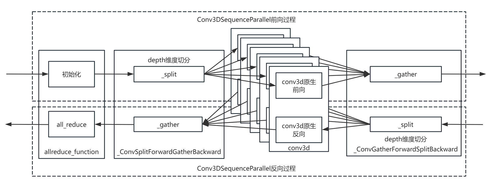

# conv3d Sequence Parallelism

## Background and Challenges

In model architectures for fields such as multimodal and machine vision, conv3d modules are often used for 3D convolution operations on feature maps. In large models, the time consumed by convolution operations increases as the scale of the feature map grows.
Since the convolution process for each block of the feature map is executed sequentially, there is actually no dependency constraint on the execution order among the blocks. In distributed training, 3D convolution operations need to be parallelized to improve convolution speed.

## Solution

Construct a `Conv3DSequenceParallel` class that splits the input feature map along the depth dimension of the convolution kernel and then performs parallel convolution.

- **Forward process**:
 Construct the `Conv3DSequenceParallel` class, split the input feature map along the depth dimension of the convolution kernel, distribute it to different process groups for conv3d 3D convolution operations, and perform a gather operation on the convolution results before outputting them to downstream modules. 
- **Backward process**:
 The `Conv3DSequenceParallel` class performs a split operation on the gradients obtained from downstream backward propagation, splitting the gradients along the depth dimension, distributing them to parallel 3D convolution modules for backward propagation, and then performing a gather operation on the backward gradients from the parallel 3D convolution modules before outputting them to upstream modules.

## Application Scenario

Applicable to training models that contain conv3d (non-padding mode) modules.

## Usage

Replace the original conv3d module with `Conv3DSequenceParallel` and specify the relevant parameters to achieve parallel acceleration. 
The `Conv3DSequenceParallel` module interface is as follows: 

``Conv3DSequenceParallel(pg, in_channels, out_channels, kernel_size, stride, dilation, bias, param_async, dtype, sp_size)`

- `pg`: required input, data type is list(int), representing the communication process group.
- `in_channels`: Required input, data type is int, representing the number of input channels.
- `out_channels`: Required input, data type is int, representing the number of output channels.
- `kernel_size`: Optional attribute, data type is tuple(int,int,int), default value: (1, 1, 1), representing the convolution kernel size.
- `stride`: Optional attribute, data type is tuple(int,int,int), default value: (1, 1, 1), representing the stride size in each dimension.
- `dilation`: Optional attribute, data type is float, default value: 1.0, representing the dilation rate.
- `bias`: optional attribute, data type is bool, default value: True. Whether to enable bias.
- `param_async`: optional attribute, data type is bool, default value: False. Whether to enable parameter asynchronous communication.
- `dtype`: optional attribute, data type, default value: torch.bfloat16. Indicates the data type.
- `sp_size`: optional attribute, data type is int, default value: `1`. Indicates the sequence parallel size.

## Application Effects

Distributes the convolution operations of each convolution region to process groups for parallel execution, improving the efficiency of 3D convolution.

## Notes

The `Conv3DSequenceParallel` module does not support padding mode. Therefore, conv3d modules that use padding cannot be replaced with the `Conv3DSequenceParallel` module.
