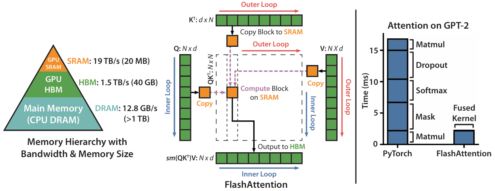

# Flash Attention

## Background and Challenges

In the field of deep learning, Transformer models are widely used in various domains such as natural language processing, speech recognition, and computer vision due to their outstanding performance. However, when processing long sequence data, the time and space complexity of their SelfAttention mechanism grows quadratically with the sequence length, leading to significant increases in computation time and memory consumption, which becomes a bottleneck for the further evolution of Transformer models. To address this, approximate attention methods have emerged, aiming to speed up model processing by reducing computation and memory usage, but they carry the risk of degrading model quality. Such methods often reduce complexity by sacrificing SelfAttention computation precision, implementing sparse attention mechanisms, or introducing alternative attention patterns, but this comes with potential compromises in model effectiveness, which is especially pronounced in detail-sensitive tasks.

## Solution

To overcome the above challenges, Flash Attention technology was introduced. Flash Attention is an efficient attention mechanism designed to significantly reduce the computation time and memory overhead of Transformer models when processing long sequences while maintaining model performance. The key to accelerating attention lies in optimizing IO memory access, i.e., reducing the number of read/write operations on on-chip memory.

Flash Attention is an exact attention method that optimizes IO memory access overhead. Its principle is shown in Figure 1. It reduces the number of memory reads/writes between high-bandwidth memory (on-chip memory) and SRAM through techniques such as Tiling, recomputation, and Kernel Fusion. The NPU side provides the same solution. For the detailed interface and usage instructions of this fused operator, please refer to the `fusion_attention` interface in the fused operator API list.

* Tiling: Uses faster SRAM instead of on-chip memory. However, SRAM has limited memory capacity and cannot complete the full attention computation for all data at once, so block-wise computation is required.
* Recomputation: Discards intermediate results from being written back and recomputes them when needed, trading computation for memory access.
* Kernel fusion: Fuses multiple operations into a single operation, using one kernel to complete the entire computation based on Tiling.

 

For more information about Flash Attention, see [FlashAttention: Fast and Memory-Efficient Exact Attention with IO-Awareness](https://arxiv.org/pdf/2205.14135).

## Application Scenario

This method is applicable to self-attention related models, especially for long sequence input scenarios. This feature is enabled by default when long sequence parallelism is turned on.

## Usage

Set the following parameter to call this algorithm:
`--use-flash-attn`

## Application Effects

It can significantly improve model training efficiency and save training memory overhead. Under the Llama2-7b model, the performance improvement is approximately 34%.
