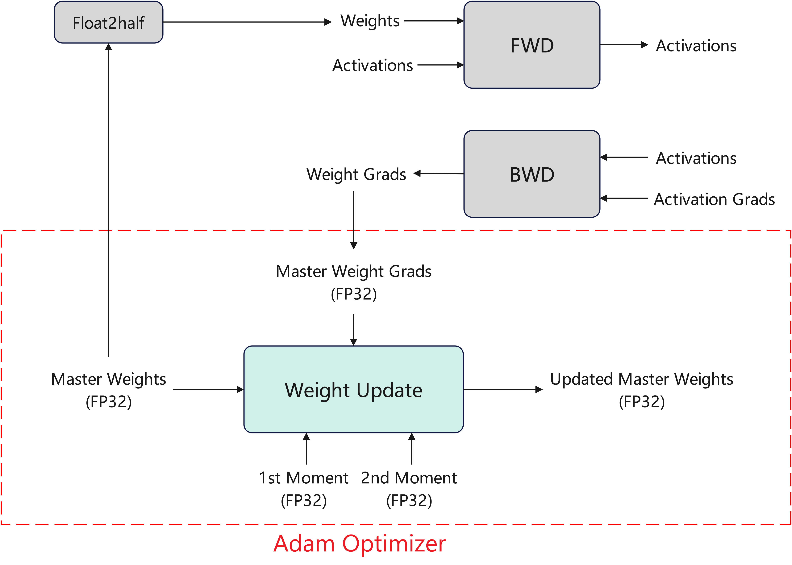
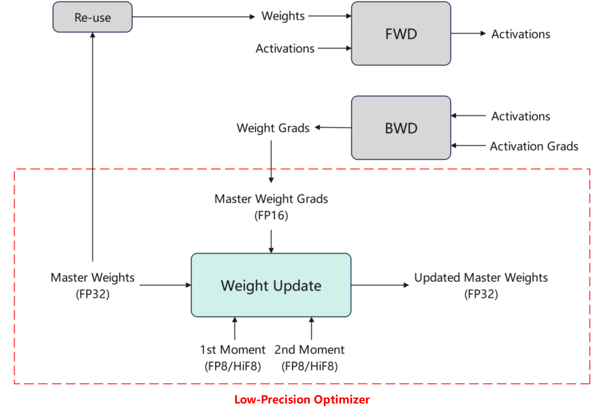

# Low-Precision Optimizer

## Problem Analysis

In large model training scenarios, Adam-type optimizers continuously save parameter copies, gradients, and first- and second-order momentum of the optimizer using FP32 full-precision data types during training, resulting in significant static memory usage.

## Solution

Quantize and compress the data stored in the optimizer to low precision respectively, to reduce memory usage:

1. Quantize the momentum in the optimizer to the E4M3 format FP8, HiF8, or MXFP8 data type, reducing momentum memory usage.
2. Quantize gradients to half-precision FP16, reducing gradient memory usage.
3. Adapt the existing parameter copy reuse algorithm to reduce parameter copy memory usage.

Before the optimizer updates parameters, the quantized data must first be dequantized to FP32 to ensure computational accuracy. After the update is complete, it is quantized back to low precision. The computation workflow is shown in the following diagram:

## Usage

Set `--quant-states fp8` to enable optimizer momentum quantization. The quantization data type can be `fp8`, `hif8`, or `mxfp8`.

Set `--quant-grads` to enable gradient quantization compression. Gradients are quantized from the FP32 data type to FP16.

Compatible with the `reuse-fp32-param` feature

## Application Effects

Reduces the static memory usage of the optimizer.

## Usage Constraints

1. Gradient quantization compression `--quant-grads` does not support GEMM gradient accumulation fusion `--gemm-gradient-accumulation-fusion`. You need to enable `--no-gradient-accumulation-fusion` to disable gradient accumulation fusion.
2. Gradient quantization compression `--quant-grads` and momentum quantization compression `--quant-states` do not support `--swap-optimizer`. To use the low-precision optimizer, you need to disable the `--swap-optimizer` feature.
