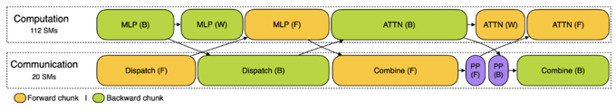
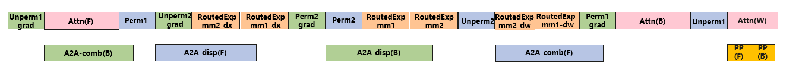
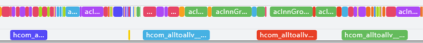

# AlltoAll Communication Overlap Across Microbatches in MoE

## Background and Challenges

The key bottleneck in MoE model training lies in the high cost of AllToAll (A2A) communication, which significantly impacts training MFU. Additionally, within the same microbatch, A2A communication and computation have dependencies, making A2A communication difficult to overlap.

During the training of the DeepSeek V3 model, the DeepSeek team innovatively proposed bidirectional pipeline AllToAll (A2A) overlap across microbatches, known as the DualPipe algorithm. DualPipe simultaneously inputs microbatches from both ends of the pipeline and incorporates the ZeroBubble concept for dw/dx separation, further reducing pipeline bubbles. Meanwhile, since there are no dependencies between the forward and backward passes of different microbatches, DualPipe orchestrates computation and communication through dual-stream scheduling, achieving full A2A communication overlap in the 1F1B phase. For details, see:
> DeepSeek-V3 Technical Report (<https://arxiv.org/abs/2412.19437>)

Specifically, the forward computation and communication within a single layer are sequentially split into four stages: Attention(F), Dispatch(F), MLP(F), and Combine(F). The backward computation within a single layer is sequentially split into Combine(B), MLP(B), Dispatch(B), and Attention(B), where Dispatch and Combine are the A2A communication before and after the MLP computation, respectively. By orchestrating the forward and backward computation and communication through dual-stream scheduling, full A2A communication overlap is achieved in the 1F1B phase. The principle is illustrated below (<https://github.com/deepseek-ai/profile-data>)

Since the forward and backward computations belong to different microbatches, there is no sequential dependency between them. Based on the forward and backward sequences described above, Attention(F) can overlap Combine(B), MLP(B) computation can overlap Dispatch(F), MLP(F) can overlap Dispatch(B), and Attention(B) can overlap Combine(F). Additionally, the DeepSeek team allocated fixed numbers of CUDA SMs for computation and communication, mitigating the issue of SM resource contention between the two.

## Solution

MindSpeed has designed and implemented a high-performance MoE cross-microbatch A2A communication overlap solution based on the characteristics of Ascend hardware. Through fine-grained computation and communication pipelining, it achieves **50%** A2A communication overlap in the warmup/cooldown phases and **100%** A2A communication overlap in the 1F1B phase. On the DeepSeek V3 model, combined with DualpipeV, it delivers an end-to-end performance improvement of **10%** compared to MindSpeed's existing A2A overlap feature `--moe-alltoall-overlap-comm`.

### Cross-Microbatch A2A Communication Overlap

The fine-grained computation and communication pipeline orchestration for the 1F1B phase implemented by MindSpeed is illustrated below:

By decoupling the dw and dx computations for the dispatch experts and the Attention backward pass, full A2A overlap can be achieved during the 1F1B phase. Additionally, since communication operations on Ascend hardware are issued by the AICPU and do not consume cube computation unit resources, the concurrency of computation and communication has minimal impact on computational efficiency. Furthermore, the dw computation of the Attention component is used to overlap PP communication, thereby achieving full communication overlap during the 1F1B phase.

The following diagram shows a profiling illustration of A2A communication overlap within a single layer when this feature is used with a real 671B DeepSeekV3 model:

With this feature enabled, the four A2A communication operations in the 1F1B phase can be completely overlapped by computation.

### A2A Self-Overlap in Warmup/Cooldown Phases

During the pipeline warmup/cooldown phase, only forward/backward computations of the same microbatch exist, so the cross-microbatch A2A communication overlap method cannot be used. To further increase the overlap ratio, intra-layer self-overlap is used during the warmup and cooldown phases: the forward computation of shared experts overlaps dispatch communication, the backward computation of shared experts overlaps combine communication, and the dw computation of routed experts overlaps dispatch communication.

### Cross-Microbatch A2A Communication Overlap Based on DualPipeV and Megatron VPP

MindSpeed implements MoE cross-microbatch A2A communication overlap based on the DualPipe pipeline. For details, see [DualPipeV Introduction](../dualpipev.md).

In addition, we note that MoE cross-microbatch A2A communication overlap can also be implemented on top of traditional Megatron VPP (Virtual Pipeline Parallelism). This only requires performing one additional warmup microbatch during the warmup phase compared to the original VPP, as shown in the following figure:

The middle red-boxed section can utilize cross-microbatch A2A overlap. Compared to the DualPipeV pipeline, this approach is simpler to implement while achieving the same A2A communication overlap.

## Usage

Please note that this feature has currently only been validated in the DeepSeek V3 scenario. Further validation and adaptation are required for other MoE model scenarios.

1. Add `--moe-fb-overlap` to the launch script.
2. If you need to use the DualPipeV pipeline, add `--schedules-method dualpipev` to the launch script.
3. If using Megatron VPP, configure `--num-layers-per-virtual-pipeline-stage` in the launch script.
4. Non-PP, multi-microbatch scenarios are supported. Do not configure `--pipeline-model-parallel-size` in the launch script, or set `--pipeline-model-parallel-size 1`.

## Usage Constraints

1. Only `--moe-token-dispatcher-type=alltoall` is supported. The `allgather/alltoall_seq` dispatcher is not yet supported.
2. Using `--swap-attention` simultaneously is not recommended, as it causes performance degradation.
3. `--expert-tensor-parallel-size=1` must be set, and expert TP is not yet supported.
4. The Megatron MoE Token Drop & Pad mode is not supported. Dropless and Drop modes are supported.
5. This depends on GroupedMatmul. Ensure that `--moe-grouped-gemm` is enabled.
6. Only `--moe-zero-memory=level0` is supported, and the `moe-zero-memory-num-layers` configuration is not supported.
7. Asynchronous DP communication overlap is not supported, and `--overlap-grad-reduce` must be disabled.
8. only Mcore models are supported. Do not enable `--use_legacy_models`.
9. Under VPP pipeline, the following additional constraints apply:
    - GBS > 1 *DP* PP * MBS
    - If noop layers are used, they must be added to the last VPP stage at the end of the model.
10. Conflicts with the following features and cannot be used simultaneously:
    - `moe-alltoall-overlap-comm`
    - `moe-hierarchical-alltoallv`
    - `recompute-in-advance`
    - `recompute-in-bubble`
