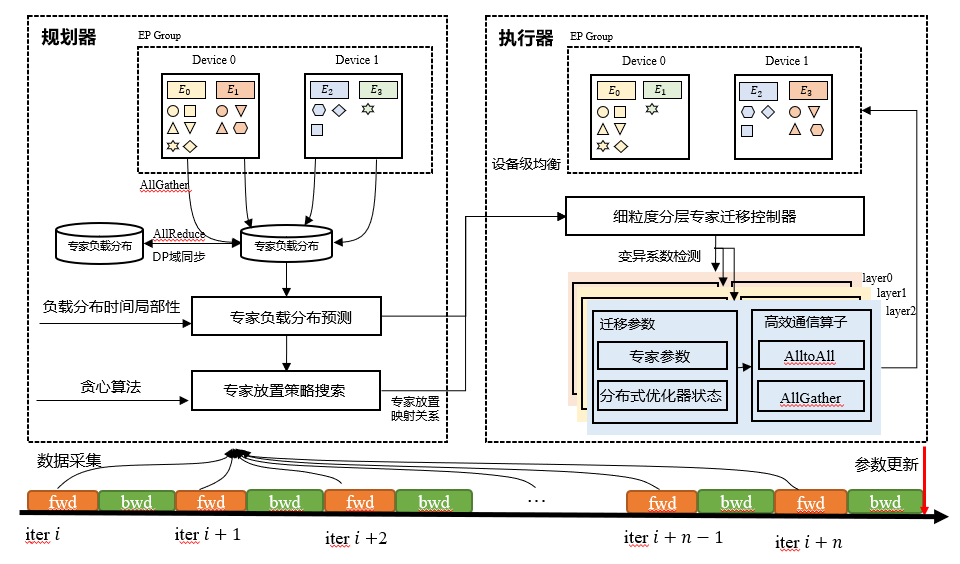
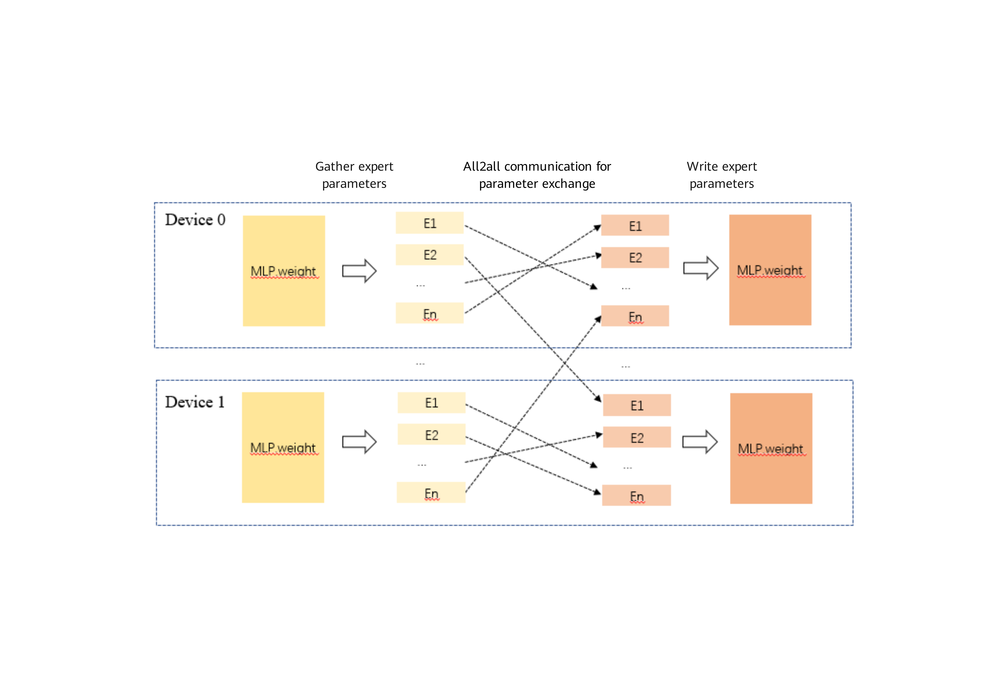

# MoE Load Balancing - Expert Migration

## Background and Challenges

During MoE model training, expert load exhibits an imbalance phenomenon, especially in the pre-training phase. The number of tokens processed by experts on different devices varies significantly, and the load changes drastically, causing fast-slow device issues that degrade throughput. The local training device load is shown in the figure below, and the load situation in large-scale training is similar.

## Solution

To address the above issues, a load balancing solution based on expert migration is proposed. By dynamically migrating experts at a certain frequency during training, hot experts are mixed and matched, which can significantly alleviate device-level load imbalance and improve throughput. The solution framework is shown in the figure below.

<p align="center"> </p>

The solution mainly consists of two parts: the planner and the executor.
**Planner**: Performs migration preparation tasks, including expert load data collection, load prediction, and expert placement optimization.

* The expert load data collection functionality is integrated within the load prediction module.
* Expert load prediction uses the Exponential Moving Average (EMA) method, with the calculation formula:
$ELP_{t+1} = \theta * ELP_{t} + (1-\theta)EL_t, $
where $ELP_t$ is the expert load prediction at step $t$, $EL_t$ is the collected expert load data at step $t$, and $\theta$ is the EMA weight, typically ranging from 0.9 to 0.999. A larger $\theta$ means the load prediction focuses more on historical data, with less influence from the current load data. In this solution, $\theta=0.9$ is used to better capture current load characteristics, making the expert migration based on it more adaptive to changing loads.
The EMA-based load prediction update processes data iteratively, eliminating the need to store historical load information. It is computationally lightweight and delivers excellent prediction results.

Before migration, an allreduce operation is performed on the expert load prediction results in the DP domain to ensure that all DP domain load predictions and the expert placement mapping based on these predictions are consistent.

The expert placement optimization adopts a greedy algorithm, with the main steps as follows:

1. Initialization: the number of experts on each device is 0, and the number of processed tokens is 0.

2. Based on the expert load prediction results, find the expert with the highest load in the expert set.

3. Traverse each device to find the device with the number of experts less than the preset value and the minimum number of processed tokens.

4. Assign the expert with the highest load to the device identified in the previous step, and remove this expert from the expert set.

5. Repeat step 2 until all experts have been placed.

***Executor***: Based on the expert placement mapping provided by the planner, the executor performs expert migration operations, exchanging expert parameters and corresponding optimizer states between devices, while remapping the top-k expert IDs determined by the MoE router to achieve device-level load balancing.
The executor consists of two parts: a fine-grained hierarchical expert migration controller and the expert migration operation itself.

* The controller decides whether to trigger expert migration operations in each transformer layer by detecting whether expert migration can significantly reduce the level of load imbalance. The load imbalance metric is designed as the coefficient of variation of the predicted load, which is the ratio of the standard deviation to the mean. This metric is dimensionless and universally applicable. In this solution, a reduction of the coefficient of variation by at least 0.08 is used as the criterion for whether expert migration is effective. By introducing the controller, MoE layers with a low degree of load imbalance will not undergo expert migration, which reduces migration overhead. This is especially effective during the SFT stage, where the load is relatively stable.

* The parameters involved in the expert migration operation include expert parameters, optimizer master parameters, and optimizer states (first-order and second-order gradient momentum), etc. It supports features such as distributed optimizer and parameter replica reuse, and performs inter-device parameter exchange through all-to-all communication.

1. Expert parameter exchange is relatively simple, requiring only parameter extraction, alltoall exchange, and update operations.

    <p align="center"> </p>

2. Main steps for optimizer state exchange:
Perform the following operations on the master parameters and first/second-order momentums

```txt
For buffer in buffers:
    For bucket in buffer.buckets:
    1. Allocate buffer: Create an optimizer state exchange buffer with the same capacity as the bucket.
    2. Write local states: Slice the local optimizer states of parameters in the bucket and copy them into the exchange buffer.
    3. Perform all-gather: Execute an all-gather operation within the data parallel (DP) group on the exchange buffer to obtain the complete optimizer states.
    4. Perform all-to-all: Extract the local expert parameter states from the exchange buffer and migrate experts via an all-to-all operation.
    5. Update local states: Retain the expert parameter state slices in the exchange buffer and update the corresponding local optimizer state slices.
    6. Release buffer: Free the temporarily allocated exchange buffer to conserve memory resources.
```

## Usage Instructions

### 1. Configuration Parameters

```bash
enable_expert_placement: True  # Expert migration feature switch
enable_fine_grained_expert_placement: True #Fine-grained hierarchical expert migration switch. If false, all MoE layers migrate at a fixed frequency by default
expert_placement_freq: 50 #Expert migration frequency
print_expert_load: True  #Device-level expert load printing switch
fine_grained_expert_placement_thre: 0.08 #Fine-grained hierarchical expert migration switch threshold. A higher value requires greater migration benefit
```

### 2. Feature Support and Limitations

Supports parameter replica reuse (`reuse_fp32_param`), distributed optimizer (`use_distributed_optimizer`), and `tp_extend_ep`.
