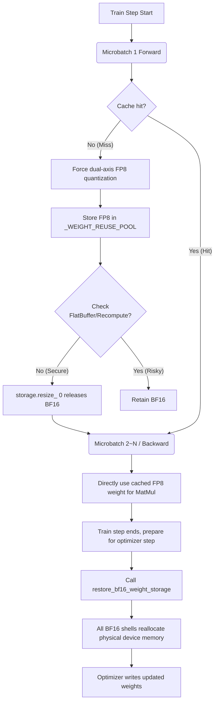

# MindSpeed FP8 Zero-Redundancy Weight

## 1. Background

### Why Is There Weight Device Memory Redundancy

In the default FP8 training architecture, the original weights loaded by the model are in `BF16` format. During forward or backward propagation, the framework calls `npu_dynamic_mx_quant` to convert `BF16` to `FP8` for matrix multiplication.

The problem lies here:

- After conversion, a new FP8 weight is generated (stored in the Reuse Cache pool).
- But the underlying **BF16 weight still occupies device memory**!
- This means that during the peak forward and backward computation phase, which is highly prone to OOM, the same weight occupies **BF16 (2 bytes) + FP8 (1 byte) = 3 bytes** of space in device memory.

## 2. Relationship Between Initial Ideas and Final Implementation

| Core Pain Points and Initial Ideas | Actual Code Implementation in the Final Branch | Meaning |
| --- | --- | --- |
| **Release BF16 device memory** | `release_bf16_weight_after_quantization` | The underlying call to `storage.resize_(0)` instantly clears the physical device memory, rather than deleting the Tensor view. |
| **Restore BF16 for optimizer update** | `restore_bf16_weight_storage` | Called at the `optimizer_step_reuse_cleanup_wrapper` boundary to fully restore BF16. |
| **Intercept Megatron's FlatBuffer** | `storage_size > expected_tensor_bytes` check | Intercepts Megatron's FlatBuffer (shared memory) to prevent blindly invalidating the entire Bucket. |
| **Activation recomputation / backward recomputation** | Not involved | Recomputation is currently incompatible with BF16 weight release. |

## 3. Final Architecture in One Sentence

The final architecture can be understood as extremely precise lifecycle micromanagement:

1. **Quantize and squeeze**: When a weight is first encountered within a step, dual-axis quantization is forcibly performed to produce FP8 and store it in the cache, followed immediately by `resize_(0)` to release the BF16 physical device memory.
2. **Safe reuse**: Subsequent microbatch and backward passes directly hit the FP8 cache, bypassing the now-empty BF16 shell.
3. **Precise resurrection**: Just before `optimizer.step()` occurs, all recorded 0-byte empty shell tensors are reallocated back to their original physical size to receive gradient updates.

---

## 4. Overall Lifecycle Structure

---

## 5. Real Device Memory Benefit Data

> **Core benefit metric: Net device memory gain = Physical size of the corresponding BF16 weight (2N)**
> *(Principle: After completing FP8 dual-axis quantization and caching during the forward pass, immediately release the BF16 physical device memory occupying 2 bytes)*

We conducted rigorous probe validation and loss alignment under different model architectures and sharding strategies, and the device memory benefit perfectly closed the loop with the theoretical derivation. From the perspective of the **model's global static device memory overview (Model States)**, the theoretical device memory reduction ratio of this solution is approximately **10.5% (2N/19N)**.

The detailed calculation logic is as follows:

**N**: Represents the number of parameters in that part of the model.
**Denominator (19N static device memory overview)**: Includes optimizer states and gradients (16N) + original BF16 weights (2N) + FP8 quantized cached weights (1N).
**Numerator (2N net device memory gain)**: The BF16 physical device memory that is successfully removed and released.

(The following is the verification of measured data for each scenario:)

### 5.1 Qwen3-32B Model Testing (2-Layer Verification)

- **Configuration**: Dense model, 2 layers. The theoretical BF16 device memory benefit is 0.75B * 2, approximately 1.5GB (slightly larger in practice due to other non-quantizable parameters and the alignment mechanism).

Number of parameters in transformer block in billions:  0.75
Number of parameters in embedding layers in billions: 1.24

- **Measured data**:
  - Peak memory usage before optimization: `max_allocated: 57307.43 MB`
  - Peak memory usage after optimization: `max_allocated: 55447.18 MB`
  - **Net device memory gain**: **1.86 GB**
- **Result**: Loss is aligned, and the device memory benefit meets expectations.

### 5.2 Qwen3-32B Model Distributed Testing (4 Cards TP=4, 6 Layers)

- **Configuration**: Dense 6 layers, tensor parallel TP=4. Total parameters 2.93B. The theoretical BF16 device memory benefit is 2.93*2, approximately 5.8 GB.
- **Measured data**:
  - Peak memory usage per card before optimization: `max_allocated: 26426.90 MB`
  - Peak memory usage per card after optimization: `max_allocated: 25024.40 MB`
  - **Net device memory gain per card**: **1.4 GB** (total cluster gain 5.6 GB).
- **Result**: The device memory benefit under TP sharding meets expectations.

### 5.3 Qwen3-30B Model Testing (2 Cards EP=2, 2 Layers)

- **Configuration**: MoE model, 2 layers, expert parallelism EP=2. Each card is responsible for 8 experts. The theoretical BF16 device memory benefit is 0.75 * 2, approximately 1.5 GB.
- **Measured data**:
  - Peak memory usage per card before optimization: `max_allocated: 41519.62 MB`
  - Peak memory usage per card after optimization: `max_allocated: 40671.62 MB`
  - **Net device memory gain per card**: **848 MB**.
- **Data analysis**: The actual BF16 volume of the 8 experts assigned to a single card plus the Attention parameters is exactly 848 MB. (Total cluster benefit is 1.6 GB).
- **Result**: Precision loss is aligned, and the device memory benefit meets expectations.
