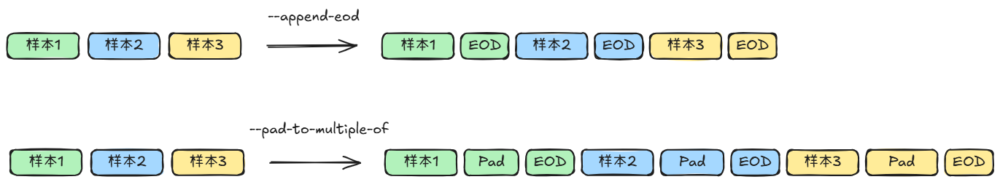

# Pack Mode Pre-training Dataset Processing

## Background and Challenges

In the pre-training tasks of large models, the input sequences within a training batch are typically formed by concatenating multiple documents. By default, the model treats these documents as a continuous sequence and does not mask the self-attention between them, meaning that cross-document contextual dependencies can be established.

However, in certain specific scenarios, different documents need to be independent of each other and cannot share contextual information. For example, when there is semantic irrelevance between documents or when training objective isolation needs to be maintained, self-attention between them must be prohibited. In such cases, the model needs to reset the attention mask and position ids at the end of each document (EOD) to achieve document-level attention isolation. To improve token utilization, the pack technique can be adopted during pre-training, which involves concatenating multiple shorter samples into a complete training sequence. During this process, the model cannot automatically identify the boundaries of different samples, so an EOD token must be explicitly inserted at the end of each sample to mark the boundary and guide the subsequent construction of the attention mask.

## Solution

MindSpeed provides data preprocessing tools that support building pre-training datasets in pack mode, as well as offline padding for pack mode datasets to accelerate the training process.

### Dataset Download

Datasets can be downloaded directly from web pages or via command line, for example:

```shell
mkdir dataset
cd dataset/
wget https://huggingface.co/datasets/tatsu-lab/alpaca/blob/main/data/train-00000-of-00001-a09b74b3ef9c3b56.parquet
cd ..
```

### Dataset Processing

#### Pre-training Dataset Processing Method

```shell
# Source the set_env.sh environment variables according to your actual environment
source /usr/local/Ascend/ascend-toolkit/set_env.sh
cd Megatron-LM
mv ../MindSpeed/tools/preprocess_data.py .
mv ../MindSpeed/tools/data_handler.py .

mkdir ./dataset

python ./preprocess_data.py \
    --input ./dataset/train-00000-of-00042-d964455e17e96d5a.parquet \
    --tokenizer-name-or-path ./model_from_hf/llama-2-7b-hf \
    --tokenizer-type PretrainedFromHF \
    --handler-name GeneralPretrainHandler \
    --output-prefix ./dataset/alpaca_llama2_7b \
    --append-eod \
    --pad-to-multiple-of 8 \
    --json-keys text \
    --workers 4 \
    --log-interval 1000
```

#### Parameter Description

- `input`: You can directly input a dataset directory or a specific file. If it is a directory, all files will be processed. Supported formats include `.parquet`, `.csv`, `.json`, `.jsonl`, `.txt`, and `.arrow`. The data format within the same folder must remain consistent.
- `handler-name`: The current pre-training defaults to using `GeneralPretrainHandler`, which supports the pre-training data style and extracts the `text` column from the data. The format is as follows:

    ```shell
    [
        {"text": "document"},
        {"other keys": "optional content"}
    ]
    ```

- `json-keys`: A list of column names to extract from the file, defaulting to `text`. It can be multiple inputs such as `text`, `input`, `title`, etc., used in combination with specific requirements and dataset content, for example:

    ```shell
    --json-keys text input output
    ```

- `append-eod`: This parameter explicitly appends the end-of-document token `EOD` to the end of each data entry, preventing the model from learning meaningless associations.
- `pad-to-multiple-of`: This parameter pads the length of each data entry to a multiple of the value specified by `pad-to-multiple-of`.

The effect after enabling the `append-eod` and `pad-to-multiple-of` parameters is as follows:


#### Processing Results

The processing results of the pre-training data are as follows:

```shell
./dataset/alpaca_llama2_7b_text_document.bin
./dataset/alpaca_llama2_7b_text_document.idx
```

During pre-training, simply pass the dataset path `--data-path` parameter as `./dataset/alpaca_llama2_7b_text_document`.

## Application Scenario

The pack mode dataset is generally used in EOD Reset training scenarios:

  1. Enable the `--reset-attention-mask` option
  2. Use the `--reset-position-ids` option to indicate whether position encoding is reset
  3. `--attention-mask-type` can be specified as causal or general

If the `pad-to-multiple-of` parameter is set during pre-processing, it can accelerate the performance of the `megatron_cp_algo` option algorithm in long sequence parallelism under EOD Reset training scenarios:

- Without setting the `pad-to-multiple-of` parameter: For cases where `--attention-mask-type` is causal, due to internal implementation requirements, the length of each subsequence will be padded online to a multiple of CP*LCM(2, TP), where LCM is the least common multiple.
- Setting the `pad-to-multiple-of` parameter: For the same scenario, you can set `pad-to-multiple-of = CP*LCM(2, TP)` during preprocessing to pad each subsequence to the required length offline, saving online padding time and accelerating training.

## Notes

When building a pack mode dataset, whether the `pad-to-multiple-of` parameter is enabled will cause certain differences in each batch sample during online training, so the two approaches cannot be fully aligned in terms of accuracy.
