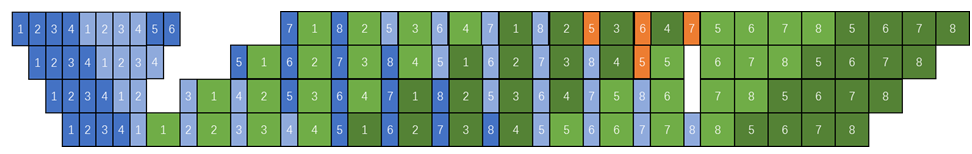
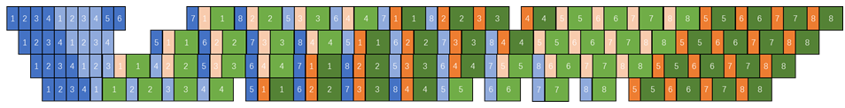

# Independent Pipelining of Recomputation

## Background and Challenges

In current pipeline scheduling, recomputation is triggered by the backward pass and scheduled together with it, meaning that recomputation must wait for the next stage to return gradients before it can begin. However, recomputation does not require the gradients from the backward pass, which leads to increased bubbles and performance degradation.

## Solution

To schedule recomputation and the backward pass independently, the scheduling of recomputation needs to be modified so that it is actively triggered by the scheduler. The scheduler is also modified to incorporate recomputation as a scheduling unit. This gives us the ability to freely insert or remove certain recomputation operations, thereby enabling optimizations in terms of both memory and performance.

A new recomputation method is implemented through torch's `saved_tensors_hooks`, which actively triggers or directly removes part of the recomputation at an appropriate time before the backward computation, thereby optimizing memory or performance.

## Application Scenario

In virtual pipeline scheduling, if the user has not enabled recomputation, recomputation can be actively inserted using bubbles to reduce the memory peak at a very small performance cost, reducing the number of forward computation blocks that need to retain activations to PP × VPP (PP stands for the number of pipeline parallelism stages, and VPP stands for the number of virtual pipeline parallelism stages).

### Figure 1: Scheduling with recomputation disabled

 

In virtual pipeline scheduling, if the user has enabled recomputation, performance can be improved by breaking the dependency between recomputation and the backward computation of the subsequent stage to perform recomputation earlier, as well as by removing the recomputation of the model's last layer.

#### Figure 2 Scheduling with recomputation enabled

 

## Usage

Add the following parameter configurations to the training script:

- Enable recomputation in bubble:
`--recompute-in-bubble`
Virtual pipeline parallelism must be enabled. Recomputation must not be enabled before using this feature, and the `recompute_num_layers` parameter must be `None` or `0`.

- Enable recomputation in advance and remove unnecessary recomputation:
`--recompute-in-advance`
Virtual pipeline parallelism must be enabled. Recomputation must be enabled before using this feature, and recompute_method is not supported when set to uniform. `recompute_num_layers` cannot be `None` or `0`.

### Notes

- The `--recompute-in-bubble` feature is currently incompatible with full recomputation uniform, full recomputation block, selective recomputation, adaptive selective recomputation, `swap-attention`, `no-align-grad-reduce`, and `no-overlap-p2p-communication` features. It is also incompatible with the `--moe-adaptive-recompute-activation` and `--moe-layer-recompute` features in MoE scenarios.

- The `--recompute-in-advance` feature is currently incompatible with full recomputation uniform, selective recomputation, adaptive selective recomputation, `no-align-grad-reduce`, and `no-overlap-p2p-communication` features.

- `--recompute-in-bubble` and `--recompute-in-advance` cannot be enabled simultaneously.

## Application Effects

`--recompute-in-bubble` proactively inserts recomputation during bubbles to achieve memory savings.

`--recompute-in-advance` enables recomputation in advance at the bubble, which can improve training performance compared to the default full recomputation approach.
