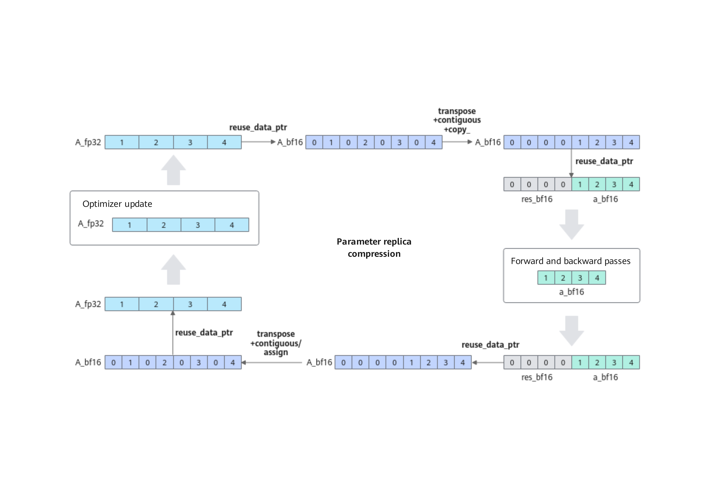

# Parameter Copy Reuse

## Background and Challenges

In large model training scenarios, mixed precision training has become a standard practice, which involves the persistent storage of computational weights and state weights. However, the lifecycle of these two types of weights do not overlap, meaning they can share memory space rather than occupying it independently. Through numerical transformation techniques, we can eliminate this redundancy and achieve efficient resource utilization.

## Solution

Given that in large model mixed precision training, BF16 (Brain Floating Point Format) computational parameters (used for forward and backward computation) and FP32 parameter copies (used for parameter updates) do not need to coexist in memory, and there is a clear numerical correspondence between them, we have designed a memory sharing algorithm to optimize memory usage efficiency.

The specific algorithm steps are as follows:

1. FP32 = BF16 + Residual;
2. Before forward computation: Convert FP32 parameters to BF16 format and save the residual;
3. Before optimizer update: Restore FP32 parameters to their original state based on the BF16 parameters and the previously saved residual, then perform the parameter update;
4. Numerical transformation simulation: Use int32 addition and subtraction operations to equivalently simulate the mutual conversion between FP32 and BF16 in the original logic, following the round-to-nearest-even rule of the IEEE 754 standard.

Refer to the following figure to understand the specific process of parameter copy reuse.

 

The detailed logic of the numerical transformation is shown in the following figure:

### Figure 2 Numerical transformation logic

 

## Application Scenario

This feature is applicable to training scenarios that use the BF16 data format. By reusing FP32 parameter memory, it reduces the memory footprint of weights.

## Usage

To enable parameter copy reuse, add the following parameter configuration to the training script:
`--reuse-fp32-param`

## Application Effects

* For optimizers of the `Float16OptimizerWithFloat16Params` type, the overall static memory savings is sizeof(bfloat16) × model parameter count. Tests on multiple models show that the performance loss is less than 1%.
* For training tasks with distributed optimizer enabled, the total static memory space saved is sizeof(bfloat16) × model parameter count / DP. Similarly, performance loss is also controlled within 1% in tests.

## Usage Constraints

1. When training with a legacy model, `reuse_fp32_param` is currently not supported for use with `--overlap-param-gather`.
2. When using the fused_ema_adamw optimizer, enabling `reuse_fp32_param` simultaneously is not supported.
3. In checkpoint resume scenarios, modifying the sharding strategy or the number of devices is not supported.
