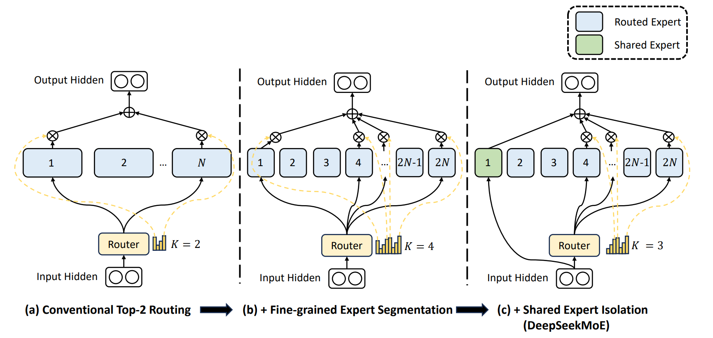

# Shared Experts

## Solution

Large language models face significant computational cost issues when scaling parameter sizes. With the evolution of Mixture of Experts (MoE) models, the concepts of routed experts and shared experts have emerged. For routed experts, input data passes through a routing module that selects experts with higher probabilities for computation; for shared experts, input data does not need to go through the routing module—all data is processed by the shared experts. The computation results of routed experts and shared experts are summed to produce the final output of the MoE module.

## Approach

By combining shared experts with routed experts, the MoE model can attend to both the commonality and specificity of input data across different input scenarios, thereby improving the model's generalization capability.

Some experts are designated as shared experts to capture and integrate common knowledge across different contexts, thereby reducing parameter redundancy in other routed experts.

For more information about shared experts, see [DeepSeekMoE: Towards Ultimate Expert Specialization in Mixture-of-Experts Language Models](https://arxiv.org/pdf/2401.06066).

### Figure 1 Shared expert isolation

## Application Scenario

Usage in MoE scenarios: `--moe-model-type megatron_moe`

## Usage

Shared Expert-related commands and parameter descriptions:

| Command Parameter                     | Description                   |
|--------------------------|------------------------|
| `--n-shared-experts [int]` | Number of shared experts                 |

## Notes

* Enabling shared experts requires mcore mode, meaning `--use-legacy-models` is not set.

* The command parameter for configuring the intermediate hidden layer size of shared experts is the same as that for routed experts: `--ffn-hidden-size [int]`

## Application Effects

By enabling shared experts, parameter redundancy among other routed experts can be reduced, parameter efficiency can be improved, and each routed expert can be ensured to focus on unique aspects.
