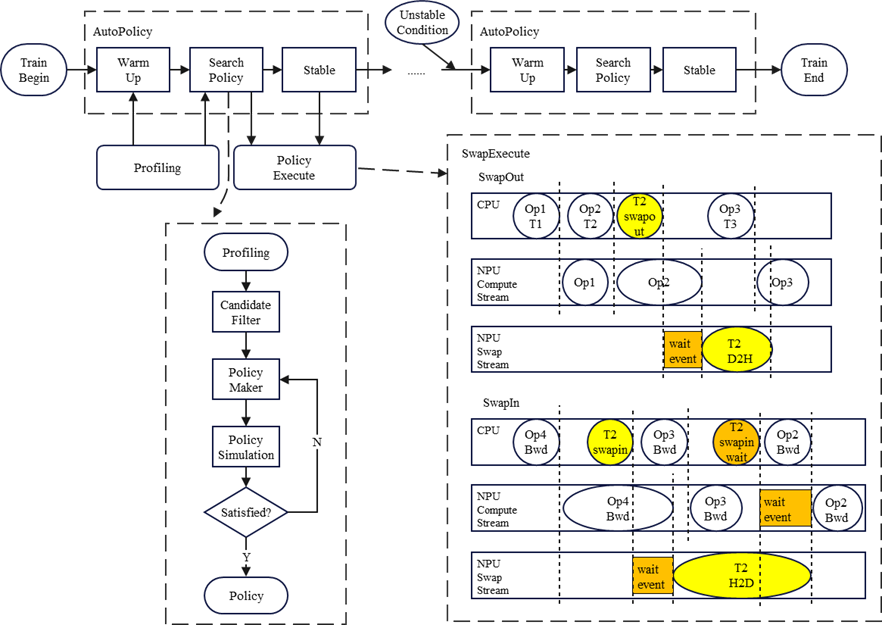

# SmartSwap

## Background and Challenges

For OOM issues encountered during user training, existing memory solutions primarily consist of two approaches: recomputation and swap. Recomputation increases computational overhead, while the swap approach requires users to manually write and control the timing of asynchronous swap-in/swap-out and memory management, significantly increasing usage costs.

## Solution

To maximize the utilization of computing device memory while improving model training performance, we support generating swap policies through adaptive iteration, a feature known as SmartSwap.

This feature iterates through data sampling, policy generation, and policy execution in a loop, selecting the optimal policy under a limited number of validation attempts. The iteration is divided into three phases.

- WarmUp phase: Only data sampling is performed. Tensor lifecycle information is collected for subsequent analysis. During this phase, OOM events are handled by overriding the underlying memory exception, allowing the model to continue running.
- SearchPolicy phase: Both data sampling and policy execution are performed. Policy generation includes steps such as candidate memory filtering, memory policy generation, and memory simulation layout.
- Stable phase: Only policy execution is performed. During policy execution, memory swap is executed asynchronously via multiple streams to mask the time overhead on the computation stream.



## Application Scenario

1. OOM scenario: When an OOM error occurs under the current training configuration, you can enable this feature to intercept the OOM error and automatically generate a Swap policy, allowing training to run within the maximum available video memory.
2. Non-OOM scenario: When no OOM error occurs under the current training configuration, you can enable this feature to automatically generate a Swap policy based on the video memory reduction value in the configuration file, allowing training to run within the specified video memory.
3. Recomputation alternative scenario: Reduce the effective scope of recomputation in the model code, saving the recomputation process.

## Usage

1. Add the enable parameter for this feature in the training script: `--smart-swap`.
2. (Optional) Modify the configuration file `mindspeed/core/memory/smart_swap/swap_policy_config.py` for this feature to debug.
3. Added v2 version to simplify user usage.

```python
self.policy_v2 = True  # True enables it, False disables it
self.policy_pref = SwapPolicyPref.BETTER_PERFORMANCE  # BETTER_PERFORMANCE selects activation, BETTER_MEMORY_SAVING selects both activation and optimizer
self.swap_bucket_size = -1  # Controls the size of each layer's tensor during swap, in bytes. Default is -1, meaning all are selected if less than zero.
self.num_attn_layers_per_stage = 1  # Specifies the granularity of SwapStage partitioning. Default is 1, meaning each SwapStage contains one attention layer.
```

## Application Effects

1. Performance gains are achieved by reducing the number of TP and PP; for example, in llama2 (8p, pp1, seqlen 8K, layer 32), changing tp8 to tp1 yields a 25% performance gain;
2. Performance gains are achieved by disabling or partially disabling full recomputation; for example, in llama2 (8p, pp1, seqlen 16K, layer 40), disabling full recomputation yields a 28% performance gain;

## Notes

1. SmartSwap is adapted for static sequence scenarios; it is not yet adapted for dynamic scenarios, such as MOE-type scenarios.
2. SmartSwap will occupy host memory. For example, on a single node with 8 cards, if each card swaps out `30 GB` to the host, the single node requires at least `8*30=240 GB` of host memory.
3. For custom-compiled cpp operators, a method for manually adding collection hooks is provided. Users need to manually modify the custom operator's cpp code and compilation code, and modify the `LD_LIBRARY_PATH` environment variable in the model training script. Examples are as follows.

- cpp code for custom operator

```cpp
// Example: mindspeed/ops/csrc/cann/gmm.cpp
#include "NPUSwapManager.h"  // NOTE: Add header fileeader file
// ...
std::vector<at::Tensor> npu_gmm(...)
{
    // NOTE: Add a pre-hook before the operator call to set the operator name and operator inputs; if the outputs are the same as the inputs, this can be set in the pre-hook.
    c10_npu::swap::NPUSwapManager::GetInstance().BeginHook("gmm_forward");
    c10_npu::swap::NPUSwapManager::GetInstance().TensorHook(x);
    c10_npu::swap::NPUSwapManager::GetInstance().TensorHook(weight);

    // ...

    ACLNN_CMD(aclnnGroupedMatmulV2, x_, weight_, bias_, scale_real, offset_real, antiquant_scale_real,
              antiquant_offset_real, group_list_real, split_item_value, group_type_value, result);

    // NOTE: Add a post-hook after the operator call to set the operator outputs and the end flag;
    c10_npu::swap::NPUSwapManager::GetInstance().TensorHook(y);
    c10_npu::swap::NPUSwapManager::GetInstance().PostHook();
    c10_npu::swap::NPUSwapManager::GetInstance().EndHook();

    // ...
    return y;
}
```

- Compilation code for custom operators

```python
# Example: mindspeed/op_builder/gmm_builder.py

class GMMOpBuilderPublic(MindSpeedOpBuilder):
    TORCH_MAJOR, TORCH_MINOR = map(int, torch.__version__.split('.')[:2])

    def sources(self):
        return ['ops/csrc/cann/gmm.cpp', 'ops/csrc/flop_counter/flop_counter.cpp']

    def include_paths(self):
        paths = super().include_paths()
        paths += ['ops/csrc/cann/inc']
        paths.append('ops/csrc/pluggable_allocator/smart_swap')  # NOTE: Add the header file path for smart_swap
        return paths

    # ...

    # NOTE: Add compilation linking options
    def extra_ldflags(self):
        flags = super().extra_ldflags()
        import os
        root_extensions_dir = os.environ.get('TORCH_EXTENSIONS_DIR')
        flags += [
            '-L' + f'{root_extensions_dir}/smart_swap/', '-lsmart_swap',
        ]
        return flags
```

- Environment variable modifications for the model training script

```bash
# Example: pretrain_xxx.sh
export TORCH_EXTENSIONS_DIR="/home/xxx/exts/"
export LD_LIBRARY_PATH=${TORCH_EXTENSIONS_DIR}/smart_swap/:${LD_LIBRARY_PATH}
```
