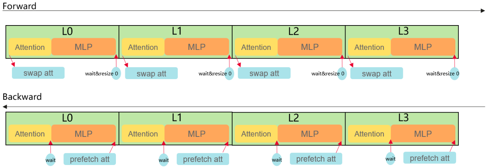
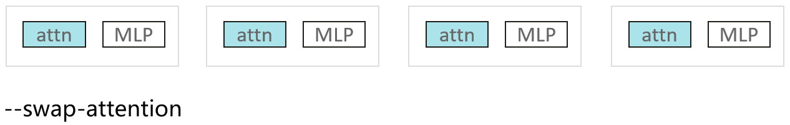
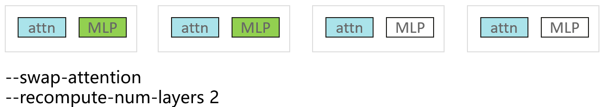

# swap-attention

## Background and Challenges

During large model training, using recomputation can significantly reduce memory usage, but it increases the computation time of the training process, leading to lower execution efficiency.

## Solution

A new swap-attention feature has been added, which uses device memory and CPU memory to store activations. While gradients are back-propagating, activations are prefetched from CPU memory to reduce recomputation, fully leveraging the advantage of high H2D bandwidth to supplement computation with networking and enhance computing power through networking, thereby improving MFU and accelerating large model training.

## Application Scenario

### a. Performance optimization

In scenarios where full recomputation is required, you can replace it by enabling `--swap-attention` and `--recompute-num-layers [int]` to improve performance.

### b. Memory saving

For scenarios where recomputation is not required, enabling only `--swap-attention` can save memory with almost no performance loss, supporting configurations for larger models.

## Usage

The parameter `--swap-attention` needs to be added. The prerequisite is that the flash attention fusion operator is enabled.

Optional parameter `--swap-modules`: The parameter type is string, with a default value of "input_norm,self_attention,post_attention_norm". Modules can be configured according to the model. In mcore scenarios, only the self_attention module is prefetched by default.

### a. Enable prefetch only: `--swap-attention`

When enabled, the activation values of the attention layer in each layer will be prefetched to improve computational efficiency.

### b. Enable prefetching and specify the number of recomputation layers: `--swap-attention` and `--recompute-num-layers [int]`

When enabled, the activation values of the attention layer in each layer will be prefetched, while the fully connected layers of the first [int] layers will be recomputed.

## Application Effects

Compared with full recomputation, it provides performance gains; compared with no recomputation, it provides memory savings.

## Notes

1. The `[int]` in `--recompute-num-layers [int]` refers to the number of layers per pipeline parallel (PP) stage. The value of `[int]` should be less than or equal to `num-layers/pipeline-model-parallel-size`.
2. If performance fluctuations occur, they may be caused by cross-NUMA memory access. You can try to mitigate this by binding processes to cores: `export CPU_AFFINITY_CONF=1,lazy_bind:0`
3. `--swap-attention` is currently incompatible with LoRA fine-tuning.
