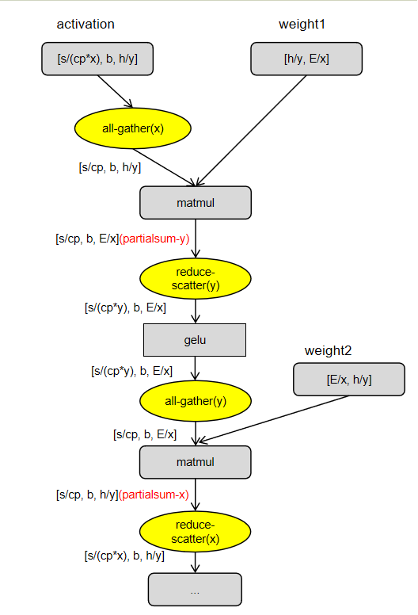

# High-Dimensional Tensor Parallelism

## Background and Challenges

During large model training, tensor parallelism (TP) partitions model parameters across multiple devices to reduce memory usage. To update parameter gradient information during training, allreduce communication must be introduced. When the cluster scale is large, if the TP domain is set to be very large, the communication overhead becomes significant, reducing training efficiency.

## Solution

To improve the communication efficiency of large-scale TP domains, high-dimensional tensor parallelism is adopted. It partitions both activations and parameters across multiple computing devices simultaneously. Compared to 1D-TP, it reduces the communication domain and decreases the number of communication operations, thereby reducing communication time and improving model training performance.

### Approach

#### 2D Tensor Parallelism Strategy

Given a TP domain size, by establishing multiple communication domains, a new sharding dimension is added to the original Megatron (`ColumnParallelLinear`, `RowParallelLinear`). The original TP communication domain is decomposed into two sub-communication domains, `tp_x` and `tp_y`, which must satisfy `tp = tp_x * tp_y`. Taking the MLP layer as an example, the implementation process is as follows:

#### Distributed Normalization

In transformer networks, normalization transforms the inputs of each layer's neurons to have the same mean and variance, accelerating convergence. When 2D tensor parallelism is applied to MLP and attention layers respectively, their inputs and outputs are partitioned along the first-dim by tp_x and the last-dim by tp_y. If the original LayerNorm or RMSNorm is used directly, all-gather(x) along the first-dim and all-gather(y) along the last-dim must be performed on the input first to ensure data integrity. To improve performance in this part, distributed normalization is adopted. Its processing flow is as follows:

##### **Step 1: Calculate the sum of the input**

First, calculate the sum of the input tensor $\mathbf{x}$ along the last dimension:

$$
e_x = \sum_{i=1}^{H} x_i
\
$$

##### **Step 2: Distributed reduction operation (All-Reduce)**

Perform a reduction (summation) of the sum $e_x$ from step 1 across all processes in the tp_y communication domain, ensuring that each process has the global sum for its communication domain:
$$
\
e_x^{\text{global}} = \text{AllReduce}\left( e_x \right) = \sum_{p=1}^{P} \sum_{i=1}^{H} x_i^{(p)}
\
$$

Where:

- $P$ is the number of distributed processes.
- $x_i^{(p)}$ represents the value of the $i$-th element in the $p$-th process.

##### **Step 3: Calculate the sum of squares of the input elements**

Next, calculate the sum of squares for each element of the input tensor:

$$
s_x = \sum_{i=1}^{H} x_i^2
$$

##### **Step 4: Perform distributed reduction operation (All-Reduce)**

Perform a reduction (summation) of the sum of squares $s_x$ from Step 3 across all processes in the tp_y communication domain, ensuring that each process has the global sum of squares for its communication domain:

$$
s_x^{\text{global}} = \text{AllReduce}\left( s_x \right) = \sum_{p=1}^{P} \sum_{i=1}^{H} \left( x_i^{(p)} \right)^2
$$

##### **Step 5: Center the input data**

Center the input data $\mathbf{x}$ by subtracting the mean. The mean $\mu$ is calculated as follows:

$$
\mu = \frac{e_x^{\text{global}}}{H}
$$

Then, center the input:

$$
x'_i = x_i - \mu \quad \forall i \in \{1, 2, \dots, H\}
$$

##### **Step 6: Calculate the square of the sum**

Calculate the square of the global sum:

$$
e_x'^2 = \left( e_x^{\text{global}} \right)^2
$$

##### **Step 7: Calculate the normalization factor**

Calculate the normalization factor $\gamma$, which is used to normalize the input data. The formula is as follows:

$$
\gamma = \frac{1}{\sqrt{ \left( \frac{s_x^{\text{global}}}{H} \right) - e_x'^2 + \epsilon }}
$$

Where:

- $\frac{s_x^{\text{global}}}{H}$ is the mean of the global sum of squares.
- $e_x'^2$ is the square of the global sum.
- $\epsilon$ is a small constant to prevent division by zero and improve numerical stability.

##### **Step 8: Normalize the input data**

Multiply the centered input data $\mathbf{x}'$ by the normalization factor $\gamma$ to obtain the normalized data $\mathbf{\hat{x}}$:

$$
\hat{x}_i = x'_i \cdot \gamma \quad \forall i \in \{1, 2, \dots, H\}
$$

##### **Step 9: Apply weights and biases**

Finally, multiply the normalized data by the weight vector $\mathbf{W}$, and determine the final output based on whether a bias vector $\mathbf{b}$ exists.

- **If bias exists**:

$$
\text{output}_i = b_i + W_i \cdot \hat{x}_i \quad \forall i \in \{1, 2, \dots, H\}
$$

- **If no bias exists**:

$$
\text{output}_i = W_i \cdot \hat{x}_i \quad \forall i \in \{1, 2, \dots, H\}
$$

## Application Scenario

When the TP communication domain needs to be set to a large size, communication efficiency becomes low, and it is necessary to decompose the communication domain to improve its communication efficiency.

## Usage

Add `--tp-2d` to the parameter list of the training script to enable 2D tensor parallelism. Use `--tp-x N1` and `--tp-y N2` to set the split sizes for the x-axis and y-axis respectively, where `tp = N1 * N2` (N1 > 1, N2 > 1) must be satisfied.

Other optimization parameters, used to assist the high-dimensional tensor parallelism feature with communication overlap, take effect only when tp-2d is enabled:

- `--enable-overlap-ag-with-matmul`: During the forward computation of linear layers, overlap all-gather communication with matmul computation to hide communication latency and accelerate training.
- `--enable-overlap-matmul-with-rs`: During the forward computation of the linear layer, enables the overlapping of matmul computation and reduce-scatter communication to accelerate the process.
- `--coc-fused-kernel`: During the forward computation of the linear layer, enables the computation-communication fused kernel, which performs operator-level fusion of matmul computation with both all-gather and reduce-scatter to achieve further acceleration. (This feature is not compatible with the previous two features and depends on the ATB acceleration library.)
- `--enable-backward-overlap-ag-with-matmul`: During the backward computation of gradients for the linear layer, enables the overlapping of all-gather communication and matmul computation to accelerate the process. (This feature depends on the ATB acceleration library.)

Only one of the three forward computation optimization parameters mentioned above, `--enable-overlap-ag-with-matmul`, `--enable-overlap-matmul-with-rs`, and `--coc-fused-kernel`, can be enabled at a time.

Notes:
The current high-dimensional tensor parallelism feature is not compatible with features such as `--sequence-parallel`, `--use-fused-rmsnorm`, and MoE. Please adjust the configuration according to the actual situation.

## Application Effects

When training the llama3-405B model with tp=16, enabling 2D tensor parallelism with `tp_x=8` and `tp_y=2` improves performance by over 5% compared to the original Megatron 1D tensor parallelism. After enabling coc-fused-kernel and enable-backward-overlap-ag-with-matmul communication-computation fusion optimizations, performance is further improved by over 5%. In other scenarios, due to differences in computational efficiency and communication group partitioning, configuration must be based on actual tuning of `tp_x` and `tp_y`, and some configurations may not guarantee efficiency improvements.
