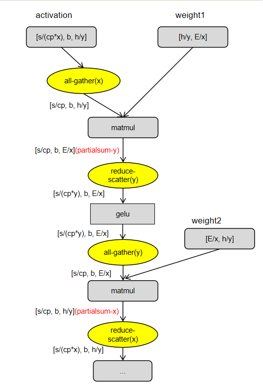

# High-Dimensional Tensor Parallelism

## Background and Challenges

During large model training, tensor parallelism (TP) partitions model parameters across multiple devices to reduce memory usage. During the training process, AllReduce communication is required to update parameter gradients and other information. When the cluster scale is large, if the TP domain is set to be very large, its communication overhead becomes substantial, thereby reducing training efficiency.

## Solution

To improve the communication efficiency of large-scale TP domains, high-dimensional tensor parallelism is adopted, which partitions both activations and parameters onto multiple compute devices simultaneously. Compared with 1D-TP, it reduces the communication domain and the number of communication operations, thereby shortening communication time and improving model training performance.

**2D Tensor Parallelism**

Given the TP domain size, an additional partitioning dimension is introduced on top of the original Megatron (`ColumnParallelLinear`, `RowParallelLinear`) by establishing multiple communication domains. The original TP communication domain is decomposed into two sub-communication domains, `tp_x` and `tp_y`, which must satisfy `tp = tp_x * tp_y`. Taking the MLP layer as an example, its implementation process is as follows:

**Distributed Normalization**

In transformer networks, normalization converts the input of each layer's neurons into data with uniform mean and variance, thereby accelerating convergence. When 2D tensor parallelism is applied to the MLP and attention layers respectively, their inputs and outputs are partitioned along the first-dim by `tp_x` and along the last-dim by `tp_y`. If the original LayerNorm or RMSNorm continues to be used, all-gather(x) along the first-dim and all-gather(y) along the last-dim must first be performed on the input to ensure the integrity of the input data. To improve the performance of this part, distributed normalization is adopted. Its processing flow is as follows:

 1. Compute the total sum of the input.
    First, compute the sum of the input tensor $\mathbf{x}$ over the last dimension:
    $$e_x = \sum_{i=1}^{H} x_i$$

 2. Conduct the distributed reduction operation (All-Reduce).
    Reduce the sum $e_x$ from step 1 across all processes in the `tp_y` communication domain (summation), ensuring that each process obtains the global sum of its communication domain:
    $$e_x^{\text{global}} = \text{AllReduce}\left( e_x \right) = \sum_{p=1}^{P} \sum_{i=1}^{H} x_i^{(p)}$$
    where:
        - $P$ is the number of distributed processes.
        - $x_i^{(p)}$ denotes the value of the $i$-th element in the $p$-th process.

 3. Compute the sum of squares of the input elements.
    Next, compute the sum of squares of each element of the input tensor:
    $$s_x = \sum_{i=1}^{H} x_i^2$$

 4. Conduct the distributed reduction operation (All-Reduce).
    Reduce (sum) the sum of squares $s_x$ from step 3 across all processes in the tp_y communication domain, ensuring that each process obtains the global sum of squares for its communication domain:
    $$s_x^{\text{global}} = \text{AllReduce}\left( s_x \right) = \sum_{p=1}^{P} \sum_{i=1}^{H} \left( x_i^{(p)} \right)^2$$

 5. Center the input data.
    Center the input data $\mathbf{x}$ by subtracting the mean. The mean $\mu$ is computed as follows: $$\mu = \frac{e_x^{\text{global}}}{H}$$
    Then, center the input:
    $$x'_i = x_i - \mu \quad \forall i \in \{1, 2, \dots, H\}$$

 6. Compute the square of the mean.
    Compute the square of the global mean:
        $$
        e_x'^2 = \left( \frac{e_x^{\text{global}}}{H} \right)^2
        $$

 7. Compute the normalization factor.
    Compute the normalization factor $\gamma$, which is used to standardize the input data. The formula is as follows: $$\gamma = \frac{1}{\sqrt{ \left( \frac{s_x^{\text{global}}}{H} \right) - \left( \frac{e_x^{\text{global}}}{H} \right)^2 + \epsilon }}$$
    Where:
        - $\frac{s_x^{\text{global}}}{H}$ is the mean of the global sum of squares.
        - $\left( \frac{e_x^{\text{global}}}{H} \right)^2$ is the square of the global mean.
        - $\epsilon$ is a small constant that prevents division by zero and improves numerical stability.

 8. Normalize the input data.
    Multiply the centered input data $\mathbf{x}'$ by the normalization factor $\gamma$ to obtain the normalized data $\mathbf{\hat{x}}$:
    $$\hat{x}_i = x'_i \cdot \gamma \quad \forall i \in \{1, 2, \dots, H\}$$

 9. Apply weights and biases.
    Finally, multiply the normalized data by the weight vector $\mathbf{W}$, and determine the final output based on whether a bias vector $\mathbf{b}$ exists.
        - If a bias exists: $$\text{output}_i = b_i + W_i \cdot \hat{x}_i \quad \forall i \in \{1, 2, \dots, H\}$$
        - If no bias exists: $$\text{output}_i = W_i \cdot \hat{x}_i \quad \forall i \in \{1, 2, \dots, H\}$$

## Application Scenario

When the TP communication domain needs to be set to a large size, communication efficiency becomes low, and the communication domain needs to be decomposed to improve its communication efficiency.

## Usage

Add `--tp-2d` to the parameter list of the training script to enable 2D tensor parallelism. `--tp-x N1` and `--tp-y N2` set the partition sizes along the x-axis and y-axis respectively, where `tp = N1 * N2` must be satisfied (`N1 > 1`, `N2 > 1`).

Other optimization parameters, used to assist the high-dimensional tensor parallelism feature with communication hiding, take effect only when tp-2d is enabled:

- `--enable-overlap-ag-with-matmul`: During the forward computation of the linear layer, enables overlapping of all-gather communication with matmul computation for acceleration.
- `--enable-overlap-matmul-with-rs`: During the forward computation of the linear layer, enables overlapping of matmul computation with reduce-scatter communication for acceleration.
- `--coc-fused-kernel`: During the forward computation of the linear layer, enables the computation-communication fused kernel, which performs operator-level fusion of the matmul computation with all-gather and reduce-scatter to achieve further acceleration (this feature is not compatible with the previous two features and depends on the ATB acceleration library).
- `--enable-backward-overlap-ag-with-matmul`: During the backward computation of gradients in the linear layer, enables the overlapping of all-gather communication with matmul to hide the communication latency and accelerate computation (this feature depends on the ATB acceleration library).

Among the three forward computation optimization parameters above, `--enable-overlap-ag-with-matmul`, `--enable-overlap-matmul-with-rs`, and `--coc-fused-kernel`, only one can be enabled at a time.

> [!NOTE]
>
> The current high-dimensional tensor parallelism feature is not compatible with `--sequence-parallel`, `--use-fused-rmsnorm`, MoE, and other features. Please adjust the configuration according to the actual situation.

## Effects

When training the Llama-3-405B model with tp=16, enabling 2D tensor parallelism with `tp_x=8` and `tp_y=2` improves performance by over 5% compared with the original Megatron 1D tensor parallelism.
After enabling the `coc-fused-kernel` and `enable-backward-overlap-ag-with-matmul` communication-computation fusion optimizations, performance is further improved by over 5%.
In other scenarios, due to differences in computation efficiency and communication group partitioning, configuration must be based on the actual tuning of `tp_x` and `tp_y`, and some configurations cannot guarantee efficiency improvement.
