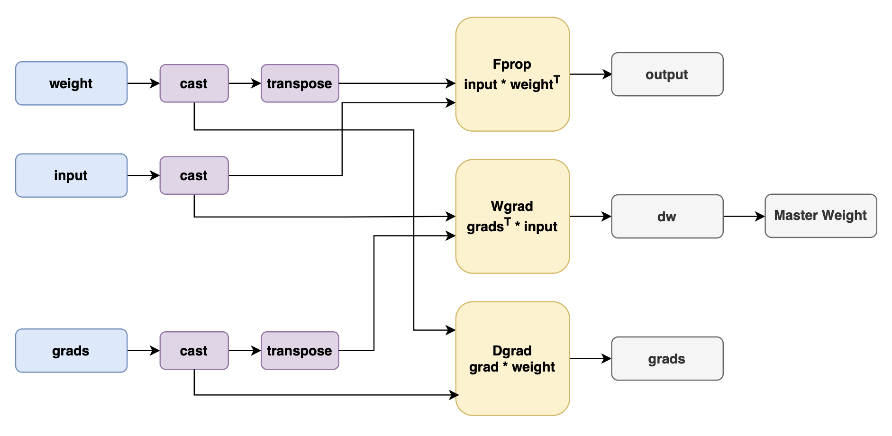

# Megatron Transformer-Engine

## Background and Challenges

Transformer Engine (TE) is a library specifically designed to accelerate the training and inference of models based on the Transformer architecture. Several current third-party frameworks rely on the APIs provided by this acceleration library for inference and training, and MindSpeed needs to provide equivalent support for these requirements.
TE supports enabling 8-bit floating point (FP8) operations on the Ascend NPU hardware platform, delivering better performance with lower memory usage. TE provides typical modules for Transformer structures, as well as components such as a low-precision state manager, which can seamlessly replace large models built on Megatron-LM to achieve low-precision training.
The TE module provided by MindSpeed can seamlessly replace the TE module provided by NVIDIA, making it easier to build Transformer layer modules. TE internally maintains the scaling factors and other low-precision training state values required for low-precision training, helping users migrate more easily from mixed-precision training to low-precision training.
In addition, the TE module provided by MindSpeed also includes an implementation of Communication Over Computation, which splits tasks that should originally be executed serially for communication and computation into finer-grained subtasks, thereby overlapping computation and communication to improve efficiency and increase model throughput.

## Solution

To ensure compatibility with third-party frameworks' dependencies on Megatron-TE related APIs and facilitate model inference and training on NPUs, MindSpeed provides equivalently abstracted TE APIs for the Ascend NPU.
The APIs currently provided by MindSpeed are:

- MindSpeedTELayernorm
- MindSpeedTELayerNormColumnParallelLinear
- MindSpeedTEGroupedLinear
- TEColumnParallelLinear
- TERowParallelLinear

In the low-precision training process, the GEMM operations in forward propagation (Fprop), activation backward propagation (Dgrad), and weight backward propagation (Wgrad) are quantized to FP8 precision for execution.
The overall network training process still follows the BF16/FP16 AMP mixed precision training flow, but specific computation operators perform calculations at FP8 precision, primarily the Matmul computations in the Linear layer, including Fprop, Dgrad, and Wgrad.
During the process of quantizing high-precision tensors to low precision, different scaling strategies exist:

- Delayed Scaling: Calculates the scaling factor based on historical amax values, then uses the scaling factor to quantize the tensor.
- Tensorwise Scaling: An online strategy that computes amax in real time and applies the scaling factor to quantize the tensor.
- Blockwise Scaling: Divides the tensor into blocks, then computes amax for each block and applies the scaling factor to quantize the tensor.
- MX Scaling: Converts floating-point vectors into MX blocks by combining block-level shared scales with low-bit-width elements, achieving dynamic quantization.

Supported low-precision data formats include:

- E4M3: 1 sign bit, 4 exponent bits, 3 mantissa bits, with a representable range of -448 to +448.
- E5M2: 1 sign bit, 5 exponent bits, 2 mantissa bits, with a representable range of -57344 to +57344.
- HiF8: 1 sign bit, dynamic dot bits, exponent bits, and mantissa bits, with a maximum representable value of 2E15.

## Application Scenario

When model training, inference, and third-party frameworks need to use related APIs, use the Megatron transformer_engine related APIs.

## Usage

Set `--transformer-impl transformer_engine` in the script to use the TE branch. Consistent with Megatron, the default value of this parameter is set to `transformer_engine`. To revert to earlier version behavior, additionally set `--transformer-impl local` in the script.
Set `--fp8-format e4m3` to select the low-precision data format. Currently, `e4m3`, `hybrid`, and `hif8` are supported. When `hybrid` is enabled, the E4M3 data format is used for forward training, and the E5M2 data format is used for backward propagation.
Set `--fp8-recipe delayed` to select the low-precision training scaling strategy. Currently, `tensorwise`, `delayed`, `mxfp8`, and `blockwise` are supported, with the default value being `delayed`.

## Notes

- `MindSpeedTELayerNormColumnParallelLinear` supports simultaneous enabling with `ascend-mc2`, but does not support simultaneous enabling with `ascend-coc`.
- `MindSpeedTEGroupedLinear` may fail in scenarios with partially reconstructed GMM features, such as 1f1b-overlap.
- Currently, low-precision GMM does not support blockwise scenarios. In other supported strategy scenarios, low-precision training automatically enables low-precision GMM computation. If you do not need to enable it, you can use the parameter `--no-use-gmm-fp8`.
- Low-precision training only supports mcore models, meaning you need to enable `--use-mcore-models`.
- HiF8 data format training only supports the tensorwise strategy, meaning you need to enable `--fp8-recipe tensorwise`.
- Currently, __low-precision communication-computation fusion__ is not supported.
- When using transformer_engine, `--use-flash-attn` must also be enabled

## Parameter Combination Restrictions

<table><thead>
  <tr>
    <th width='120'>TE module feature</th>
    <th>How to enable</th>
    <th>Supported</th>
  </tr></thead>
<tbody>
  <tr>
    <td rowspan="5">Low-precision training</td>
    <td rowspan="5">--transformer-impl transformer_engine
      --fp8-format e4m3/hybrid/hif8
      --fp8-recipe tensorwise/delayed/mxfp8/blockwise </td>
    <td style="text-align: center; vertical-align: middle">✅</td>
  </tr>
</tbody>
<tbody>
  <tr>
    <td rowspan="5">Communication overlapping with computation</td>
    <td rowspan="5">--transformer-impl transformer_engine
      --use-ascend-mc2 </td>
    <td style="text-align: center; vertical-align: middle">✅</td>
  </tr>
  </tbody>
  <tr>
    <td rowspan="5">Low-precision communication-computation parallel</td>
    <td rowspan="5">--transformer-impl transformer_engine
      --fp8-format e4m3/hybrid/hif8
      --fp8-recipe tensorwise/delayed/mxfp8/blockwise
      --use-ascend-mc2 </td>
    <td style="text-align: center; vertical-align: middle">❌</td>
  </tr>
</table>

## Related Feature References

The TE module provides the underlying low-precision (FP8) computation foundation for models. If you are focusing on the overall solution for low-precision training or low-precision adaptation under specific parallel architectures, please refer to the following related feature documentation:

- [MindSpeed FP8 Zero-Redundancy Weight Architecture Design](mxfp8/Zero_Redundancy_Weight.md): Learn how to further release bf16 weights based on TE to save memory.
