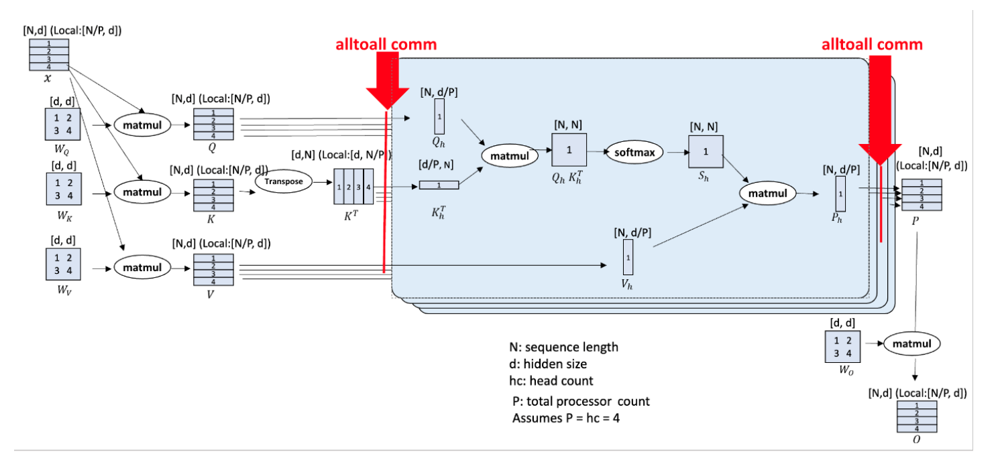

# Ulysses Long-Sequence Parallelism

## Background and Challenges

With the rapid advancement of AI technology, particularly in the fields of generative AI and scientific research models, the importance of long-sequence training has become increasingly prominent. Whether in complex scenarios such as conversational AI, long document summarization, or video content generation, systems are required to effectively reason over long contexts across vast spatial and temporal dimensions. Furthermore, the summarization of massive texts at the chapter or book level, involving the processing of tens or even hundreds of thousands of words, poses severe challenges for conversational AI and summarization tasks. Traditional parallel processing methods, such as data, tensor, and pipeline parallelism, face significant limitations when handling long sequences. These methods often fail to scale effectively to accommodate increases in sequence dimensions, thereby impacting overall system performance and efficiency.

Specifically, traditional parallel methods may encounter the following issues when processing long sequences:

- Memory constraints: As sequence length increases, the memory resources required by the system grow exponentially, leading to out-of-memory conditions.

- Computational efficiency: Processing long sequences often requires substantial computational resources, and traditional parallel methods may fail to fully utilize these resources, resulting in low computational efficiency.

- Communication overhead: In distributed systems, processing long sequences may involve communication between multiple nodes, and traditional parallel methods can incur significant communication overhead, impacting overall performance.

Ulysses long-sequence parallelism is an innovative solution designed to address the above challenges. It effectively overcomes memory limitations, improves computational efficiency, and reduces communication overhead, thereby significantly enhancing the capability of long-sequence processing.

## Solution

The Ulysses long-sequence parallelism solution is supported to address the sequence dimension scaling problem.

### Approach

First, Ulysses partitions each sample along the sequence dimension across the participating compute devices. Then, before attention computation, an all-to-all communication operation is performed on the partitioned queries (Q), keys (K), and values (V), so that each compute device receives the complete sequence but only for a non-overlapping subset of attention heads. This allows the participating compute devices to compute different attention heads in parallel. Finally, Ulysses can use another all-to-all operation to gather the results across attention heads while simultaneously re-partitioning along the sequence dimension.
For specific details, refer to the paper [DeepSpeed Ulysses: System Optimizations for Enabling Training of Extreme Long Sequence Transformer Models](https://arxiv.org/pdf/2309.14509). The execution flow is shown in the following figure:

#### Figure 1 Ulysses partitioning principle

 

## Application Scenario

num-attention-heads must be divisible by tensor-model-parallel-size × context-parallel-size.

- num-attention-heads: the number of attention heads
- tensor-model-parallel-size: the tensor model parallel size
- context-parallel-size: the context parallel size

### Notes

For non-group-query-attention scenarios with sequences under 32k, enabling Ulysses long-sequence parallelism is recommended.

## Usage

<table>
  <thead>
    <tr>
      <th width="200">Key parameter</th>
      <th>Description</th>
    </tr>
  </thead>
  <tbody>
    <tr>
      <td>--context-parallel-size [int]</td>
      <td>Required. Sets the context parallel size. Defaults to 1. Configure based on user requirements.</td>
    </tr>
    <tr>
      <td>--context-parallel-algo <b>ulysses_cp_algo</b></td>
      <td>        Optional. Sets the context parallel algorithm. 
        <b>ulysses_cp_algo</b>: Enables Ulysses context parallelism. This is the default value. 
        hybrid_cp_algo: Enables Hybrid context parallelism. 
        megatron_cp_algo: Enables Ring Attention context parallelism.
      </td>
    </tr>
  </tbody>
</table>

## Application Effects

By partitioning the input sequence across multiple compute devices, the memory consumption of a single device is reduced. Compared to not enabling sequence parallelism, the per-step time increases, but computational efficiency is improved compared to recomputation.

## Acknowledgments

1. GitHub project address:
<https://github.com/microsoft/DeepSpeed/tree/master/blogs/deepspeed-ulysses>
