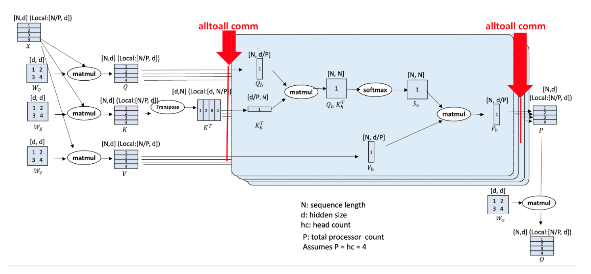

# Ulysses Long-Sequence Parallelism

## Background and Challenges

With the rapid advancement of generative AI and scientific research models, long-sequence training has become a critical driver. From conversational AI and long-document summarization to video generation, systems are required to perform effective reasoning over long contexts across broad spatial and temporal dimensions. In particular, when dealing with massive texts at the chapter or even book level — spanning tens of thousands to hundreds of thousands of words — traditional conversational AI and summarization tasks are facing significant challenges. However, conventional parallel processing approaches such as data, tensor, and pipeline parallelism encounter substantial limitations when handling long sequences. These methods often fail to scale effectively with increasing sequence dimensions, thereby impacting overall system performance and efficiency.

Specifically, traditional parallel methods may encounter the following issues when processing long sequences:

- Memory constraints: As sequence length increases, the memory resources required by the system grow exponentially, leading to out-of-memory conditions.

- Computational efficiency: Processing long sequences often requires substantial computational resources, and traditional parallel methods may fail to fully utilize these resources, resulting in low computational efficiency.

- Communication overhead: In distributed systems, processing long sequences may involve communication between multiple nodes, and traditional parallel methods can incur significant communication overhead, impacting overall performance.

Ulysses long-sequence parallelism is an innovative solution designed to address the above challenges. It effectively overcomes memory limitations, improves computational efficiency, and reduces communication overhead, thereby significantly enhancing the capability of long-sequence processing.

## Solution

The Ulysses long-sequence parallelism solution is supported to address the sequence dimension scaling problem.

First, Ulysses partitions each sample along the sequence dimension across the participating compute devices. Then, before attention computation, an all-to-all communication operation is performed on the partitioned queries (Q), keys (K), and values (V), so that each compute device receives the complete sequence but only for a non-overlapping subset of attention heads. This allows the participating compute devices to compute different attention heads in parallel. Finally, Ulysses can use another all-to-all operation to gather the results across attention heads while simultaneously re-partitioning along the sequence dimension.

For specific details, refer to the paper [DeepSpeed Ulysses: System Optimizations for Enabling Training of Extreme Long Sequence Transformer Models](https://arxiv.org/pdf/2309.14509). The execution flow is shown in the following figure:

Figure 1 Ulysses partitioning principle

 

## Application Scenario

`--num-attention-heads` must be divisible by `--tensor-model-parallel-size * --context-parallel-size`.

* `--num-attention-heads`: the number of attention heads
* `--tensor-model-parallel-size`: the tensor parallel size
* `--context-parallel-size`: the context parallel size

> [!NOTE]
>
> - For group-query-attention models, ensure that `num_attention_heads` is divisible by `num_query_groups`.
> - For non-group-query-attention scenarios with sequence length below 32k, enabling Ulysses long-sequence parallel is recommended.

## Usage

<table>
  <thead>
    <tr>
      <th width="240">Important Parameter</th>
      <th>Parameter Description</th>
      <th>Required</th>
      <th>Default Value</th>
    </tr>
  </thead>
  <tbody>
    <tr>
      <td><code>--context-parallel-size [int]</code></td>
      <td>Sets the long-sequence parallel size. Configure according to user requirements.</td>
      <td>No</td>
      <td>1</td>
    </tr>
    <tr>
      <td><code>--context-parallel-algo</code></td>
      <td>
        Long-sequence parallel algorithm options:
        <ul>
          <li><b><code>ulysses_cp_algo</code></b>: Enables Ulysses long-sequence parallelism</li>
          <li><code>hybrid_cp_algo</code>: Enables Hybrid long-sequence parallelism</li>
          <li><code>megatron_cp_algo</code>: Enables Ring Attention long-sequence parallelism</li>
        </ul>
      </td>
      <td>No</td>
      <td>megatron_cp_algo</td>
    </tr>
  </tbody>
</table>

## Effects

By partitioning the input sequence across multiple compute devices, the memory consumption of a single device is reduced. Compared to not enabling sequence parallelism, the per-step time increases, but computational efficiency is improved compared to recomputation.
