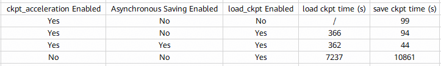

# Checkpoint Read/Write Performance Optimization in Verl+Megatron Post-Training

## Background and Challenges

In the current post-training scenario using the Verl+Megatron backend, saving and loading checkpoints takes a long time, which affects training efficiency.

## Solution

To address the above issue, the most time-consuming validation logic in native Megatron and Torch has been skipped. Users can control whether to skip this validation to accelerate checkpoint loading and saving through a parameter.

## Application Scenario

* Post-training with the verl+megatron backend

## Usage

Add the following parameter to the training script to enable ckpt load and save acceleration:
`+actor_rollout_ref.actor.megatron.override_transformer_config.ckpt_acceleration=True`

## Application Effects

The above approach significantly improves the efficiency of loading and saving checkpoints in the verl+megatron backend. The measured results in a qwen3-30b-dapo scenario with 16 GPUs × 2 nodes are as follows:

