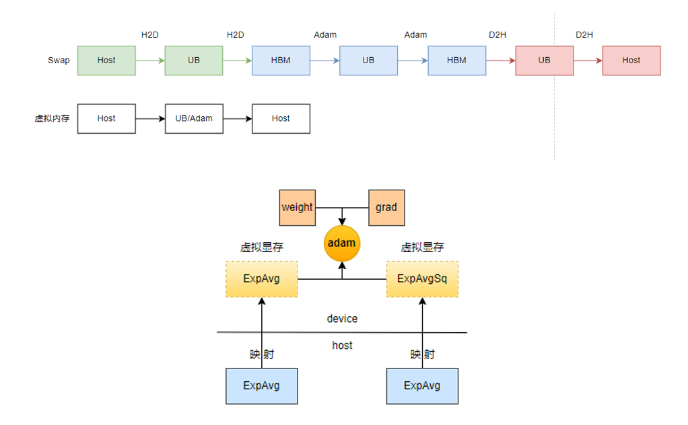

# Virtual Optimizer

## Background and Challenges

In large-scale cluster training, increasing pipeline parallelism (PP) imposes significant memory pressure on the earlier stages. At the same time, we observe that when gradient accumulation is increased, the overhead of swapping the first-order and second-order momentum in the optimizer section is negligible. Therefore, the device memory of the optimizer section can be swapped to the CPU to save overall network memory. However, the current distributed optimizer logic is complex and coupled with various communication parallelisms (such as overlap-grad-reduce and overlap-param-gather), making it quite complicated to implement a system for swapping optimizer memory.

## Solution

To avoid introducing a complex swap system engineering effort and the additional memory and performance overhead brought by multiple streams, we leverage the native virtual memory capability of the Ascend driver. This allows us to create a tensor whose actual memory resides on the host side but whose memory address can be mapped to the device. This tensor can participate in the computation of most NPU operators (except those involving in-line computation). Based on this, we can implement the swap functionality for optimizer momentum by modifying just a single line of code:

```python

# before
...
state['exp_avg'] = torch.zeros_like(p, memory_format=torch.preserve_format)
state['exp_avg_sq'] = torch.zeros_like(p, memory_format=torch.preserve_format)
...

# after
...
state['exp_avg'] = torch_npu.empty_with_swapped_memory(p.size(), device=p.device)
state['exp_avg_sq'] = torch_npu.empty_with_swapped_memory(p.size(), device=p.device)
...
```

## Comparison with Swapping

The following diagram provides a comparative illustration:



**Advantage analysis**:

- Virtual memory can save the time of two UB-to-HBM transfers, performing access directly from the hardware execution.
- Transfers based on virtual memory can leverage the operator's own pipeline mechanism (MTE2/MTE3/Vector), achieving instruction-level parallelism masking with computation and avoiding the additional stream synchronization performance and memory overhead introduced by methods like Swap (e.g., the multiple streams introduced by Swap).

**Disadvantage**: The allocated host virtual memory cannot perform on-the-fly computation (as there is no hardware on-the-fly computation unit).

## Usage

When you need to swap the memory of the optimizer section, there are several scenarios:

1. If you want to swap all first-order and second-order momentums, you can specify `--virtual-optimizer all`.
2. If you want each PP stage to swap the same amount of memory (for example, you want each stage to swap 2 GB of memory), you can specify `--virtual-optimizer 2.0`.
3. If you want each PP stage to swap different amounts of memory (assuming there are four PP stages, and you want to swap 6, 5, 4, and 3 GB of memory respectively), you can specify `--virtual-optimizer 6 5 4 3`.

Recommended Configuration

```bash
export CPU_AFFINITY_CONF=1,lazy_bind:0
```

This configuration enables the coarse-grained core binding mode, which binds tasks to the NUMA CPU cores corresponding to the NPU. This effectively avoids cross-NUMA memory access and reduces scheduling overhead, thereby improving computational stability and performance.

## Notes

- Due to driver limitations, tensors allocated as virtual memory cannot be directly accessed, and therefore cannot be directly printed or saved. When you need to save or print them, you can use the following functions to access tensors in virtual memory. (Note: Saving and loading for the optimizer section has already been adapted.)

```python
def swap_tensor_copy_wrapper(func):
    def wrapped(*args, **kwargs):
        dst, src = args[0], args[1]
        dst_swap, src_swap = is_swap_tensor(dst), is_swap_tensor(src)
        if dst_swap or src_swap:
            if dst.device == src.device:
                dst.fill_(1).mul_(src)
            elif dst_swap:
                src_npu = src.to(dst.device)
                dst.fill_(1).mul_(src_npu)
            elif src_swap:
                src_npu = torch.ones_like(src).mul(src)
                dst.copy_(src_npu)
            else:
                raise TypeError
        else:
            func(*args, **kwargs) # copy_
    return wrapped


def swap_tensor_func_wrapper(org_func, func_type):
    def wrapped(*args, **kwargs):
        if is_swap_tensor(args[0]):
            if func_type == "detach":
                detach = org_func(*args, **kwargs)
                setattr(detach, "swap_tensor", True)
                setattr(detach.data, "swap_tensor", True)
                return detach
            src = torch.empty_like(args[0])
            src.copy_(args[0])
            if func_type == "cpu":
                return src.cpu()
            elif func_type == "npu" or func_type == "clone":
                return src
            else:
                raise ValueError(f"func_type {func_type} not supported")
        else:
            return org_func(*args, **kwargs)
    return wrapped

p = torch.randn(100).npu()
exp_avg_swap = torch_npu.empty_with_swapped_memory(p.size(), device=p.device)
setattr(exp_avg_swap, "swap_tensor", True)

torch.Tensor.copy_ = swap_tensor_copy_wrapper(torch.Tensor.copy_)
torch.Tensor.cpu = swap_tensor_func_wrapper(torch.Tensor.cpu, "cpu")
exp_avg_cpu = exp_avg_swap.cpu()
print(f"exp_avg_cpu: {exp_avg_cpu}")
```

- This feature depends on the latest Driver (25.0.RC1) / CANN (8.1.RC1) / PTA (commercial release Q2 2025).
