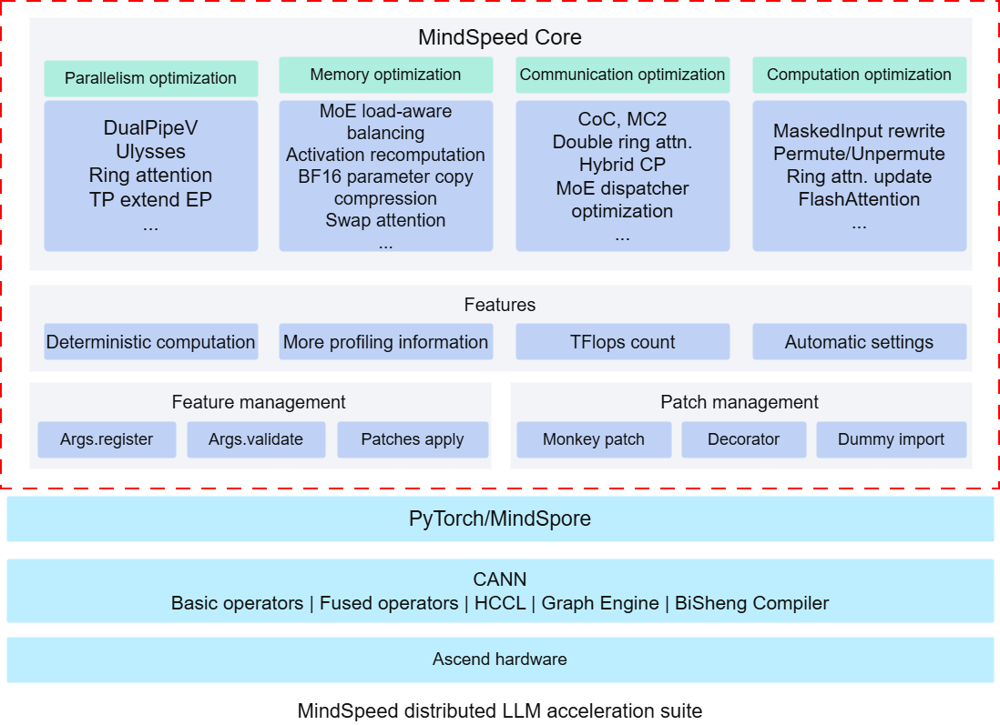

# Introduction

## Overview

MindSpeed Core is an acceleration library for large models on Huawei Ascend devices. Large model training is a highly complex process involving numerous technologies and challenges. A key difficulty is that large model training requires substantial device memory resources, posing a significant challenge for compute cards. To address the issue of insufficient device memory on a single compute card, the industry has developed third-party large model acceleration libraries such as Megatron and DeepSpeed. These libraries partition models and input data, distribute them across different compute cards, and then aggregate the results through collective communication. Ascend provides the MindSpeed Core acceleration library to enable rapid migration of customer large model services to Ascend devices, with support for Ascend-specific algorithms to ensure out-of-the-box usability.

## MindSpeed Core Architecture

The overall architecture of MindSpeed Core is illustrated in the figure below, which is divided into three layers:

- Acceleration features:
Provides a rich variety of acceleration features across multiple dimensions such as parallelism, memory, communication, and computation.
Features are designed with cohesion and decoupling, enabling quick one-click activation and convenient secondary development.

- Tool/functional features:
Powerful and easy-to-use tool features accelerate the end-to-end model tuning process, significantly improving development efficiency.
Automatic parallel strategy search uses small-scale simulation to quickly provide near-optimal parallel configurations.

- Patch/feature management:
Non-intrusive patch management facilitates rapid iteration between versions.
Independent and decoupled management of various features enables lightweight and quick application to your own framework.

Figure 1 MindSpeed architecture

## Features

MindSpeed features consist of seven major modules: Megatron feature support, parallelism strategies, memory optimization, affinity computing, communication optimization, key scenario support, and Multimodality.
