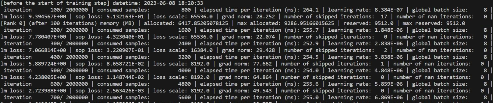

# Model Migration Guide

## Overview

[Megatron-LM](https://github.com/NVIDIA/Megatron-LM) is a distributed training acceleration library proposed by NVIDIA.
It supports data parallelism and model parallelism, and is widely used in large model training.
After compatibility adaptation for the MindSpeed Ascend platform, it now supports efficient execution on the Ascend platform.

The primary goal of this guide is to help users with basic `Megatron-LM` model training experience migrate models originally trained on other hardware platforms (such as GPUs) to the Ascend platform (NPU).

This guide covers the full-process method for model migration, with a primary focus on how to effectively migrate models trained with `Megatron-LM` to the Ascend platform and run them with high performance within a reasonable accuracy error range.

The intended audience for this manual is primarily researchers, engineers, and developers with a certain foundation in deep learning and programming experience:

- Understand the basic concepts and technologies of deep learning, and be able to use the Python programming language and the Megatron-LM framework for deep learning model development and debugging;

- Have a certain understanding of deep learning model training and optimization, including training task execution and evaluation, distributed training, performance data collection and analysis, etc.;

- Have a basic understanding of common system performance optimization methods, such as parallelization and compilation optimization.

### What Is Model Migration

Model migration refers to moving a deep learning model originally running on a GPU or other hardware platform to an NPU, while ensuring the model runs with high performance within a reasonable accuracy error range.

### Why Model Migration

When migrating a model from other hardware platforms to an NPU, a series of adaptation operations from the bottom layer to the top layer are involved due to differences in hardware architecture and libraries. Taking GPU as an example, the reasons why model migration to NPU requires adaptation can be divided into three aspects:

- Differences in hardware characteristics and performance features
Due to the different hardware characteristics and performance features of NPUs and GPUs, models may require further performance debugging and optimization on the NPU to fully leverage the NPU's potential.

- Differences in computing architecture
NVIDIA GPUs use the Compute Unified Device Architecture (CUDA) parallel computing architecture, while Huawei NPUs use the Compute Architecture for Neural Networks (CANN, a heterogeneous computing architecture).

- Differences in deep learning frameworks
To support NPU hardware, the `Megatron-LM` framework needs to be adapted through `MindSpeed`, including adapting functions such as tensor operations and automatic differentiation for efficient execution on NPUs.

### How to Migrate a Model

This manual provides an end-to-end guide for the Megatron-LM model migration. For details, refer to the [Overall Process of Model Migration](#overall-process-of-model-migration) section.

## Overall Process of Model Migration

The main process for model migration based on Megatron-LM is as follows.


## Model Selection

- Select the [Megatron-LM](https://github.com/NVIDIA/Megatron-LM) repository core_v0.12.1, and use the built-in GPT model in `pretrain_gpt.py` under the repository root as the model for migration.

- Before migration, ensure that the selected model can run on a third-party platform (such as GPU) and output accuracy and performance baselines.

## Model Migration

With just one line of code, you can easily enable the various features of `MindSpeed` and complete the migration for a model trained with `Megatron-LM`.

1. Refer to the [Installation Guide](./install_guide.md) to set up the basic environment.

2. In the `Megatron-LM` repository root directory, modify the `pretrain_gpt.py` file and add a new line under `import torch`:

   `import mindspeed.megatron_adaptor`

   This completes the adaptation of the `Megatron-LM` model.

   The specific modification is shown below.

    ```python
    import os
    import torch
    import mindspeed.megatron_adaptor # New code line
    from functools import partial
    from typing import Union
    ```

## Model Training

### Environment Variable Configuration

Execute the following commands in the terminal to configure the `Ascend` environment variables. The `CANN_INSTALL_PATH` refers to the installation location of the CANN software package, which needs to be adjusted according to the specific conditions of the machine.

```shell
source ${CANN_INSTALL_PATH}/ascend-toolkit/set_env.sh
```

### Dataset Preparation

1. Download `vocab.json` and `merges.txt` from [gpt-3.5-turbo](https://huggingface.co/Xenova/gpt-3.5-turbo/tree/main), place them in the newly created `gpt-tokenizer` directory under the `Megatron-LM` repository root, and rename them to `gpt2-vocab.json` and `gpt2-merges.txt` respectively.

    If the download speed is too slow or the site is inaccessible, configure an available proxy for accessing websites or an available Hugging Face domestic mirror and try again.

2. Download the Alpaca dataset file `train-00000-of-000010-a09b74b3ef9c3b56.parquet` from [Hugging Face](https://huggingface.co/datasets/tatsu-lab/alpaca) and place it in any directory on the server, for example, `/home/datasets/Alpaca`.

    If the download speed is too slow or the site is inaccessible, configure an available proxy for accessing websites or an available Hugging Face domestic mirror and try again.

3. Read the raw corpus from the Alpaca dataset in Parquet format and convert it to JSON format for subsequent processing.

    Execute the following command in the bash terminal to complete the raw corpus processing.

    ```shell
    # # Dependency installation
    pip3 install nltk pyarrow pandas

    cd /home/datasets/Alpaca/
    python convert_parquet.py
    ```

    Where `convert_parquet.py` is a newly created file in the `/home/datasets/Alpaca/` directory, with the specific code as follows:

    ```python
    import json
    import pandas as pd
    data_df = pd.read_parquet("train-00000-of-000010-a09b74b3ef9c3b56.parquet")
    data_df['text'] = data_df['text'].apply(lambda v: json.dumps({"text": v}))
    with open("alpaca_json.json", encoding='utf-8', mode='w') as f:
        for i, row in data_df.iterrows():
            f.write(row["text"])
            f.write("\n")
    ```

    If `pip install` fails to download dependencies, please configure an available pip source and try again.

4. Execute the following command in the `Megatron-LM` repository root directory to perform data preprocessing, converting the JSON format dataset generated in step 3 into a dataset format recognized by `Megatron-LM`.

    ```shell
    python tools/preprocess_data.py \
        --input /home/datasets/Alpaca/alpaca_json.json \
        --output-prefix ./gpt_pretrain_data/alpaca \
        --tokenizer-type GPT2BPETokenizer \
        --vocab-file ./gpt-tokenizer/gpt2-vocab.json \
        --merge-file ./gpt-tokenizer/gpt2-merges.txt \
        --append-eod \
        --log-interval 1000 \
        --workers 8
    ```

    After execution, two files will be generated in the `gpt_pretrain_data` directory: `alpaca_text_document.bin` and `alpaca_text_document.idx`.

### Running Training

#### Single-Node Multi-Card Training

1. In the root directory of the `Megatron-LM` repository, create a new training script `pretrain_single.sh`. The content of `pretrain_single.sh` is as follows.

    ```shell
    #!/bin/bash

    export CUDA_DEVICE_MAX_CONNECTIONS=1

    GPUS_PER_NODE=8 # Number of GPUs per node, fill in according to the actual situation
    # Change for multinode config
    MASTER_ADDR=localhost # localhost for single-node, fill in the master node IP for multi-node
    MASTER_PORT=6000
    NNODES=1 # Number of nodes, fill in 1 for single-node
    NODE_RANK=0 # Node rank, fill in 0 for the master node
    WORLD_SIZE=$(($GPUS_PER_NODE*$NNODES))

    CHECKPOINT_PATH=./ckpt
    VOCAB_FILE=./gpt-tokenizer/gpt2-vocab.json # File downloaded in step 1 of the dataset preparation chapter, fill in according to the actual path
    MERGE_FILE=./gpt-tokenizer/gpt2-merges.txt # File downloaded in step 1 of the dataset preparation chapter, fill in according to the actual path
    DATA_PATH=./gpt_pretrain_data/alpaca_text_document # gpt_pretrain_data is the file path generated in step 4 of the dataset preparation chapter, and alpaca_text_document is the common prefix for the bin and idx files

    # Distributed node parameters
    DISTRIBUTED_ARGS="
        --nproc_per_node $GPUS_PER_NODE \
        --nnodes $NNODES \
        --node_rank $NODE_RANK \
        --master_addr $MASTER_ADDR \
        --master_port $MASTER_PORT \
    "

    # GPT model parameters
    GPT_ARGS="
        --num-layers 24 \
        --hidden-size 1024 \
        --num-attention-heads 16 \
        --seq-length 1024 \
        --max-position-embeddings 1024 \
        --micro-batch-size 8 \
        --global-batch-size 64 \
        --lr 0.00015 \
        --train-iters 1000 \
        --lr-decay-iters 320000 \
        --lr-decay-style cosine \
        --min-lr 1.0e-5 \
        --weight-decay 1e-2 \
        --lr-warmup-fraction .01 \
        --clip-grad 1.0 \
        --fp16 \
        --transformer-impl local \
    "

    # Dataset configuration
    DATA_ARGS="
        --data-path $DATA_PATH \
        --vocab-file $VOCAB_FILE \
        --merge-file $MERGE_FILE \
        --split 949,50,1 \
    "

    OUTPUT_ARGS="
        --log-interval 100 \
        --save-interval 100 \
        --eval-interval 1000 \
        --eval-iters 10
    "

    torchrun $DISTRIBUTED_ARGS pretrain_gpt.py \
        $GPT_ARGS \
        $DATA_ARGS \
        $OUTPUT_ARGS \
        --distributed-backend nccl \
        --save $CHECKPOINT_PATH \
        --ckpt-format torch
    ```

2. Run `bash pretrain_single.sh` in the terminal. A training log showing the iteration results for each step as follows indicates that the migration training is successful.

    

    Starting from core_r0.10.0, `Megatron-LM` and `MindSpeed` extensively use type annotations with higher-version syntax, such as:

    ```python
    hierarchical_context_parallel_sizes: Optional[list[int]] = None
    ```

    Therefore, if the following error occurs:

    ```python
    TypeError: 'type' object is not subscriptable.
    ```

    You need to upgrade Python to version 3.9 or later.

   **Follow-up Processing**

    - The `pretrain_single.sh` training script has a default model saving path configured. If you need to load a model for retraining, refer to the [Model Saving and Loading](#model-saving-and-loading) section to complete secondary training of the model.

    - If some CUDA interface errors are reported during training, it may be caused by some unsupported APIs (operator APIs or framework APIs). You can go to the [Ascend MindSpeed Open Source Project](https://gitcode.com/Ascend/MindSpeed) to raise an issue for help.

#### Multi-Node Multi-Card Training

Here, the dual-node training is used as an example.

   **Prerequisites**
   Before training, ensure that communication between the two servers is normal and that no other processes are interfering. Ensure that the environments are consistent (including the conda environment, CANN environment, etc.), the code is consistent, and both can perform single-node training normally. Determine one machine to serve as the master node.

1. In the `Megatron-LM` repository root directory on both machines, create a new training script `pretrain_distributed.sh`. The content of the `pretrain_distributed.sh` script is as follows.

    ```shell
    #!/bin/bash

    export CUDA_DEVICE_MAX_CONNECTIONS=1

    GPUS_PER_NODE=8 # Number of GPUs per node, fill in according to the actual situation
    # Change for multinode config
    MASTER_ADDR=xxx.xxx.xxx.xxx # Enter the master node IP
    MASTER_PORT=6000
    NNODES=2 # Number of nodes
    NODE_RANK=0 # Node rank, enter 0 for the master node and 1 for the worker node
    WORLD_SIZE=$(($GPUS_PER_NODE*$NNODES))

    CHECKPOINT_PATH=./ckpt
    VOCAB_FILE=./gpt-tokenizer/gpt2-vocab.json # File downloaded in step 1 of the dataset preparation section, enter the actual path
    MERGE_FILE=./gpt-tokenizer/gpt2-merges.txt # File downloaded in step 1 of the dataset preparation section, enter the actual path
    DATA_PATH=./gpt_pretrain_data/alpaca_text_document # gpt_pretrain_data is the file path generated in step 4 of the dataset preparation chapter, and alpaca_text_document is the common prefix for the bin and idx files

    # Distributed node parameters
    DISTRIBUTED_ARGS="
        --nproc_per_node $GPUS_PER_NODE \
        --nnodes $NNODES \
        --node_rank $NODE_RANK \
        --master_addr $MASTER_ADDR \
        --master_port $MASTER_PORT \
    "

    # GPT model parameters
    GPT_ARGS="
        --num-layers 24 \
        --hidden-size 1024 \
        --num-attention-heads 16 \
        --seq-length 1024 \
        --max-position-embeddings 1024 \
        --micro-batch-size 8 \
        --global-batch-size 128 \
        --lr 0.00015 \
        --train-iters 1000 \
        --lr-decay-iters 320000 \
        --lr-decay-style cosine \
        --min-lr 1.0e-5 \
        --weight-decay 1e-2 \
        --lr-warmup-fraction .01 \
        --clip-grad 1.0 \
        --fp16 \
        --transformer-impl local \
    "

    #Dataset configuration
    DATA_ARGS="
        --data-path $DATA_PATH \
        --vocab-file $VOCAB_FILE \
        --merge-file $MERGE_FILE \
        --split 949,50,1 \
    "

    OUTPUT_ARGS="
        --log-interval 100 \
        --save-interval 100 \
        --eval-interval 1000 \
        --eval-iters 10 \
    "

    torchrun $DISTRIBUTED_ARGS pretrain_gpt.py \
        $GPT_ARGS \
        $DATA_ARGS \
        $OUTPUT_ARGS \
        --distributed-backend nccl \
        --save $CHECKPOINT_PATH \
        --ckpt-format torch
    ```

2. `Megatron-LM` supports setting the `data_cache_path` command-line parameter to specify a path for sharing data across multiple machines. If `data_cache_path` is not set, the shared storage feature is not used.

    If shared storage is **not used**,
    you need to modify `megatron/core/datasets/gpt_dataset.py` in the `Megatron-LM` repository on both nodes.
    The specific modifications are as follows.

    ```python
    # Original
    if not path_to_cache or (
        not cache_hit
        and (not torch.distributed.is_initialized() or torch.distributed.get_rank() == 0) # Delete this line
    )

    # After modification
    if not path_to_cache or (
        not cache_hit
    )
    ```

3. Set the IP information for both nodes to ensure distributed communication can proceed.

    Set `HCCL_IF_IP` to the local IP on both the **primary and secondary nodes**. The command is:

    ```shell
    export HCCL_IF_IP=xxx.xxx.xxx.xxx
    ```

    Use `ifconfig` on both the **primary and secondary nodes** to check the network interface corresponding to the local IP. For example, if the detected interface is `enp189s0f0`, set:

    ```shell
    export GLOO_SOCKET_IFNAME=enp189s0f0
    ```

4. Execute the multi-node multi-GPU training script on the primary node. The specific run command is as follows:

    ```shell
    bash pretrain_distributed.sh
    ```

5. Execute the multi-node multi-GPU training script on the secondary node. The specific run command is as follows:

    ```shell
    bash pretrain_distributed.sh
    ```

    Observing the training log with per-step iteration results, as shown in the following figure, in the standard output of the secondary node terminal indicates that the multi-node multi-GPU training adaptation is complete and training can be stopped.

    

    Starting from core_r0.10.0, Megatron-LM and MindSpeed extensively use type annotations with higher-version syntax, such as:

    ```python
    hierarchical_context_parallel_sizes: Optional[list[int]] = None
    ```

    Therefore, if the following error occurs:

    ```python
    TypeError: 'type' object is not subscriptable.
    ```

    You need to upgrade Python to version 3.9 or later.

    **Follow-up Processing**

    - The `pretrain_distributed.sh` training script has the model saving path configured by default.
    If you need to load a model for retraining,
    refer to the [Model Saving and Loading](#model-saving-and-loading) section to complete secondary training of the model.

    - If some CUDA API errors are reported during training, it may be caused by unsupported APIs (operator APIs or framework APIs).
    You can go to the [Ascend MindSpeed Open Source Project](https://gitcode.com/Ascend/MindSpeed) to raise an ISSUE for help.

## Model Saving and Loading

**Model Saving**

The `Megatron-LM` acceleration library integrates the model saving function. You can use the `--save` parameter to specify the save path, and `--save-interval` to specify the save interval.

In the `pretrain_single.sh` script configured in the [Single-Node Multi-Card Training](#single-node-multi-card-training) section, the configuration for model saving is as follows:

```shell
CHECKPOINT_PATH=./ckpt
#Other content in the script has been omitted, mainly showing the configuration for model saving
torchrun $DISTRIBUTED_ARGS pretrain_gpt.py \
    $GPT_ARGS \
    $DATA_ARGS \
    $OUTPUT_ARGS \
    --distributed-backend nccl \
    --save $CHECKPOINT_PATH \
    --ckpt-format torch
```

After executing single-node multi-GPU training, files such as `latest_checkpointed_iteration.txt` and `iter_00000010/mp_rank_00/model_optim_rng.pt` will be generated in the `ckpt` folder under the `Megatron-LM` repository root directory, indicating that the model has been saved successfully.

The specific file path for saving the model may vary depending on the user's configuration. As long as files with a similar hierarchical structure appear, it indicates that the model has been saved successfully.

**Model Loading**

If you need to continue training using the saved model, you can use the `--load` parameter to load the model from a specified path. For example, modify the configured `pretrain_single.sh` in [Single-Node Multi-GPU Training](#single-node-multi-card-training) as follows:

```shell
#!/bin/bash

export CUDA_DEVICE_MAX_CONNECTIONS=1

GPUS_PER_NODE=8 # Number of GPUs per node, fill in according to the actual situation
# Change for multinode config
MASTER_ADDR=localhost # Defaults to localhost for single-node; fill in the master node IP for multi-node
MASTER_PORT=6000
NNODES=1 # Number of nodes, fill in 1 for single-node
NODE_RANK=0 # Node rank, fill in 0 for the master node
WORLD_SIZE=$(($GPUS_PER_NODE*$NNODES))

CHECKPOINT_PATH=./ckpt
VOCAB_FILE=./gpt-tokenizer/gpt2-vocab.json # File downloaded in step 1 of the dataset preparation chapter, fill in according to the actual path
MERGE_FILE=./gpt-tokenizer/gpt2-merges.txt # File downloaded in step 1 of the dataset preparation chapter, fill in according to the actual path
DATA_PATH=./gpt_pretrain_data/alpaca_text_document # gpt_pretrain_data is the file path generated in step 4 of the dataset preparation chapter, and alpaca_text_document is the common prefix for the bin and idx files

# Distributed node parameters
DISTRIBUTED_ARGS="
    --nproc_per_node $GPUS_PER_NODE \
    --nnodes $NNODES \
    --node_rank $NODE_RANK \
    --master_addr $MASTER_ADDR \
    --master_port $MASTER_PORT \
"

# GPT model parameters
GPT_ARGS="
    --num-layers 24 \
    --hidden-size 1024 \
    --num-attention-heads 16 \
    --seq-length 1024 \
    --max-position-embeddings 1024 \
    --micro-batch-size 8 \
    --global-batch-size 64 \
    --lr 0.00015 \
    --train-iters 1000 \
    --lr-decay-iters 320000 \
    --lr-decay-style cosine \
    --min-lr 1.0e-5 \
    --weight-decay 1e-2 \
    --lr-warmup-fraction .01 \
    --clip-grad 1.0 \
    --fp16 \
    --transformer-impl local \
    --use-checkpoint-opt_param-scheduler
"

#Dataset configuration
DATA_ARGS="
    --data-path $DATA_PATH \
    --vocab-file $VOCAB_FILE \
    --merge-file $MERGE_FILE \
    --split 949,50,1 \
"

OUTPUT_ARGS="
    --log-interval 100
    --save-interval 100
    --eval-interval 1000
    --eval-iters 10
"

torchrun $DISTRIBUTED_ARGS pretrain_gpt.py \
    $GPT_ARGS \
    $DATA_ARGS \
    $OUTPUT_ARGS \
    --distributed-backend nccl \
    --save $CHECKPOINT_PATH \
    --load $CHECKPOINT_PATH \
    --ckpt-format torch
```

Run `bash pretrain_single.sh` in the terminal.

The following ckpt loading log appears on the terminal standard output, indicating that model loading has been executed.


At the same time, the training log showing the iteration results for each step in the standard terminal output indicates that retraining was successfully resumed after loading the model.


