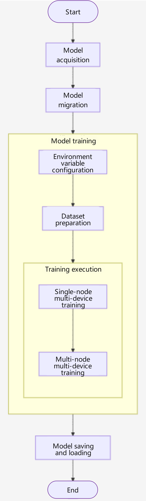
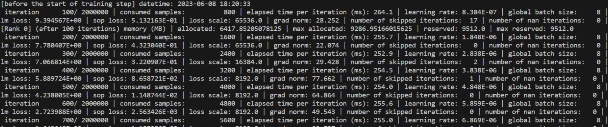
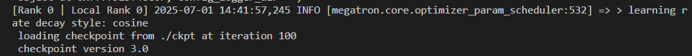

# Model Migration Guide

## Overview

[Megatron-LM](https://github.com/NVIDIA/Megatron-LM) is a distributed training acceleration library proposed by NVIDIA.
It supports data parallelism and model parallelism, and is widely used in large model training.
After compatibility adaptation for the MindSpeed Ascend platform,
it now supports high-performance execution on the Ascend platform.

The primary goal of this manual is to guide users familiar with `Megatron-LM` model training to migrate models originally trained on other hardware platforms (such as GPU) to the Ascend platform (NPU).

The manual covers the full-process migration method for models,
with the main focus on how to effectively migrate `Megatron-LM` training models to the Ascend platform
and run them with high performance within an acceptable accuracy tolerance.

The intended readers of this manual are mainly researchers, engineers, and developers familiar with deep learning and programming experience:

- Understand the basic concepts and techniques of deep learning, and be able to use the Python programming language and the Megatron-LM framework for deep learning model development and debugging;

- Understand  of deep learning model training and optimization, including training task execution and evaluation, distributed training, performance data collection and analysis, etc.

- Have a basic awareness of common system performance optimization methods, such as parallelization and compilation optimization.

### What Is Model Migration

Model migration refers to migrating a deep learning model that originally runs on GPU or other hardware platform to NPU, while ensuring that the model runs with high-performance execution within an acceptable accuracy tolerance.

### Why Perform Model Migration

When a model is migrated from other hardware platforms to NPU,
a series of adaptation operations from the lower layers to the upper layers are involved due to differences in hardware architecture and libraries.
Taking GPU as an example, the reasons why a model needs adaptation when migrating to NPU can be divided into three aspects:

- Differences in hardware characteristics and performance features
Because NPU and GPU differ in hardware characteristics and performance features, the model may require further performance tuning and optimization on NPU to fully unleash the potential of NPU.

- Differences in computing architecture
NVIDIA GPUs adopt Compute Unified Device Architecture (CUDA) parallel computing architecture, while Huawei NPUs adopt Compute Architecture for Neural Networks (CANN) heterogeneous computing architecture.

- Differences in deep learning frameworks
To support NPU hardware, the `Megatron-LM` framework must be adapted through `MindSpeed`, including adapting tensor operations, automatic differentiation, and other functions so that they can be executed efficiently on NPUs.

### How to Migrate a Model

This manual provides an end-to-end guide to the Megatron-LM model migration process.
For details, see the [Overall Model Migration Process](#overall-model-migration-process) section.

## Overall Model Migration Process

The main process for migrating a Megatron-LM-based model is as follows.



## Model Selection

- Select the branch `core_v0.12.1` of the [Megatron-LM](https://github.com/NVIDIA/Megatron-LM) repository,
and use the built-in GPT model in `pretrain_gpt.py` under the repository root directory as the model to be migrated.

- Before migration, ensure that the selected model can run on a third-party platform (such as GPU) and produce accuracy and performance baselines.

## Model Migration

With just a single line of code, you can easily use the various features of `MindSpeed` to complete the model migration from `Megatron-LM`.

 1. Refer to the [Installation Guide](../user-guide/install_guide.md) to set up the basic environment.

 2. In the root directory of the `Megatron-LM` repository, modify the `pretrain_gpt.py` file and add a new line below `import torch`:

    `import mindspeed.megatron_adaptor`

    This completes the adaptation of the `Megatron-LM` model.

    The specific modifications are as follows.

    ```python
    import os
    import torch
    import mindspeed.megatron_adaptor # Add the code line.
    from functools import partial
    from typing import Union
    ```

## Model Training

### Environment Variable Configuration

Run the following command in the terminal to configure the Ascend environment variables, where `CANN_INSTALL_PATH` is the installation location of the CANN package and needs to be adjusted according to the specific server requirements.

```shell
source ${CANN_INSTALL_PATH}/ascend-toolkit/set_env.sh
```

### Dataset Preparation

 1. Download `vocab.json` and `merges.txt` from [gpt-3.5-turbo](https://huggingface.co/Xenova/gpt-3.5-turbo/tree/main). Place the downloaded files into a newly created `gpt-tokenizer` directory under the root directory of the `Megatron-LM` repository, and rename them to `gpt2-vocab.json` and `gpt2-merges.txt`, respectively.

    If the download is too slow or inaccessible, configure an available proxy for accessing overseas websites or an available domestic HuggingFace mirror and retry.
    If you cannot access HuggingFace community resources smoothly, it is recommended to download from ModelScope instead, while paying attention to the correctness and security of the files to be downloaded.

 2. Download the Alpaca dataset file [train-00000-of-00001-a09b74b3ef9c3b56.parquet](https://huggingface.co/datasets/tatsu-lab/alpaca) from HuggingFace and place it in any directory on the server, for example `/home/datasets/Alpaca`.

    If the download is too slow or inaccessible, configure an available proxy for accessing overseas websites or an available domestic HuggingFace mirror and retry.
    If you cannot access HuggingFace community resources smoothly, it is recommended to download from ModelScope instead, while paying attention to the correctness and security of the files to be downloaded.

 3. Read the raw corpus of the Alpaca dataset in parquet format and convert it to JSON format for subsequent processing.

    Run the following command in a bash terminal to complete the raw corpus processing.

    ```shell
    # Install dependencies
    pip3 install nltk pyarrow pandas

    cd /home/datasets/Alpaca/
    python convert_parquet.py
    ```

    Here, `convert_parquet.py` is a newly created file in the `/home/datasets/Alpaca/` directory, and its specific code is as follows:

    ```python
    import json
    import pandas as pd
    data_df = pd.read_parquet("train-00000-of-00001-a09b74b3ef9c3b56.parquet")
    data_df['text'] = data_df['text'].apply(lambda v: json.dumps({"text": v}))
    with open("alpaca_json.json", encoding='utf-8', mode='w') as f:
        for i, row in data_df.iterrows():
            f.write(row["text"])
            f.write("\n")
    ```

    If `pip install` fails to download dependencies, configure an available pip source and retry.

 4. Run the following command in the root directory of the `Megatron-LM` repository to perform data preprocessing, converting the JSON-format dataset generated in step 3 into a dataset format recognized by `Megatron-LM`.

    ```shell
    mkdir -p ./gpt_pretrain_data

    python tools/preprocess_data.py \
        --input /home/datasets/Alpaca/alpaca_json.json \
        --output-prefix ./gpt_pretrain_data/alpaca \
        --tokenizer-type GPT2BPETokenizer \
        --vocab-file ./gpt-tokenizer/gpt2-vocab.json \
        --merge-file ./gpt-tokenizer/gpt2-merges.txt \
        --append-eod \
        --log-interval 1000 \
        --workers 8
    ```

    After execution completes, two files will be generated in the `gpt_pretrain_data` directory: `alpaca_text_document.bin` and `alpaca_text_document.idx`.

### Training Execution

#### Single-Node Multi-Device Training

 1. In the root directory of the `Megatron-LM` repository, create a training script `pretrain_single.sh`. The content of `pretrain_single.sh` is as follows.

    ```shell
    #!/bin/bash

    export CUDA_DEVICE_MAX_CONNECTIONS=1

    GPUS_PER_NODE=8 # Number of devices per node. Fill in according to the actual situation.
    # Change for multinode config
    MASTER_ADDR=localhost # Defaults to localhost for a single node. Fill in the primary node IP for multiple nodes.
    MASTER_PORT=6000
    NNODES=1 # Number of nodes. Fill in 1 for a single node.
    NODE_RANK=0 # Node rank. Enter 0 for the primary node.
    WORLD_SIZE=$(($GPUS_PER_NODE*$NNODES))

    CHECKPOINT_PATH=./ckpt
    VOCAB_FILE=./gpt-tokenizer/gpt2-vocab.json # File downloaded in step 1 in the Dataset Preparation section. Enter the actual path.
    MERGE_FILE=./gpt-tokenizer/gpt2-merges.txt # File downloaded in step 1 in the Dataset Preparation section. Enter the actual path.
    DATA_PATH=./gpt_pretrain_data/alpaca_text_document # gpt_pretrain_data is the file path generated in step 4 of the Dataset Preparation section. alpaca_text_document is the common prefix of the bin and idx files.

    # Distributed arguments
    DISTRIBUTED_ARGS="
        --nproc_per_node $GPUS_PER_NODE \
        --nnodes $NNODES \
        --node_rank $NODE_RANK \
        --master_addr $MASTER_ADDR \
        --master_port $MASTER_PORT \
    "

    # GPT model arguments
    GPT_ARGS="
        --num-layers 24 \
        --hidden-size 1024 \
        --num-attention-heads 16 \
        --seq-length 1024 \
        --max-position-embeddings 1024 \
        --micro-batch-size 8 \
        --global-batch-size 64 \
        --lr 0.00015 \
        --train-iters 1000 \
        --lr-decay-iters 320000 \
        --lr-decay-style cosine \
        --min-lr 1.0e-5 \
        --weight-decay 1e-2 \
        --lr-warmup-fraction .01 \
        --clip-grad 1.0 \
        --fp16 \
        --transformer-impl local \
    "

    # Dataset configuration
    DATA_ARGS="
        --data-path $DATA_PATH \
        --vocab-file $VOCAB_FILE \
        --merge-file $MERGE_FILE \
        --split 949,50,1 \
    "

    OUTPUT_ARGS="
        --log-interval 100 \
        --save-interval 100 \
        --eval-interval 1000 \
        --eval-iters 10
    "

    torchrun $DISTRIBUTED_ARGS pretrain_gpt.py \
        $GPT_ARGS \
        $DATA_ARGS \
        $OUTPUT_ARGS \
        --distributed-backend nccl \
        --save $CHECKPOINT_PATH \
        --ckpt-format torch
    ```

 2. Run `bash pretrain_single.sh` in the terminal. A training log showing the iteration results for each step, as shown below, indicates that the training is successful.

    

    **Follow-up Procedure**

    - The `pretrain_single.sh` script configures the model saving path by default. If you need to load a model for retraining, refer to the [Model Saving and Loading](#model-saving-and-loading) section to perform secondary training of the model.

    - Some CUDA errors reported during training may be caused by unsupported APIs (operator APIs or framework APIs). You can go to the [Ascend MindSpeed open-source community](https://gitcode.com/Ascend/MindSpeed) to submit an ISSUE for assistance.

    - Starting from `core_r0.10.0`, `Megatron-LM` and `MindSpeed` make extensive use of type annotations that rely on newer syntax, such as:

        ```python
        hierarchical_context_parallel_sizes: Optional[list[int]] = None
        ```

        If the following error occurs:

        ```python
        TypeError: 'type' object is not subscriptable.
        ```

        Upgrade Python to version 3.10 or later.

#### Multi-Node Multi-Device Training

This section uses two-node training as an example.

**Prerequisites**

Before training, ensure that the two servers can communicate normally without interference from other processes.
Ensure that the environments are consistent (including the conda environment, CANN environment, etc.) and the code is consistent,
and that both servers can perform single-node training normally.
Select one server as the primary node.

 1. In the root directory of the `Megatron-LM` repository on both servers, create a training script named `pretrain_distributed.sh`. The content of the `pretrain_distributed.sh` script is as follows.

    ```shell
    #!/bin/bash

    export CUDA_DEVICE_MAX_CONNECTIONS=1

    GPUS_PER_NODE=8 # Number of devices per node. Fill in according to the actual situation.
    # Change for multinode config
    MASTER_ADDR=xxx.xxx.xxx.xxx # Fill in the primary node IP.
    MASTER_PORT=6000
    NNODES=2 # Number of nodes.
    NODE_RANK=0 # Node rank. Fill in 0 for the primary node and 1 for the secondary node.
    WORLD_SIZE=$(($GPUS_PER_NODE*$NNODES))

    CHECKPOINT_PATH=./ckpt
    VOCAB_FILE=./gpt-tokenizer/gpt2-vocab.json # File downloaded in step 1 of the Dataset Preparation section. Fill in according to the actual path.
    MERGE_FILE=./gpt-tokenizer/gpt2-merges.txt # File downloaded in step 1 of the dataset preparation section. Fill in the actual path.
    DATA_PATH=./gpt_pretrain_data/alpaca_text_document # gpt_pretrain_data is the file path generated in step 4 of the dataset preparation section, and alpaca_text_document is the common prefix of the bin and idx files.

    # Distributed arguments
        DISTRIBUTED_ARGS="
        --nproc_per_node $GPUS_PER_NODE \
        --nnodes $NNODES \
        --node_rank $NODE_RANK \
        --master_addr $MASTER_ADDR \
        --master_port $MASTER_PORT \
    "

    # GPT model arguments
    GPT_ARGS="
        --num-layers 24 \
        --hidden-size 1024 \
        --num-attention-heads 16 \
        --seq-length 1024 \
        --max-position-embeddings 1024 \
        --micro-batch-size 8 \
        --global-batch-size 128 \
        --lr 0.00015 \
        --train-iters 1000 \
        --lr-decay-iters 320000 \
        --lr-decay-style cosine \
        --min-lr 1.0e-5 \
        --weight-decay 1e-2 \
        --lr-warmup-fraction .01 \
        --clip-grad 1.0 \
        --fp16 \
        --transformer-impl local \
    "

    # Dataset configuration
    DATA_ARGS="
        --data-path $DATA_PATH \
        --vocab-file $VOCAB_FILE \
        --merge-file $MERGE_FILE \
        --split 949,50,1 \
    "

    OUTPUT_ARGS="
        --log-interval 100 \
        --save-interval 100 \
        --eval-interval 1000 \
        --eval-iters 10 \
    "

    torchrun $DISTRIBUTED_ARGS pretrain_gpt.py \
        $GPT_ARGS \
        $DATA_ARGS \
        $OUTPUT_ARGS \
        --distributed-backend nccl \
        --save $CHECKPOINT_PATH \
        --ckpt-format torch
    ```

 2. `Megatron-LM` supports setting `data_cache_path` to specify a path for sharing data across multiple servers. If `data_cache_path` is not set, the shared storage feature is not used.

    If shared storage is **not used**, you need to modify `gpt_dataset.py` under `megatron/core/datasets/` in the `Megatron-LM` repository on both nodes. The specific modifications are as shown below.

    ```python
    # Original
    if not path_to_cache or (
        not cache_hit
        and (not torch.distributed.is_initialized() or torch.distributed.get_rank() == 0) # Delete this line
    )

    #After modification
    if not path_to_cache or (
        not cache_hit
    )
    ```

 3. Set the IP information of the two nodes to ensure distributed communication.

    On both the **primary and secondary nodes**, set `HCCL_IF_IP` to the local IP. The setting command is as follows:

    ```shell
    export HCCL_IF_IP=xxx.xxx.xxx.xxx
    ```

    On both the **primary and secondary nodes**, use `ifconfig` to check the network interface corresponding to the local IP. For example, if the network interface found on the server is `enp189s0f0`, set it as follows:

    ```shell
    export GLOO_SOCKET_IFNAME=enp189s0f0
    ```

 4. Execute the multi-node multi-device training script on the primary node. The specific command is as follows:

    ```shell
    bash pretrain_distributed.sh
    ```

 5. Execute the multi-node multi-device training script on the secondary node. The specific command is as follows:

    ```shell
    bash pretrain_distributed.sh
    ```

    Observing the training log with per-step iteration results as shown in the following figure on the standard output of the secondary node terminal indicates that the multi-node multi-device training adaptation is complete,
    and the training can be stopped.

    

    Starting from `core_r0.10.0`,
    Megatron-LM and MindSpeed extensively use type annotations with newer syntax, such as:

    ```python
    hierarchical_context_parallel_sizes: Optional[list[int]] = None
    ```

    If the following error occurs:

    ```python
    TypeError: 'type' object is not subscriptable.
    ```

    Upgrade Python to 3.9 or later.

    **Follow-up Procedure**

    - The `pretrain_distributed.sh` script configures the model saving path by default.

    If you need to load the model for retraining,
    refer to the [Model Saving and Loading](#model-saving-and-loading) section to perform secondary training of the model.

    - Some CUDA errors reported during training may be caused by unsupported APIs (operator APIs or framework APIs). You can go to the [Ascend MindSpeed open-source community](https://gitcode.com/Ascend/MindSpeed) to submit an ISSUE for assistance.

## Model Saving and Loading

**Model Saving**

The `Megatron-LM` acceleration library integrates the model saving functionality. You can use the `--save` parameter to specify the save path and `--save-interval` to specify the save interval.

In the `pretrain_single.sh` script configured in the [Single-Node Multi-Device Training](#single-node-multi-device-training) section, the configuration related to model saving is as follows:

```shell
CHECKPOINT_PATH=./ckpt
#Other content in the script has been omitted, and only the model saving configuration is shown.
torchrun $DISTRIBUTED_ARGS pretrain_gpt.py \
    $GPT_ARGS \
    $DATA_ARGS \
    $OUTPUT_ARGS \
    --distributed-backend nccl \
    --save $CHECKPOINT_PATH \
    --ckpt-format torch
```

After single-node multi-device training is executed, files similar to `latest_checkpointed_iteration.txt` and `iter_00000010/mp_rank_00/model_optim_rng.pt` are generated in the `ckpt` folder under the root directory of the `Megatron-LM` repository, indicating that the model has been saved successfully.

The specific file path for the saved model may vary slightly depending on the user's configuration. As long as files at a similar hierarchy level as described above appear, the model has been saved successfully.

**Model Loading**

If you need to use the saved model to continue training, you can use the `--load` parameter to load the model from the specified path. For example, modify the configured `pretrain_single.sh` in [single-Node multi-Device training](#single-node-multi-device-training) as follows:

```shell
#!/bin/bash

export CUDA_DEVICE_MAX_CONNECTIONS=1

GPUS_PER_NODE=8 # Fill in the number of devices per node based on the actual situation.
# Change for multinode config
MASTER_ADDR=localhost # Default to localhost for single-node scenario; enter the primary node IP for multi-node scenario.
MASTER_PORT=6000
NNODES=1 # Number of nodes; enter 1 for single-node scenario.
NODE_RANK=0 # Node rank; enter 0 for the primary node.
WORLD_SIZE=$(($GPUS_PER_NODE*$NNODES))

CHECKPOINT_PATH=./ckpt
VOCAB_FILE=./gpt-tokenizer/gpt2-vocab.json # File downloaded in step 1 in the dataset preparation section; enter the actual path.
MERGE_FILE=./gpt-tokenizer/gpt2-merges.txt # File downloaded in step 1 in the dataset preparation section; enter the actual path.
DATA_PATH=./gpt_pretrain_data/alpaca_text_document # gpt_pretrain_data is the file path generated in step 4 of the dataset preparation section, and alpaca_text_document is the common prefix of the bin and idx files

# Distributed arguments
DISTRIBUTED_ARGS="
    --nproc_per_node $GPUS_PER_NODE \
    --nnodes $NNODES \
    --node_rank $NODE_RANK \
    --master_addr $MASTER_ADDR \
    --master_port $MASTER_PORT \
"

# GPT model arguments
GPT_ARGS="
    --num-layers 24 \
    --hidden-size 1024 \
    --num-attention-heads 16 \
    --seq-length 1024 \
    --max-position-embeddings 1024 \
    --micro-batch-size 8 \
    --global-batch-size 64 \
    --lr 0.00015 \
    --train-iters 1000 \
    --lr-decay-iters 320000 \
    --lr-decay-style cosine \
    --min-lr 1.0e-5 \
    --weight-decay 1e-2 \
    --lr-warmup-fraction .01 \
    --clip-grad 1.0 \
    --fp16 \
    --transformer-impl local \
    --use-checkpoint-opt_param-scheduler
"

# Dataset configuration
DATA_ARGS="
    --data-path $DATA_PATH \
    --vocab-file $VOCAB_FILE \
    --merge-file $MERGE_FILE \
    --split 949,50,1 \
"

OUTPUT_ARGS="
    --log-interval 100
    --save-interval 100
    --eval-interval 1000
    --eval-iters 10
"

torchrun $DISTRIBUTED_ARGS pretrain_gpt.py \
    $GPT_ARGS \
    $DATA_ARGS \
    $OUTPUT_ARGS \
    --distributed-backend nccl \
    --save $CHECKPOINT_PATH \
    --load $CHECKPOINT_PATH \
    --ckpt-format torch
```

Run `bash pretrain_single.sh` in the terminal.

The following ckpt loading log appears in the terminal standard output, indicating that model loading has been executed.



At the same time, the training log showing the iteration result of each step appears in the terminal standard output, indicating that retraining has been successfully resumed after loading the model.


