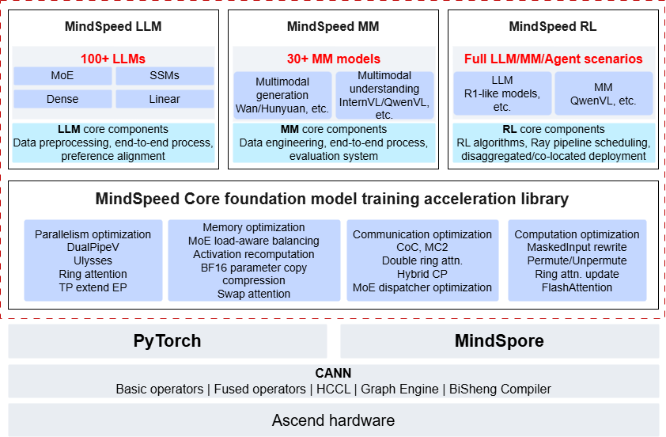

# What is MindSpeed

MindSpeed is a high-performance acceleration library purpose-built for the Ascend platform, comprising four key components: the MindSpeed Core affinity acceleration module, the MindSpeed LLM suite, the MindSpeed MM suite, and the MindSpeed RL suite.

With its outstanding performance and deeply optimized algorithm architecture, MindSpeed provides robust support for customers training large models in the AI domain. By leveraging MindSpeed, you can fully tap into and harness the high-performance computing power of Ascend devices, accelerating the large model training process to deliver faster and better AI services to end users.

## Overall Architecture

**Figure 1**  MindSpeed overall architecture

**Table 1** Component introduction

|Component|Description|
|--|--|
|MindSpeed Core affinity acceleration module|A large model acceleration module based on Ascend devices, providing optimization across four dimensions: computation, memory, communication, and parallelism. It supports acceleration features for scenarios such as long sequences and MoE.|
|MindSpeed LLM suite|A large language model suite based on the Ascend ecosystem. It aims to provide an end-to-end large language model training solution, including distributed pre-training, distributed instruction fine-tuning, and corresponding development toolchains such as multimodal data preprocessing, weight conversion, online inference, and baseline evaluation, covering mainstream large language models in the industry.|
|MindSpeed MM suite|An Ascend multimodal large model suite for large-scale distributed training, focusing on multimodal generation and multimodal understanding. It provides an end-to-end multimodal large model training process, including capabilities such as multimodal data preprocessing, training and fine-tuning, online inference, and performance evaluation, covering mainstream multimodal large models in the industry.|
|MindSpeed RL suite|Provides core acceleration capabilities such as training-inference co-location on ultra-large Ascend clusters, asynchronous pipeline scheduling, and heterogeneous training-inference partitioning communication.|

## Key Features

- MindSpeed Core:
  - Parallel algorithm optimization: supports multi-dimensional parallel strategies such as model parallelism, optimizer parallelism, expert parallelism, and long-sequence parallelism, with affinity optimization tailored to the Ascend software and hardware architecture, significantly improving the performance and efficiency of cluster training.
  - Memory resource optimization: provides memory compression, memory reuse, memory swapping, and differentiated recomputation techniques to maximize memory resource utilization, effectively alleviate memory bottlenecks, and improve training efficiency.
  - Communication performance optimization: adopts strategies such as computation-communication fusion and computation-communication overlap, combined with efficient computing-network coordination mechanisms, to significantly improve computing resource utilization, reduce communication latency, and optimize overall training performance.
  - Computation performance optimization: integrates a high-performance fused operator library, combined with Ascend-affinity computation optimization, to fully unleash Ascend computing power and significantly improve computation efficiency.
  - Differentiated capability support: provides differentiated capabilities in scenarios such as long sequences, weight saving, and automatic parallel strategy search.

- MindSpeed LLM:
  - Mainstream LLMs: supports 100+ mainstream LLMs including Qwen3, DeepSeek, and Mamba2 series, covering Dense, MoE, and SSM architectures. Provides high-performance training scripts optimized for the Ascend architecture, ready to use out of the box.
  - Distributed pre-training: supports distributed pre-training with data preprocessing solutions and multi-dimensional parallelism strategies including TP, PP, DP, CP, and EP.
  - Distributed instruction fine-tuning: supports mainstream full-parameter fine-tuning, LoRA, and QLoRA training algorithms, with performance and memory optimization techniques for fine-tuning.
  - Model weight conversion: supports weight conversion between Megatron and HuggingFace formats, as well as independent and merged conversion of LoRA fine-tuned weights.
  - Online inference and evaluation: supports distributed online inference of models and online evaluation on public benchmark datasets.

- MindSpeed MM:
  - Mainstream multimodal models: supports mainstream multimodal understanding models such as the InternVL/QwenVL series; supports mainstream video generation models such as the OpenSoraPlan/CogVideoX/HunyuanVideo/Wan2.1/Wan2.2 series; supports mainstream text-to-image models such as the FLUX/SANA/HiDream/Qwen Image series. Provides high-performance training scripts optimized for the Ascend architecture, ready to use out of the box.
  - Distributed training: supports distributed full-parameter fine-tuning, providing data preprocessing solutions and multi-dimensional parallel strategies including heterogeneous PP/TP/SP/FSDP2; achieves ultra-long sequence performance optimization through fine-grained selective recomputation and async-offload techniques, fully utilizing heterogeneous resources such as memory, H2D, and D2H. Supports LoRA fine-tuning and DPO training.
  - Model weight conversion: supports weight conversion between Megatron/HuggingFace formats and independent/merged conversion of LoRA fine-tuning weights.
  - Online inference and evaluation: supports distributed online inference of models and online evaluation using public benchmark data.

- MindSpeed RL:
  - Memory resource optimization: supports co-card deployment of training and inference, optimal parallel co-card switching between training and inference, and fine-grained memory management techniques for training and inference.
  - Compute flow orchestration optimization: supports asynchronous replay buffer, decouples data dependencies, enables asynchronous training and task pipeline overlap, significantly improving end-to-end throughput.
  - Load balancing optimization: supports data load balancing for variable-length sequences, significantly improving compute utilization and end-to-end throughput.
  - Large-scale RL optimization: supports high-performance training of hundred-billion-parameter MoE models with long sequences.

## More Information

For more information about MindSpeed, see the online course: [MindSpeed](https://www.hiascend.com/edu/courses?activeTab=MindSpeed).
