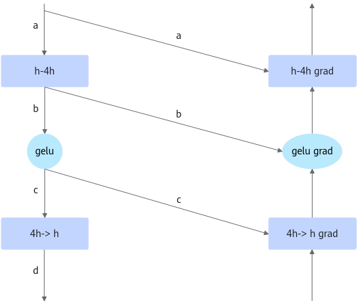
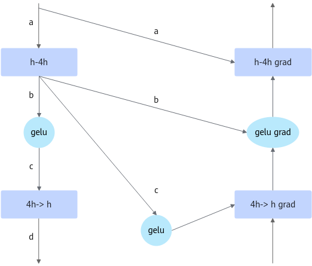

# 激活函数重计算

## 问题分析

现有的大模型训练框架中，重计算和反向计算是绑定在一起调度的，这严重限制了重计算的灵活性。在某些场景下，会限制重计算在模型性能上的优化。

比如在模型中存在某个流程：

前向：gelu激活函数模块->后续模块A。

反向：后续模块A的反向（需要gelu输出的激活值）->gelu反向（与重计算绑定）。

gelu激活函数会产生大量的数据，但本身计算量很小。此时进行激活函数的重计算可以在性能劣化极少的代价下，减少内存占用。
但在现有重计算框架下，如果对gelu激活函数模块做重计算，并不能节省gelu函数的输出。这是因为在反向时，模块A所需要的gelu输出的激活值，会早于gelu激活函数模块的重计算流程，所以前向必须保留激活函数的输出，导致激活函数的输出并不能节省下来。


## 解决方案

本特性重新实现了一套重计算框架，可以将重计算灵活地插入到反向计算之前的任意位置。

反向（新框架）：

gelu函数重计算->后续模块A的反向。

此时，gelu函数的输出已经早于模块A的反向，在前向时就无须保留gelu函数的输出值。

## 解决思路

通过设计一种传入模块函数进行重计算的机制，在合适的时机，丢弃重计算模块输出的物理存储，保留逻辑视图。在反向时，在恰当时机，利用register_hook插入重计算流程，并利用传入的函数重新进行计算，得到结果。

例如，gelu在mlp中的位置下图所示。反向计算需要前向产生的a，b，c, d。其中b, c的shape为(batch, seq , 4 * hidden_szie)，gelu为激活函数，其计算较少，故可将tensor c释放掉，反向在 4h->h 反向前重新计算。



在前向4h->h计算完毕后，将c释放，保留逻辑视图。在4h->h grad前，需要将c计算回来。这里使用给d打tensor_hook的方式来进行重计算的插入，如下图所示：



## 使用场景

主要用于训练场景，用户内存不足或要节省内存时。

## 使用方法

脚本中添加：`--recompute-activation-function` 可开启激活函数重计算。

添加：`--recompute-activation-function-num-layers ${num}` 可指定激活函数重计算的层数。

激活函数重计算可以与全重计算同时开启：

1.同时开启时，仅支持 `--recompute-method 为 block`

2.同时开启时，会按照指定的全重计算和激活函数重计算的层数做各自类型的重计算，即不会有一层既做全重计算又做激活函数重计算。

（注意点：执行优先级是先计算全重计算层，后计算激活函数重计算层。在流水线并行未开启的情况下，全重计算层数和激活函数重计算层数之和应该等于总层数。）

3.暂不兼容自适应重计算特性。

## 使用效果
激活函数重计算在llama2-7B场景下，根据模型配置不同，收益也会发生改变。
在不同参数场景下，激活函数重计算收益表现如下：				
| 模型参数                                                                          | 设备数    | 内存收益        |
|-----------------------------------------------------------------------------|----------|-------------|
| seq-length=12288、micro-batch-size=2、TP=4、DP=2  | 8卡（单机）   | 8.05G   |
| seq-length=8096、micro-batch-size=2、TP=4、DP=2   | 8卡（单机）   | 5.31G   |
| seq-length=16384、micro-batch-size=2、TP=4、DP=2  | 8卡（单机）   | 12.49G  |
| seq-length=12288、micro-batch-size=1、TP=4、DP=2  | 8卡（单机）   | 4.04G   |
| seq-length=12288、micro-batch-size=2、TP=8、DP=1  | 8卡（单机）   | 4.02G   |

## 扩展使用

本特性引入的 CheckpointWithoutOutput 类可以自定义对任何模块进行重计算，并且在合适的时机进行重计算恢复。

此处提供一个示例，可以灵活使用 CheckpointWithoutOutput 来对自定义的函数进行重计算：

（注意：如要使用register_hook，需要确保张量有梯度）
```python
from mindspeed.core.tensor_parallel.random import CheckpointWithoutOutput


class Custom_module(torch.nn.Module):
    def __init__(self):
        ......

    def forward(self, input):
        self.activation_checkpoint_manager = CheckpointWithoutOutput()
        function_output = self.activation_checkpoint_manager.checkpoint(self.custom_function, False, function_input1, function_input2, ...)
        ...(after used output)
        self.activation_checkpoint_manager.discard_output()
        if module_output.requires_grad:
            module_output.register_hook(self.activation_checkpoint_manager.recompute)

        return module_output
```