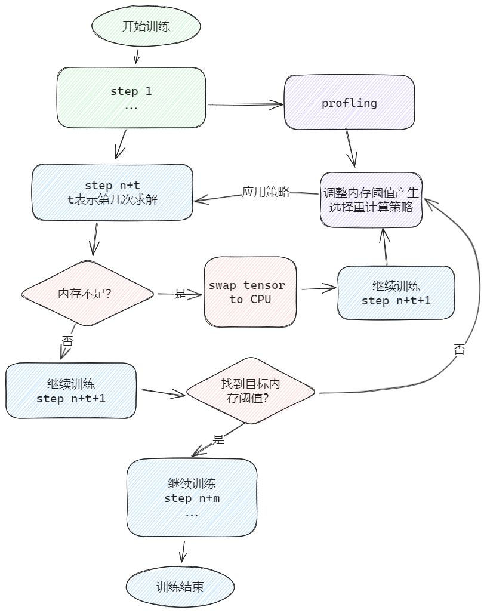
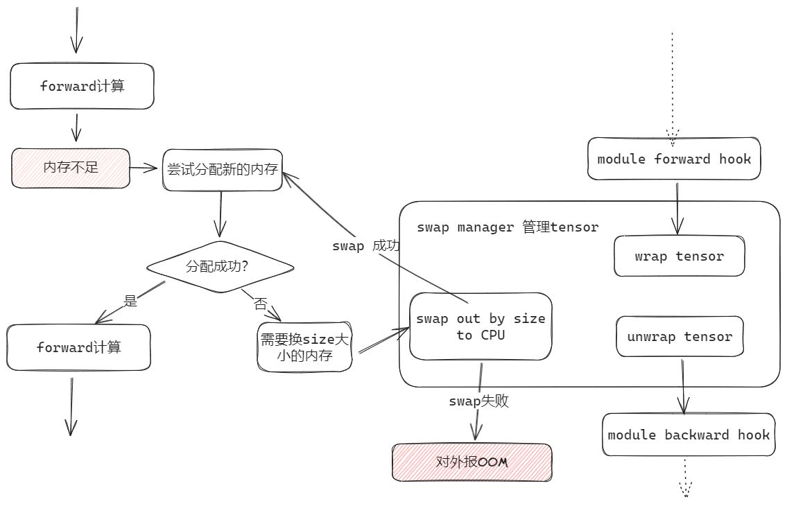

# 自适应选择重计算

## 背景与挑战

[Megatron重计算技术](./recomputation.md)是优化内存使用的关键手段，通过避免冗余数据存储以减少内存占用。然而，传统的重计算策略往往预设固定模式，未能动态响应实际内存需求，限制了内存资源的高效利用。

## 解决方案

为了实现NPU内存资源的最大化利用并显著提升模型训练效率，我们引入了自适应选择重计算特性。这一创新机制能够智能调整训练过程中的内存分配，依据当前内存状况动态选择最佳的重计算策略。

自适应选择重计算特性由三大关键组件构成：

重计算策略搜索：根据实时内存状态，智能筛选最适宜的重计算方案。
* SwapManager功能集成：确保关键张量能在CPU与NPU间无缝迁移，预防因内存溢出而导致的训练中断。
+ 内存管理：适配Ascend Extension for PyTorch的NPU PluggableAllocator接口，实现OOM（Out Of Memory）异常的及时响应与处理。
重计算策略搜索依赖SwapManager功能，及时将tensor换到CPU，避免OOM导致训练中断。自动选择重计算策略流程如下图所示。

##### 图1 自动选择重计算策略流程

 

##### 图2 SwapManager管理流程
SwapManager 需适配 PTA 的 NPUPluggableAllocator 接口拦截 OOM，让 SwapManager 功能可以介入，流程如下图所示：

 

## 使用场景

该特性主要用于训练场景，如果用户发现开启了全重计算功能后， NPU显存剩余较多，此时若想充分利用显存，从而提高训练性能，可以考虑开启该特性。

## 使用方法

* 在训练脚本中配置如下参数启用该特性：
`--adaptive-recompute-device-swap`
*  可选参数
    * 支持手动调整训练内存大小来自动选择重计算策略，请使用`--adaptive-recompute-device-size`进行设置来指定自适应选择重计算策略的训练内存大小（单位：MB）。内存>0为有效内存，最大内存限度为device最大内存。在该范围内自适应重计算才可以进行最优策略搜寻，不在有效内存范围内会使用读取到的device最大内存信息作为默认值。需要注意的是内存设定较小时，性能会与全重计算一致。该方式如果发生OOM，您需要重新选择一个新的内存值来重启模型训练。您也可以通过二分法的方式获得最优解，对该特性不熟悉请勿使用此选项。
    * 支持设置停止profiling的训练step，请使用`--adaptive-recompute-profiling-step`进行设置。该参数需要设置为>0的整数。默认在第10步停止profiling。若该值<=0，则采用默认值10，推荐设置该值>5。当step<5或者>总步数的1/10时，会有告警信息，但不影响正常训练，不会对性能和精度有任何影响。
*  此特性暂只适用于`--use-legacy-models`。

## 使用效果

相较于全重计算模式，LLaMA2-7B模型训练场景下性能提升10%以上，显著优化了训练效率与资源利用。

## 注意事项

- 自适应选择重计算当前暂只适用于`--use-legacy-models`。
- 当前自适应选择性重计算与全重计算、选择重计算、重计算独立调度流水线ripipe、激活函数重计算、预取特性swap-attention等特性均不兼容。
- 由于自适应选择重计算特性修改了PyTorch内存管理模块，打开会存在冲突，mindspeed进行了assert判断。
- 当使用`--adaptive-recompute-device-swap`时，用户可以通过环境变量`MIN_SWAP_TENSOR_SIZE`来指定允许被换出tensor的最小大小（最小可为1024），如不指定，则默认为1024
- 当使用`--adaptive-recompute-device-swap`时，用户可以通过环境变量`SWAP_SIZE_MULTIPLE`来指定换出大小与malloc大小的比值（最小可为1），如不指定，则默认为1
- 自适应重计算通过实现自己的allocator来实现对OOM的拦截，此allocator仍然支持PTA的环境变量`PYTORCH_NPU_ALLOC_CONF`，用户可以参考[此处](https://www.hiascend.com/document/detail/zh/CANNCommunityEdition/80RC2alpha001/apiref/envref/envref_07_0053.html)来配置该环境变量。