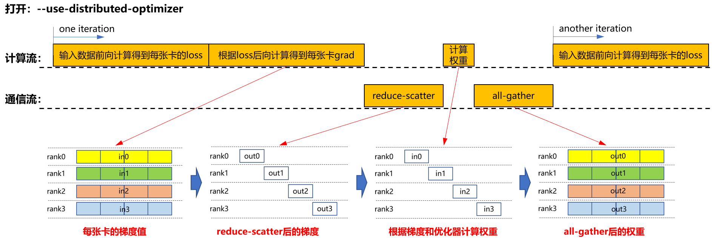
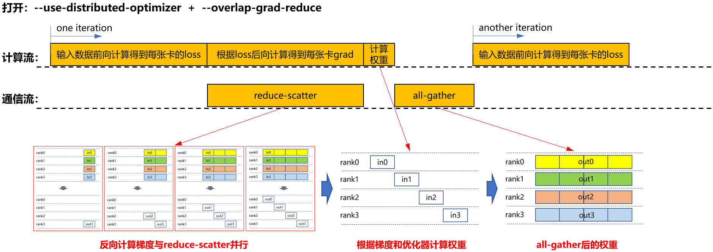
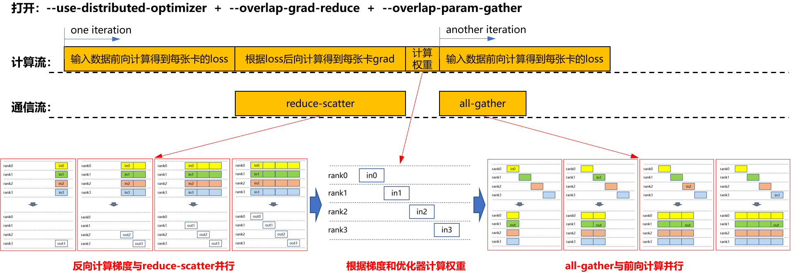

# Megatron权重更新通信隐藏

## 背景与挑战

在大模型的训练过程中，数据并行策略被普遍采用。在梯度更新阶段，传统方法要求数据并行组内的通信操作必须在反向传播计算完全结束后才启动，这种串行执行模式导致计算与通信流程中存在明显的空闲等待期，从而降低了整体执行效率。

## 解决方案

为解决上述问题，引入了计算与通信任务的并行执行策略，通过流水线技术来实现计算与通信的流水掩盖，有效提升资源利用率。

### a. 仅启用分布式优化器，即仅打开 `--use-distributed-optimizer`
在前向与反向计算结束后，将进行独立的通信阶段，包括梯度的reduce-scatter、权重计算以及权重的all-gather，如下图所示。获取更新后的权重后，系统将进入下一轮的前向计算阶段。

 

### b. 同时启用分布式优化器与梯度通信重叠,即打开 `--use-distributed-optimizer` 和 `--overlap-grad-reduce`
在打开`--use-distributed-optimizer`的同时打开`--overlap-grad-reduce`，运行流程如下图所示。对梯度的reduce-scatter过程与反向计算过程并行，从而避免了额外的reduce-scatter时间，显著提高了计算与通信的并行效率，如下图所示。

 

### c. 启用分布式优化器、梯度通信重叠与参数聚合重叠，即打开 `--use-distributed-optimizer` 和 `--overlap-grad-reduce` 和 `--overlap-param-gather`
在打开`--use-distributed-optimizer`和`--overlap-grad-reduce`的基础上进一步打开`--overlap-param-gather`，运行流程如下图所示，对权重的all-gather过程与下一轮的前向计算并行，从而节省了单独的all-gather过程。

 

以上流程对比发现，打开--overlap-param-gather后，通信与计算完全并行，极大提高了计算-通信并行效率，进而提升了模型训练效率。

## 使用场景

该特性适用于采用数据并行策略的训练场景，特别是当通信开销不可忽视时。“权重更新通信隐藏”通过减少通信延迟对整体训练时间的影响，显著提升了模型训练速度。

## 使用方法

* 要启用权重更新通信隐藏功能，需在训练配置中加入以下参数：
    `--overlap-param-gather`
* 确保同时开启了以下两个参数。
    `--use-distributed-optimizer`
    `--overlap-grad-reduce`

## 使用效果

权重更新通信隐藏通过实现计算与通信任务的并行执行，提高大规模模型训练中的资源利用率和训练效率。具体体现在以下几个方面：
* 提高吞吐量
权重更新通信隐藏消除了传统同步模式下不必要的等待时间。这种优化使得系统在单位时间内能够处理更多的数据，从而显著提升了系统的整体吞吐量。

* 降低延迟
单次迭代所需的时间得以减少，这是因为计算和通信不再完全串行进行，而是部分重叠。这不仅减少了单个训练步骤的延迟，还缩短了整个训练周期，提高了模型从开始训练到完成部署的速度。

* 优化资源使用
确保了计算资源和通信带宽被更加高效地利用。传统的同步方法可能会导致计算节点在等待其他节点完成通信时处于空闲状态；而该技术使得硬件资源几乎始终处于工作状态，极大地减少了因同步障碍造成的闲置浪费。

根据实际测试数据，在使用LLAMA2 70B这样的大型语言模型进行训练时，应用了权重更新通信隐藏技术后，端到端性能提升了3.4%。

## 注意事项

* Megatron原生版本存在生成顺序有误的问题，该异常导致下一轮的前向计算提前。开启该特性后，为了修复此异常，attention层init的顺序会更正为先创建linear_qkv再创建linear_proj。
* Legacy下，--overlap-param-gather暂不支持和reuse_fp32_param一起使用。
