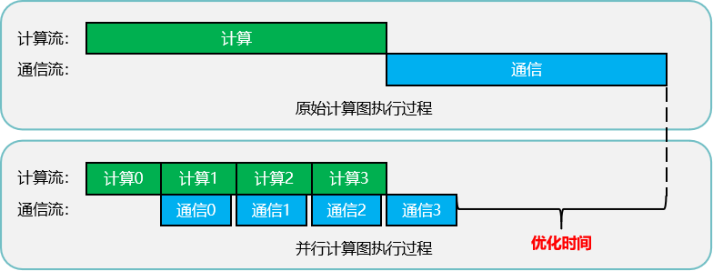

# Megatron异步DDP

## 背景与挑战

在大模型训练场景下，传统[Megatron数据并行](./data-parallel.md)策略往往采用串行执行模式，即在各数据并行组内完成反向传播计算后，再统一执行梯度通信（未启用分布式优化器时为AllReduce，启用时为ReduceScatter）。这种顺序执行方式导致计算与通信之间的等待时间，降低了资源利用率与整体训练效率。

## 解决方案

为突破上述瓶颈，引入了异步DDP（Distributed Data Parallel，分布式数据并行）优化机制，通过将计算与通信任务分解为更细粒度的子任务，实现两者的流水线式重叠执行，有效提升资源利用率。其核心原理如下图所示：

##### 图1 异步DDP并行计算示意图

 

Bucket机制：设立一个临时存储区（Bucket），用于暂存反向传播产生的梯度。一旦Bucket达到预设容量，即刻触发内部梯度的通信任务，无需等待所有反向计算完成。此机制允许后续反向计算与当前通信任务并行运行，显著提升了计算与通信资源的利用率。

## 使用场景

* 模型开启数据并行和分布式优化器（--use-distributed-optimizer）。
* 需要高效利用集群资源进行大规模深度学习模型训练的环境。
* 需要快速迭代模型参数、缩短实验周期的研究和开发工作。

## 使用方法
需在训练脚本中加入以下参数，即可激活异步DDP优化算法。
`--use-distributed-optimizer`
`--overlap-grad-reduce`

## 使用效果

异步DDP通过实现计算与通信任务的重叠执行，显著改善了大模型训练中的资源利用率和训练效率，对于LLaMA2-70B模型，端到端性能提升约2-3%。

