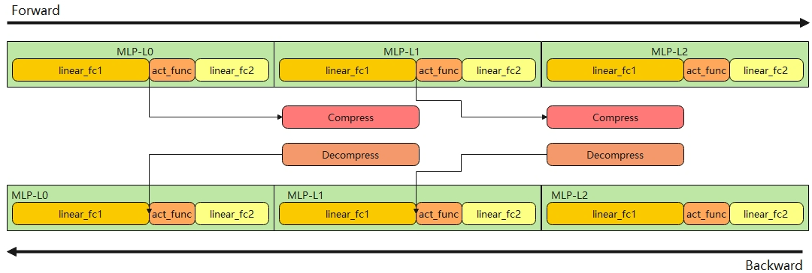

# compress-activation

## 背景与挑战

随着序列长度增加激活值显存占比会逐渐增加，导致单卡峰值内存过高。

因此我们开发了基于自研的昇腾无损压缩算子来压缩激活值占用内存，精度无损。当存在减小峰值内存的需求时，可以选择开启以下三个开关来开启内存压缩特性。
- 特性一：`--compress-dense` 对MLP模块中第一个线性层所产生的激活值进行压缩。
- 特性二：`--compress-activation` 对选定transformer layer所产生的激活值进行压缩。
- 特性三：`--compress-optimizer` 对优化器的一/二阶动量进行压缩。

## 解决方案
- 特性一：
记录首节点MLP执行顺序，对Dense层MLP模块产生的激活值使用多流异步的方式调用昇腾无损压缩算子进行内存压缩，由于该算子使用vector算力，能够和cube计算及通信做掩盖，压缩及解压缩过程本身基本不会导致性能劣化。具体方法如下图所示：

- 特性二：
记录各卡transformer layer的执行顺序，对layer中产生的激活值做无损压缩。通过多流异步的方式调用昇腾无损压缩算子进行内存压缩，压缩算子使用vector算力，能够和cube计算及通信做掩盖，压缩及解压缩过程本身基本不会导致性能劣化。具体流程如下图所示：

- 特性三：
直接调用昇腾无损压缩算子对AdamW优化器的一/二阶动量进行未掩盖的压缩，会引入小幅度的性能劣化。

## 使用场景

训练内存不足的大模型训练场景。

## 使用方法
- 特性一：
    `--compress-dense level0` 只进行Vector压缩，节省空间较少，带来极小的性能开销。
    `--compress-dense level1` 在进行Vector压缩的同时，将部分结果swap到CPU上，节省空间较多，但是带来额外的性能开销。
- 特性二：
    `--compress-activation` 表示压缩哪些层产生的激活值，可配置为`1-3`或`1,2,3`，表示压缩1/2/3层产生的激活值，可配置为`1-3,5-8,10`表示压缩1/2/3/5/6/7/8/10层产生的激活值，也可配置为0表示压缩所有层，默认值为NULL。 
- 特性三：
    `--compress-optimizer` 是否压缩优化器的一/二阶动量，默认值为False。

## 使用效果

使用激活值压缩特性会降低峰值内存。使用优化器一/二阶动量压缩特性会因压缩/解压缩过程未掩盖而引入小幅度的额外性能劣化。在如llama，qwen等典型模型下，开启特性一/二平均内存收益在3%/7%。如：qwen3-8b模型在序列长度为8192，并行配置为PP4TP2CP1，开启特性二的情况下获得内存收益6.2%。

## 使用约束

- 特性二为特性一的迭代版本，两者不能同时开启。特性三可以与特性一或特性二同时开启。
- 当前和 `recompute_activation_function` 特性暂不兼容。