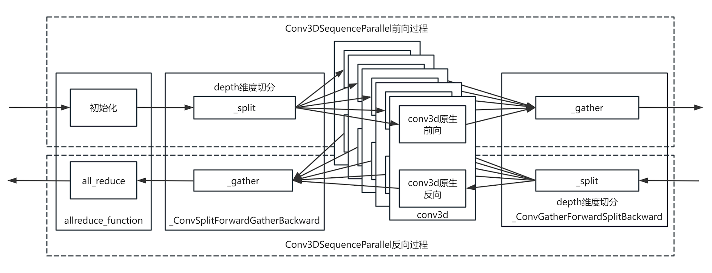

# conv3d 序列并行
## 背景与挑战
在多模态、机器视觉等领域的模型结构中经常会采用conv3d模块用于特征图的三维卷积操作。在大模型中，卷积操作的耗时会随着特征图规模的增加而增加。 
由于特征图的每一个卷积区块的卷积过程是顺序执行，但实际上各个区块的执行顺序并不存在先后顺序上的约束关系。在分布式训练中需要对三维卷积操作进行并行化处理来提高卷积速度。 

## 解决思路
构造Conv3DSequenceParallel类，将输入特征图按照卷积核的depth维度进行切分后进行并行卷积。 
- **前向过程** : 
 构造Conv3DSequenceParallel类，将输入特征图按照卷积核的depth维度进行切分，分发到不同的进程组中进行conv3d三维卷积操作,将卷积结果进行gather操作后输出到下游模块。 
- **反向过程** : 
 Conv3DSequenceParallel类会将下游反向得到的梯度进行split操作，实现梯度的depth维度进行切分，分发到并行的三维卷积模块上进行反向传播，再将并行的三维卷积模块的反向梯度进行gather操作后输出到上游模块。 

## 使用场景
训练含有conv3d（非padding模式）模块的模型。 

## 使用方法
将原有的conv3d模块替换为Conv3DSequenceParallel并指定相关参数，以实现并行加速。 
Conv3DSequenceParallel模块接口如下： 

`Conv3DSequenceParallel(pg, in_channels, out_channels, kernel_size, stride, dilation, bias, param_async, dtype, sp_size)`
- `pg`：必选输入，数据类型为list(int)，表示通信进程组。
- `in_channels`：必选输入，数据类型为int，表示输入通道数。
- `out_channels`：必选输入，数据类型为int，表示输出通道数。
- `kernel_size`：可选属性，数据类型为tuple(int,int,int)，默认值：(1, 1, 1)，表示卷积核大小。
- `stride`：可选属性，数据类型为tuple(int,int,int)，默认值：(1, 1, 1)，表示各个维度卷积步长大小。
- `dilation`：可选属性，数据类型为float，默认值：1.0，表示扩张率。
- `bias`：可选属性，数据类型为bool，默认值：True。表示是否开启偏置。
- `param_async`：可选属性，数据类型为bool，默认值：False。表示是否开启参数异步通信。
- `dtype`：可选属性，表示数据类型，默认值：torch.bfloat16。表示数据类型。
- `sp_size`：可选属性，数据类型为int，默认值：1。表示序列并行大小。

## 使用影响
将逐卷积区域的卷积操作分发到进程组中进行并行化执行，提高三维卷积效率。 

## 注意事项
Conv3DSequenceParallel模块并不支持padding模式，因此使用了padding的conv3d模块不能使用Conv3DSequenceParallel模块替换。