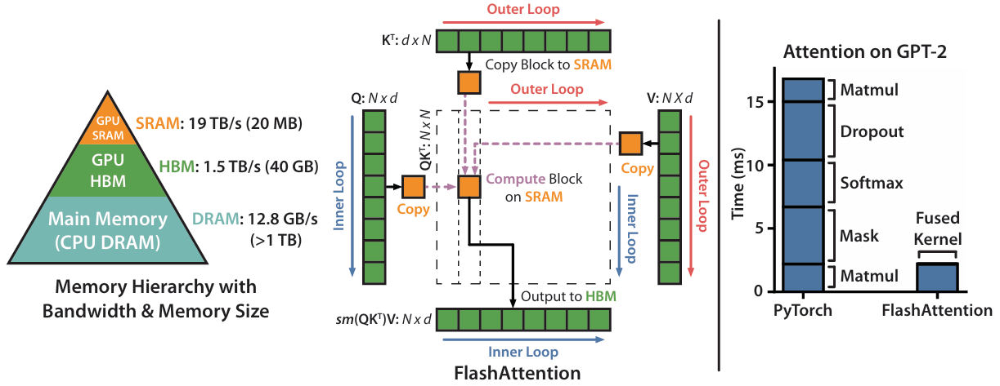

# Flash attention 

## 背景与挑战

在深度学习领域，Transformer模型因其卓越的性能而广泛应用于自然语言处理、语音识别和计算机视觉等多个领域。然而，当处理长序列数据时，其SelfAttention机制的时间与空间复杂度随序列长度呈平方增长，导致计算时间和内存消耗显著增加，成为Transformer模型进一步演进的桎梏。为此，近似注意力方法应运而生，旨在通过削减计算量与内存使用以提速模型处理，却潜藏降低模型质量的风险。此类方法常通过牺牲SelfAttention计算精度、实施稀疏注意力机制或引入替代注意力模式以减小复杂度，但伴随而来的是模型效能的潜在折损，尤其在细节敏感任务中影响更为显著。

## 解决方案

为了克服上述挑战，引入了Flash Attention技术。Flash Attention是一种高效的注意力机制，旨在在保持模型性能的同时，显著降低Transformer模型在处理长序列时的计算时间和内存开销。加速注意力的关键在于优化IO访存，即降低片上内存的读/写次数。

Flash Attention是一种优化IO访存开销的精确注意力方法，原理如图1所示，通过Tiling切片、重计算、Kernel Fusion等方式来减少高带宽内存（片上内存）和SRAM之间的内存读/写次数。NPU侧提供了相同解决方案，该融合算子的详细接口与使用说明请参见融合算子API清单中的fusion_attention接口。
* Tiling切片：利用更高速的SRAM代替Memory on Chip，但SRAM的内存容量较少，无法一次性完成所有数据的完整注意力计算，因此需要进行分块计算。
* 重计算：放弃中间结果写回，需要使用时重新计算，用计算换访存。
* Kernel Fusion：将多个操作融合为一个操作，基于Tiling利用一个kernel完成整个计算。

 

关于Flash Attention更多信息请参见[FlashAttention: Fast and Memory-Efficient Exact Attention with IO-Awareness](https://arxiv.org/pdf/2205.14135)。

## 使用场景

本方法适用于self-attention相关模型，尤其适用于长序列输入场景，开启长序列并行时该特性默认开启。

## 使用方法

设置如下参数即可调用该算法：
`--use-flash-attn`

## 使用效果

可以大幅提升模型训练效率并节省训练内存开销，在LLaMA2-7B模型下，性能提升约34%。