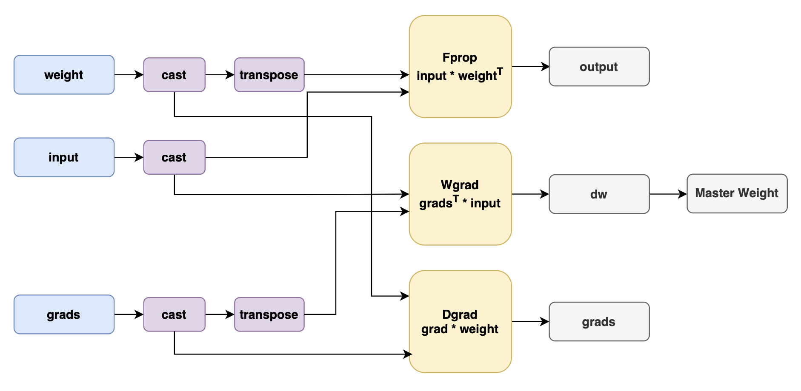

## 低精度训练

## 问题分析

随着大模型的演进，参数量以指数级上升，目前业界采用FP16/BF16混合精度训练以提升模型训练性能，为了进一步优化Transformer模型的性能，推出了FP8低精度训练，旨在以减少计算量以提升模型性能。

## 解决方案

低精度训练流程中主要是将前向传播 (Fprop)、激活反向传播 (Dgrad) 和权重反向传播 (Wgrad)中的GEMM，量化为FP8的精度执行运算。  
整网训练流程仍然是以BF16/FP16的AMP混合精度训练流程，但在特定的计算算子以FP8的精度进行计算，主要是Linear层中的Matmul计算，包括Fprop、Dgrad和Wgrad  
在高精度量化为低精度tensor的过程中，存在着不同的scaling策略:  
- Delayed Scaling:根据历史amax值计算scaling factor，然后使用scaling factor对tensor进行量化。  
- Tensorwise Scaling:在线策略，实时计算amax并应用scaling factor对tensor进行量化。
- Blockwise Scaling:对tensor进行分块，然后分别计算amax并应用scaling factor对tensor进行量化。  
- MX Scaline: 通过块级共享scale与低位宽元素组合，将浮点向量转化为MX块，实现动态量化。
支持的低精度的数据格式有:  
- E4M3: 1个符号位，4个指数位，3个尾数位，表示范围为-448到+448。
- E5M2: 1个符号位，5个指数位，2个尾数位，表示范围为-57344到+57344。
- HiF8: 1个符号位，动态的Dot位、指数位和尾数位，最大可表示2E15。

## 使用方法
设置`--transformer-impl transformer_engine`开启transformer_engine

设置`--fp8-format e4m3`，选择低精度数据格式，目前支持`e4m3`、`hybrid`和`hif8`，开启`hybrid`时，前向训练采用E4M3数据格式，反向传播采用E5M2数据格式。

设置`--fp8-recipe delayed` 选择低精度训练scaling策略，目前支持`tensorwise`、`delayed`、`mxfp8`和`blockwise`，默认值为`delayed`。
## 使用限制

1. 低精度训练仅支持mcore models，即需要开启`--use-mcore-models`  
2. HiF8数据格式训练仅支持tensorwise策略，即需要开启`--fp8-recipe tensorwise`  
3. 当前不支持低精度通算融合
