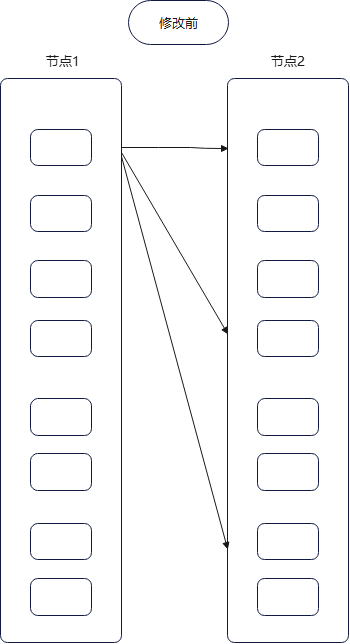
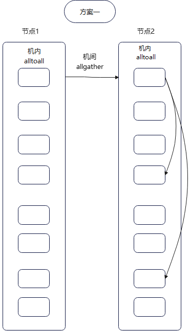

# MoE Hierarchical Alltoallv分层通信

## 背景与挑战

大模型训练过程中，在MoE Layer中前向和反向均有两次alltoallv进行数据传输。在原本的实现中，多卡多机组成了一个规模较大的通信组，机间机内同时进行alltoallv通信，造成机间的冗余通信较多。

如下图所示，假设有两个节点，其中topk=3，节点1内的某个token选择了节点2上不同卡的3个专家，那么这个token通过alltoallv传输了3次，也就是topk次。

## 解决方案

将规模较大的通信组分成两个相互正交的inner group和outer group。在outer group内，也就是ep组内，使用allgather收集token，再在inner group内，也就是tp组内，使用alltoallv传输token，提供分层通信的功能，节省topk倍的冗余通信，提升性能。

## 使用场景

在多机情况下，deepseekv2类moe模型，开启tp_extend_ep特性，且需要提升性能的场景下。

## 使用方法

在启动脚本中添加参数--moe-hierarchical-alltoallv，即可开启分层通信开关。

## 使用效果

开启分层通信moe_hierarchical_alltoallv前后，5000step精度对齐，性能收益4.28%

在内存优化特性memory level0开启的情况下，开启分层通信moe_hierarchical_alltoallv前后对比，5000step精度对齐，性能收益3.02%

在内存优化特性memory level1开启的情况下，开启分层通信moe_hierarchical_alltoallv前后对比，5000step精度对齐，性能收益4.34%

## 注意事项：

1.仅支持在多机情况下，moe_tp_extend_ep和moe_alltoall_overlap_comm特性开启的情况下

2.Megatron和MindSpeed版本均为使用core_r0.8.0分支。