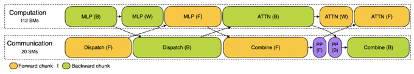
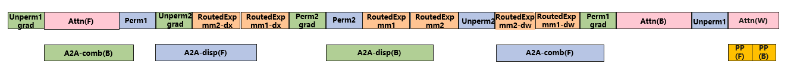
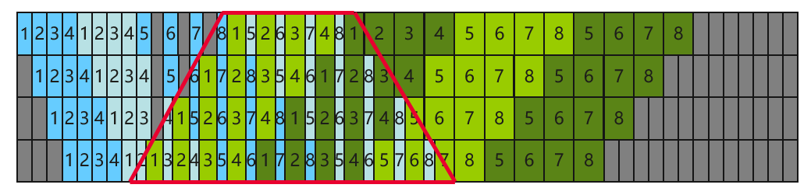

# MoE跨microbatch间AlltoAll通信掩盖

## 背景与挑战
MoE模型训练的关键瓶颈在于高昂的AllToAll(A2A)通信耗时，显著影响训练MFU。另外，相同microbatch内，A2A通信和计算存在依赖，因此A2A通信难掩盖。

在DeepSeek V3模型训练中，DeepSeek团队创新性地提出了双向流水跨MicroBatch间AllToAll(A2A)掩盖，即DualPipe算法。
Dualpipe从流水线两端同时输入micro batch，同时借鉴ZeroBubble思想进行dw/dx分离，进一步缩减了流水线空泡（bubble）。
同时，不同micro batch前反向无依赖关系，DualPipe通过双流编排计算通信，实现1F1B阶段A2A通信全掩盖，详情参见：
> DeepSeek-V3 Technical Report (https://arxiv.org/abs/2412.19437)

具体来说，单层内的前向计算和通信按顺序被拆分为Attention(F), Dispatch(F), MLP(F), Combine(F)四个阶段， 单层内的反向计算按顺序被拆分为Combine(B), MLP(B), Dispatch(B), Attention(B)，其中Dispatch和Combine分别为MLP计算前后的A2A通信。通过双流编排正向和反向的计算和通信，实现1F1B阶段A2A通信全掩盖。原理如下图 (https://github.com/deepseek-ai/profile-data)：

由于正向和反向计算是不同的microbatch，因此正向和反向的计算不存在顺序依赖关系，根据上述正向和反向的顺序，可用Attention(F)掩盖Combine(B)，MLP(B)计算掩盖Dispatch(F)，MLP(F)掩盖Dispatch(B)，Attention(B)掩盖Combine(F)。同时DeepSeek团队为计算和通信分配了固定的CUDA SM数量，缓解计算和通信的SM资源抢占问题。

## 解决方案
MindSpeed基于昇腾硬件特点，设计实现了一套高性能的MoE跨microbatch间A2A通信掩盖方案，通过细粒度的计算和通信流水排布，实现了warmup/cooldown阶段A2A通信**50**%掩盖，1F1B阶段A2A通信**100**%掩盖的效果。在DeepSeek V3模型上结合DualpipeV相比MindSpeed已有A2A掩盖特性`--moe-alltoall-overlap-comm`端到端性能提升**10**%。

### 跨microbatch间A2A通信掩盖
MindSpeed实现的1F1B细粒度计算和通信流水排布如下图：

通过分离调度专家和Attention部分反向的dw和dx计算，可实现1F1B阶段的A2A全掩盖。同时，由于昇腾硬件上通信行为由AICPU下发，不会消耗cube计算单元资源，因此计算和通信的并发对计算效率的影响很低。另外，使用了Attention部分的dw计算掩盖了PP的通信，从而实现1F1B阶段通信的全掩盖。

下图是真实671B DeepSeekV3模型使用该特性时，单层内的A2A通信掩盖profiling示意图：

使用该特性后在1f1b阶段4次A2A通信可被计算完全掩盖。
### Warmup/Cooldown阶段A2A自掩盖
在流水线Warmup/Cooldown阶段，仅存在同microbatch的正向/反向计算，因此无法使用跨microbatch间的A2A通信掩盖方法。为了进一步提升掩盖比例，在warmup和cooldown阶段使用了层内的自掩盖：正向使用共享专家的计算掩盖dispatch通信，反向使用共享专家的反向计算掩盖combine通信，使用路由专家的dw计算掩盖dispatch通信。

### 基于DualpipeV和Megatron VPP的跨microbatch间A2A通信掩盖
MindSpeed基于dualpipe流水实现了MoE跨microbatch间A2A通信掩盖，具体细节参见[DualpipeV介绍](../dualpipev.md)。

另外，我们注意到在传统Megatron VPP（虚拟流水线并行）的基础上，也可以实现MoE跨microbatch间的A2A通信掩盖，只需要在warmup阶段相比于原始VPP多做一个warmup microbatch，具体见下图：

中间红框部分可使用跨microbatch间A2A掩盖。相比于DualpipeV流水，该方案实现上更简单，也同样可实现A2A通信掩盖。

## 使用方法
请注意当前该特性仅在DeepSeek V3场景进行了验证，在其他MoE模型场景需要进一步验证和适配。

1. 在启动脚本中加入`--moe-fb-overlap`。

2. 如果需要使用DualpipeV流水，请在启动脚本中加入`--schedules-method dualpipev`
3. 如果使用megatron VPP，请在启动脚本中配置`--num-layers-per-virtual-pipeline-stage`

## 使用约束
1. 当前仅支持`--moe-token-dispatcher-type=alltoall`, 暂不支持`allgather/alltoall_seq` Dispatcher。
2. 不建议同时使用`--swap-attention`，开启后性能劣化。
3. 当前需设置`--expert-tensor-parallel-size=1`，暂不支持专家TP。
4. 当前暂不支持Megatron MoE Token Drop&Pad模式，仅支持Dropless。
5. 当前依赖GroupedMatmul, 确保打开`--moe-grouped-gemm`。
6. 当前仅支持`--moe-zero-memory=level0`，且不支持`moe-zero-memory-num-layers`配置。
7. 当前暂不支持异步DP通信掩盖，需关闭`--overlap-grad-reduce`。
8. 当前仅支持Mcore Models，不能打开`--use_legacy_models`。
9. 与下列特性冲突，不能同时使用：
   1. `moe-alltoall-overlap-comm`
   2. `moe-hierarchical-alltoallv`