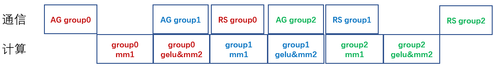

# MoE Experts Pipeline Degree大专家流水

## 问题分析

该功能在面向megatron+mindspeed框架MoE类模型大专家的情况下，专家的计算时间和通信时间在每层神经网络中占比大，严重影响性能和内存。

## 解决方案

本方案中，将专家分组做流水，使专家计算内部的通信和计算相互掩盖，只有头尾未掩盖通信开销。在负载基本均衡的情况下，专家的allgather和reducescatter的未掩盖通信变成了1/moe_experts_pipeline_degree。（moe_experts_pipeline_degree表示流水次数）

## 使用场景

基于gpt-moe大专家模型，专家的计算时间和通信时间在每层神经网络中占比大的情况。

## 使用方法

在启动脚本中添加并合理配置 --moe-experts-pipeline-degree [int]

其中，[int]是大专家的流水粒度，是大于1小于专家数num_experts，并且可以被专家数num_experts整除的整数。

## 使用效果

配置大专家流水moe_experts_pipeline_degree前后, 5000step精度对齐。性能收益2.11%，内存收益4.38%

## 注意事项：

1.仅支持tp>1, sp和moe_alltoall_overlap_comm特性开启的情况下

2.Megatron和MindSpeed版本均为使用core_r0.8.0分支。