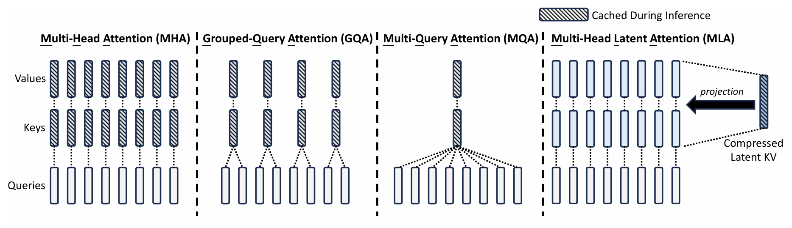

# Multi-head Latent Attention多头潜注意力机制

## 背景与挑战
传统 Transformer 模型通常采用多头注意力机制（Multi-head Attention，MHA），该机制通过计算查询（query）、键（key）和值（value）矩阵之间的相关性，使模型能够捕捉输入序列中不同部分之间的依赖关系。在推理生成阶段，为避免重复计算，模型需要维护一个键值缓存（KV cache），然而该缓存的空间占用与序列长度、批次大小、隐藏层维度以及注意力头数等因素成正比。这一问题导致模型在实际应用时面临显著的内存开销，成为模型扩展的主要瓶颈。针对此问题，DeepSeek 提出了多头潜注意力机制（Multi-head Latent Attention，MLA），通过优化 KV cache 存储结构，有效减少显存占用，从而提升模型在推理中的效率。

## 解决方案
与传统 KV cache 不同，MLA 并不直接存储完整的 key 和 value 矩阵，而是通过一个压缩隐向量来表示 key 和 value，借助低秩压缩技术降低 KV cache。在训练中，query 也会进行低秩压缩以降低激活值内存。下图对比了 MLA 与 MHA、Grouped-Query Attention （GQA）、Multi-Query Attention（MQA）在工作机制上的区别。

更多关于 MLA 的细节可参见原文：
> DeepSeek-V2: A Strong, Economical, and Efficient Mixture-of-Experts Language Model (https://arxiv.org/abs/2405.04434)

## 使用场景

MLA 解决了标准 Transformer 模型的内存瓶颈，可作为一种通用的模型结构降低显存占用，提高推理效率。

## 使用方法
启用 MLA，需在训练脚本中加入以下参数配置：

`--multi-latent-attention`：Use Multi-head Latent Attention

`--q-lora-rank`：Rank of Query tensor's low rank representation

`--kv-lora-rank`：Rank of Key and Value tensors' low rank representation

`--qk-head-dim`：Dimension of the head in the QK projection. q_head_dim = qk_head_dim + qk_pos_emb_head_dim

`--qk-pos-emb-head-dim`：Dimension of the position embedding in the QK projection

`--v-head-dim`：Dimension of the head in the V projection

`--rotary-scaling-factor`：Rotary scaling factor for the rotary embeddings

## 使用效果

与传统 MHA 相比，MLA 可以显著降低 KV 缓存占用，同时又具有恢复 key 和 value 矩阵中全部信息的能力，特征表达能力优于其他 KV cache 方法（例如 GQA, MQA 等），保证了模型的性能。