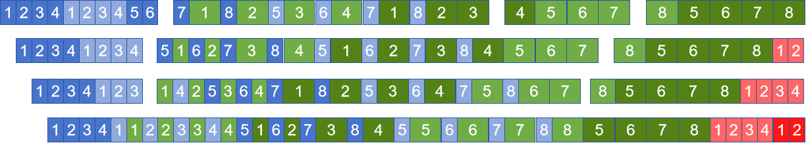
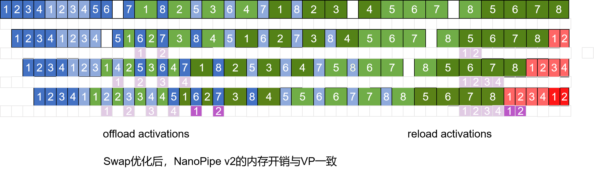

# nanopipe流水线并行

## 背景与挑战

流水线并行是AI大模型分布式训练的关键组成部分之一，但其效率受到流水线中空泡的影响，为了提高吞吐量，需要降低其空泡比例。nanopipe展示了另一个角度下的优化思路。

## 解决方案

在大模型流水线调度中，反向的输入梯度和权重梯度通常是一起调度计算的，然而，通过分析他们计算的依赖关系，可以发现其实只有输入梯度的计算存在相互层间的依赖关系。因此，通过独立调度反向的输入梯度和权重梯度的计算，可以减少流水线调度的空泡。

##### 图1 反向输入梯度和权重梯度一起调度的Interleaved 1F1B

##### 图2 独立调度输入梯度和权重梯度的nanopipe

##### 图3 独立调度权重计算展示图

 
分离权重梯度计算流程，可通过修改RowParallelLinear和ColumnParallelLinear的backward实现，将对权重的梯度计算进行剥离，先存储在调度器上权重的梯度计算队列中。在需要对权重的梯度计算时，从调度器上权重的梯度计算队列中，依次出队，然后计算对应的梯度。

## 使用场景

在训练模型时，降低空泡的比例，从而提升计算效率，达到更好的流水线并行。此特性暂时仅适用于Legacy分支，即脚本中配置`--use-legacy-models`。

## 使用方法

* nanopipe依赖于虚拟流水线并行，需设置如下参数。
`--num-layers-per-virtual-pipeline-stage N   # 开启虚拟流水线并行`
N表示每个虚拟流水线阶段的层数。
 
* 在脚本中配置以下参数，使能nanopipe流水线并行。
`--use-nanopipe` 
`--pipeline-model-parallel-size  N   # 开启流水线并行，N大于2`
默认为False，根据用户需求配置。

## 使用效果

通过流水线并行，nanopipe可以更快地处理大量的数据，提高数据处理的效率和准确性，提升计算的速度，减少空泡占比，如下表所示：

| device | TP | SP | PP | SEQ | hidden-size | Nano vs vpp收益 |
| :-----: | :----: | :----: | :-----:| :----: | :----: | :-----: |
| 单机 | 1 | 关 | 4 | 4096 | 4096 | 3.24% |
| 双机 | 4 | 开 | 4 | 8192 | 8192 | 1.02% |

# nanoswap

## 背景与挑战

使用nano时grad从前向到反向需要持续存储在npu上，生命周期过长，多次累加会增大npu内存的峰值。

## 解决方案

将过多的张量做offload动作存储到cpu上，在内存峰值过后再将其张量reload回npu上。

### 解决思路

在前向时将上一轮过多的张量offload到cpu，再在连续的反向运算中途reload回npu上，通过swap流控制不会让reload和offload出现顺序错误。

完整nanopipe-swap原理图如下图所示：

## 使用方法

基于nanopipe的基础上再开启`--use-nanopipe-swap`。

## 使用效果

优化设备内存峰值，如下表所示：

| device | TP | SP | PP | SEQ | hidden-size | mc2 | Nano内存峰值 |swap内存峰值 | Nano vs swap内存峰值下降 |
| :-----: | :----: | :----: | :-----:| :----: | :----: | :-----: | :-----: | :-----: | :-----: |
| 单机 | 2 | 开 | 4 | 1024 | 4096 | 开 | 5520.62 | 5177.72 | 6.21% |