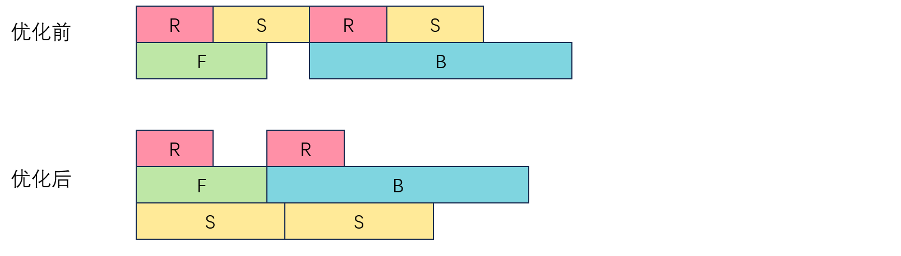
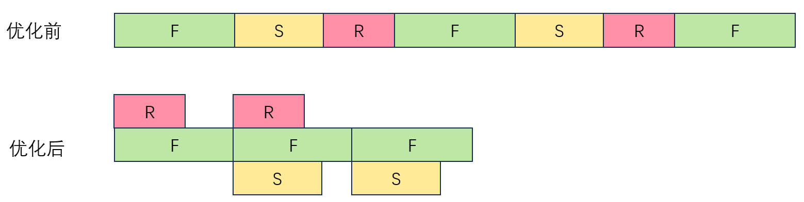
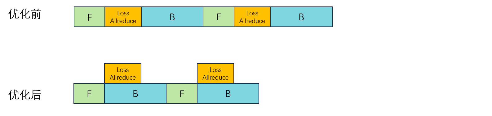

# 通信掩盖优化(Prototype)

## 问题分析

在当前的 interleave/nanopipe调度中，warmup/cooldown 阶段的 p2p 通信和计算是顺序执行，并没有进行掩盖处理，导致通信时间完全暴露，除此之外在1f1b阶段目前的通信掩盖方案为前向计算掩盖反向通信和反向计算掩盖前向通信。类似地，PP的最后一个stage用于日志打印的 AllReduce 完全没有进行掩盖。这些通信的特点是数据量较小，在单数据中心内即使不做掩盖，它们对训练时长时影响也不大。然而，在多数据中心（Data Center，简称DC）训练时由于数据要在多个数据中心之间传递，因此通信的延迟会显著增加（例如，千公里的时延为 5ms），于是这些未被掩盖的通信会严重影响训练效率。除此之外，在开启virtual pipeline之后每一个virtual stage前向和反向的计算时间被进一步缩短，导致P2P通信更难被完全掩盖。

## 解决方案

* 针对interleave/nanopipe调度的问题，我们将原始的单流send/receive 变为多流，并将warmup/cooldown 阶段的receive算子提前。因此，在1f1b阶段多流通信使Send和Receive并发，破除了原始方案中send/receive按顺序传输的限制，使得通信更容易被掩盖。receive算子提前后可以提前接收前一个stage 发来的数据，并对warmup/cooldown阶段通信掩进行掩盖。

优化前和优化后1f1b阶段多数据中心训练通信和计算掩盖情况：

优化前和优化后warmup阶段通信和计算掩盖的情况：

* 针对日志打印的 AllReduce 未被掩盖的问题，我们将 AllReduce 操作变为异步，使用计算进行掩盖，可完全消除这部分的通信耗时。

优化前allreduce 完全未做掩盖，优化后可全部掩盖：

### 解决思路:

* 针对interleave/nanopipe调度通信优化，通过修改调度中通信group，使用ping/pong 的方式实现多流传输。
* 针对日志打印的 AllReduce 掩盖优化，将loss function中的allreduce修改为异步操作，并在train 函数中对allreduce进行wait。

## 使用场景

使用virtual pipeline并行，并且p2p通信跨数据中心时使用interleave/nanopipe调度通信优化。DP通信跨数据中心时使用日志打印的 AllReduce 掩盖优化。

## 使用方法

* interleave/nanopipe调度通信优化需要设置`--overlap-warmup-cooldown-communication` 和 `--use-multi-stream`，其中`--overlap-warmup-cooldown-communication`用于开启优化，`--use-multi-stream`用于设置使用单流下发通信算子还是多流下发通信算子，跨DC训练时两个选项需要同时开启，仅开启`--use-multi-stream`时将报错。单DC训练时可以仅开启`--overlap-warmup-cooldown-communication`。
* 日志打印的 AllReduce 掩盖优化需要开启 `--async-log-allreduce`，单DC训练和多DC训练均有优化效果。

## 使用效果

PP跨DC训练优化效果如下表所示：

| 模型        | TP  | PP  | DP  | VP  | nanopipe | 带宽收敛比 | 数据中心之间距离（KM） | 性能提升比例 | 跨DC基线单step时长(ms) | 跨DC优化后单step时长(ms) |
|-------------|-----|-----|-----|-----|----------|------------|------------|--------------|------------------|------------------|
| llama2-70B  | 8   | 8   | 1   | 5   | Off      | 128        | 960        | 24%          | 15923.4          | 12343.7          |
| llama2-70B  | 8   | 8   | 1   | 2   | Off      | 128        | 960        | 2.9%         | 12723.5          | 12345.4          |
| llama2-70B  | 8   | 8   | 1   | 1   | Off      | 128        | 960        | 16%          | 15286.0          | 12814.6          |
| llama2-70B  | 8   | 8   | 1   | 5   | On       | 128        | 960        | 25%          | 16764.5          | 12265.4          |
| llama2-70B  | 8   | 8   | 1   | 2   | On       | 128        | 960        | 0.1%         | 12345.4          | 12207.7          |
| llama2-70B  | 8   | 8   | 1   | 1   | On       | 128        | 960        | 0.5%         | 12531.0          | 12517.8          |

