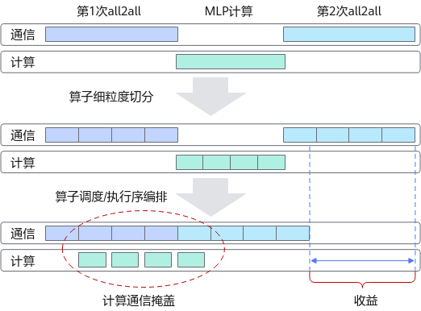

# MLP通信隐藏

## 背景与挑战

大模型训练过程中，通信和计算往往存在依赖关系，这样的串行执行顺序会造成计算和通信流存在一定程度的空闲等待时间，导致执行效率较低。

## 解决方案

对通信和计算算子做更为细粒度的切分，保证细粒度间的计算和通信任务不存在依赖关系，是创造可并行执行任务的前提。

再对算子调度/执行顺序进行编排，实现计算和通信的并行执行，在计算过程能掩盖中间部分的通信过程。

##### 图1 MLP与通信的掩盖

## 使用场景
* MLP通信隐藏：`--use-pipe-experts`
开启后，将对每个experts进行细粒度切分，对前向和反向的执行顺序进行编排，实现通信和计算之间的掩盖，提高效率。

*  多流水线：`--pipe-experts-multi-stream`
需要在打开`--use-pipe-experts`的基础上开启使用。开启后，能够保证ep的alltoall通信和tp的allgather/reduce-scatter之间串行执行，避免集合通信出现链路冲突。

*  多副本：`--pipe-experts-multi-data N`
需要在打开`--use-pipe-experts`的基础上开启使用，`N`表示使用N份副本。开启后，能将输入数据切分为多个副本，将不同副本间的计算和通信类比为多个experts的计算和通信。

## 使用方法
开启MLP通信隐藏，该功能将对每个experts进行细粒度切分，对前向和反向的执行顺序进行编排，实现通信和计算之间的掩盖，提高效率。
`--moe-model-type deepspeed_moe`
`--use-pipe-experts`

开启--use-pipe-experts后，可单独或同时设置以下特性：
* 多流水线
`--pipe-experts-multi-stream`
开启后，能够保证ep的alltoall通信和tp的allgather/reduce-scatter之间串行执行，避免集合通信出现链路冲突。

* 多副本
`--pipe-experts-multi-data N   # N表示使用N份副本`
开启后，能将输入数据切分为多个副本，将不同副本间的计算和通信类比为多个experts的计算和通信。
## 使用效果

使用该特性可以提升性能。

8机, world_size = 64, sequence_len = 128k, num_layers = 4, recompute_granularity = full, hidden_size = 12288, moe_router_topk = 2, ep = 4, tp = 8, dp = 2, cp = 4, pp = 1, sp = True

场景1：num_experts = 4 (num_local_experts = 1)

| pipe-experts | multi-stream |   multi-data    | 平均TFLOPs |  提升幅度  |
|:------------:|:------------:|:---------------:|:--------:|:------:|
|      关       |      关       | 关 = 1 (Default) |  104.88  |   /    |
|      开       |      关       |      开 = 2      |  108.01  | 2.99%  |
|      开       |      关       |      开 = 4      |  110.96  | 5.80%  |
|      开       |      开       |      开 = 2      |  110.21  | 5.08%  |
|      开       |      开       |      开 = 4      |  111.43  | 6.25%★ |

场景2：num_experts = 16 (num_local_experts = 4)

| pipe-experts | multi-stream |   multi-data    | 平均TFLOPs |  提升幅度  |
|:------------:|:------------:|:---------------:|:--------:|:------:|
|      关       |      关       | 关 = 1 (Default) |  103.15  |   /    |
|      开       |      关       | 关 = 1 (Default) |  109.27  | 5.93%  |
|      开       |      关       |      开 = 2      |  109.20  | 5.86%  |
|      开       |      开       | 关 = 1 (Default) |  109.49  | 6.14%★ |
|      开       |      开       |      开 = 2      |  108.32  | 5.01%  |

场景3：num_experts = 8 (num_local_experts = 2)

| pipe-experts | multi-stream |   multi-data    | 平均TFLOPs |  提升幅度   |
|:------------:|:------------:|:---------------:|:--------:|:-------:|
|      关       |      关       | 关 = 1 (Default) |  103.98  |    /    |
|      开       |      开       | 关 = 1 (Default) |  109.32  | 5.13%★  |
|      开       |      开       |      开 = 2      |  108.38  |  4.23%  |

总体上，使用MLP通信隐藏特性后，通过减少通信时间、提高设备利用效率，在上述参数配置可以获得5%-6%的计算效率提升。

## 注意事项
* 在开启`--pipe-experts-multi-data`时，若N过大，导致输入数据切分过细，会引入多余的cast和add算子，导致额外的开销，引起性能恶化。
    * 8机：当num_local_experts = 1时，推荐开启`--pipe-experts-multi-data 4`来获得最佳性能；当num_local_experts大于1时，不推荐开启“多副本”。
    * 单机：当num_local_experts为1或2时，推荐开启`--pipe-experts-multi-data 2`来获得最佳性能；当num_local_experts为4及以上时，不推荐开启“多副本”。
* “多副本”特性主要被用来提供num_local_experts为1时无法进行experts间的细粒度切分的替代方案。虽然兼容num_local_experts大于1的场景，开启后可以进一步提高计算通信掩盖比例，但会新引入cast和add算子操作，当掩盖的收益不足以抵消新引入算子的拖慢时，可能会导致性能恶化。
* 在未开启`--sequence-parallel`（SP，序列并行）时，无法开启多流水线`--pipe-experts-multi-stream`。
* 未适配MoE token dropless特性。