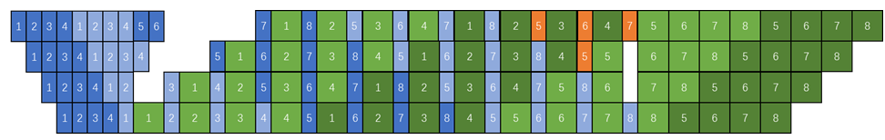
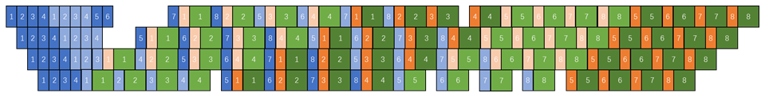

# 重计算流水线独立调度
## 背景与挑战

在目前的流水线调度中，重计算由反向计算触发，与反向计算绑定在一起调度，意味着重计算需要等待下一个stage返回梯度才可以开始计算。然而重计算并不需要用到反向计算的梯度，这导致bubble的增多和性能的下降。

## 解决方案

为了将重计算和反向计算独立调度，需要将重计算的调度修改为由调度器主动触发，并修改调度器，将重计算作为一个调度单元加入到调度器中，这使我们获得了自由地插入或去除部分重计算的能力，进而可以在内存和性能方面做出优化。

通过torch的saved_tensors_hooks实现一种新的重计算方法，在反向计算前合适的时机主动触发或者直接去除部分重计算，从而实现对内存或性能的优化。

## 使用场景

在虚拟流水线调度中，若用户未开启重计算，则可以利用bubble主动插入重计算，以极小的性能代价换取内存峰值的降低，将需要保留激活值的前向计算块的个数减少到PP * VPP（PP表示流水线并行数，VPP表示虚拟流水线并行数）。

##### 图1 未开启重计算调度图

 

在虚拟流水线调度中，若用户已开启重计算，则可以通过解除重计算与后一个stage的反向计算间的依赖关系从而提前重计算，以及去除模型最后一层的重计算，实现计算性能的提升。

##### 图2 开启重计算调度图

 

## 使用方法
需在训练脚本中加入以下参数配置：

* 开启利用bubble进行重计算功能:
`--recompute-in-bubble`
必须开启虚拟流水线并行特性，使用此功能前不能开启重计算，recompute_num_layers参数需为None或0。

+ 开启提前重计算以及去除不必要重计算功能:
`--recompute-in-advance`
必须开启虚拟流水线并行特性，使用此功能前需要开启重计算，且不支持recompute_method为uniform，recompute_num_layers不能为None或0。

#### 说明：

*  --recompute-in-bubble 特性暂不兼容完全重计算uniform、完全重计算block、选择重计算、自适应选择重计算、swap-attention、no-align-grad-reduce和no-overlap-p2p-communication特性，不兼容moe场景下的--moe-adaptive-recompute-activation、--moe-layer-recompute特性。
+  --recompute-in-advance 特性暂不兼容完全重计算uniform、选择重计算、自适应选择重计算、no-align-grad-reduce和no-overlap-p2p-communication特性。
*  --recompute-in-bubble和--recompute-in-advance两者不可同时开启。

## 使用效果

`--recompute-in-bubble`, 在bubble主动插入重计算，实现内存节省。

`--recompute-in-advance`, 在bubble处提前开启重计算，相比于默认的完全重计算方案可以实现训练性能提升。