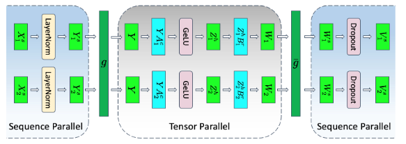

# Megatron序列并行

## 背景与挑战

在大模型训练中，张量并行虽能有效降低内存占用并加快训练速度，但其要求将模型各层分割为独立块，这在处理如LayerNorm和Dropout等操作时存在局限。尽管这些操作计算成本较低，但存储激活所需的冗余内存显著，为了解决这一问题，序列并行作为一种补充策略被引入，旨在分摊那些在张量并行中无法切分的内存和计算负担。

## 解决方案

序列并行（Sequence Parallelism，SP）策略在张量并行的基础上进一步提高计算效率，是一种通过将输入数据的序列维度进行切分的并行计算方式。

将 LayerNorm 以及 Dropout 等操作的输入按序列维度进行了切分，使得各个设备上面只需要做一部分的 Dropout 和 LayerNorm 等操作即可。

为了方便理解，以下图为例：假设输入$X$的大小为$ s \times b \times h $，按照序列维度切分$X=[X_1^s,X_2^s]$，经过LayerNorm操作后的结果为$Y=[Y_1^s,Y_2^s]$，随后进行张量模型并行。

[原文链接](https://arxiv.org/pdf/2205.05198)

## 使用场景

序列并行技术适用于以下场景：

* 内存占用过高：即使采用了张量并行，内存占用仍接近或超出处理器内存限制。
* 计算资源优化：旨在进一步降低内存开销，提升训练速度。
## 使用方法

序列并行依赖张量并行，因此启用序列并行，需在训练脚本中加入以下参数配置：

`--tensor-model-parallel-size  N        # 设置张量模型并行大小，N为单个并行组内的NPU数目`
`--sequence-parallel      # 开启序列并行`

## 使用效果

通过序列并行策略，利用多设备协同作用，在张量并行的基础上，进一步降低了内存占用，使得设备可以容纳更大参数的模型训练。

