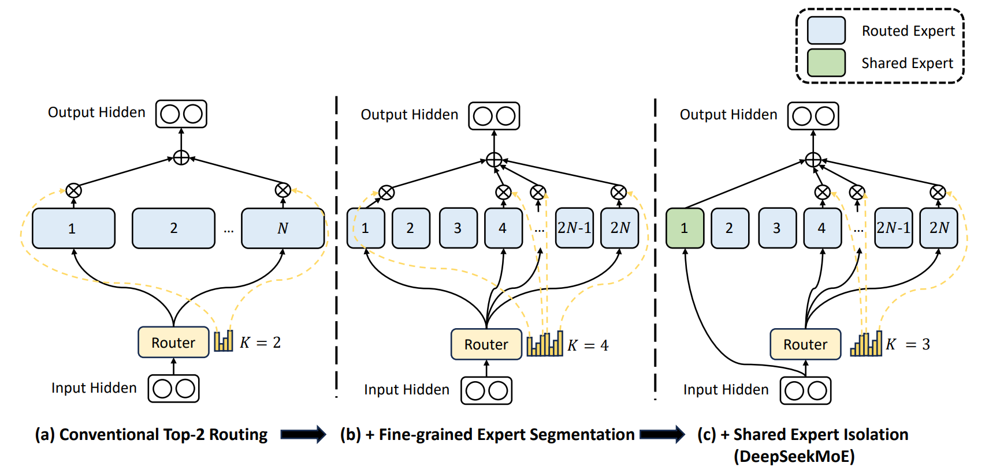

# 共享专家特性

## 方案介绍：

大语言模型在扩展参数规模时面临着较大的计算成本问题，而随着混合专家模型MoE的演进，产生了路由专家和共享专家的概念。针对路由专家，输入数据会经过路由模块选择概率较高的专家进行计算；而对于共享专家，输入数据无需经过路由模块计算，所有数据都会经过共享专家计算。路由专家和共享专家的计算结果相加后作为MoE模块最终的计算结果。

## 解决方案
通过将共享专家和路由专家结合，MoE模型能够在不同的输入情况下既关注到输入数据的共性也能关注到输入数据的差异性，从而提高模型的泛化能力。

将部分专家设定为共享专家，用以获取和整合不同上下文中的共同知识，从而降低其他路由专家中的参数冗余。

关于共享专家更多信息请参见[DeepSeekMoE: Towards Ultimate Expert Specialization in Mixture-of-Experts Language Models](https://arxiv.org/pdf/2401.06066)。

##### 图1 共享专家隔离

## 使用场景

MoE场景下使用：`--moe-model-type megatron_moe`

## 使用方法

共享专家相关命令和参数说明：

| 命令参数                     | 参数说明                   |
|--------------------------|------------------------|
| `--n-shared-experts [int]` | 共享专家数量                 |

## 注意事项

* 开启共享专家需要在mcore模式下，即没有设置`--use-legacy-models`

*  共享专家中间隐藏层大小的配置命令与路由专家相同：`--ffn-hidden-size [int]`

## 使用效果
通过使能共享专家，可以减少其他路由专家之间的参数冗余，提高参数效率，并确保每个路由专家能够专注于独特方面。