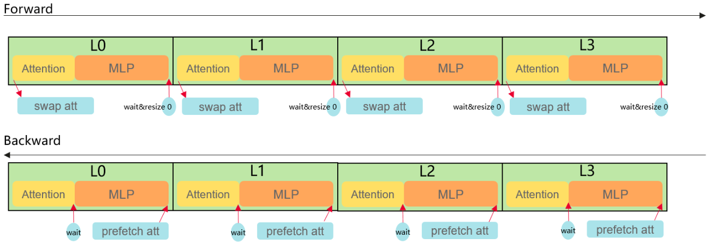

# swap-attention

## 问题分析

大模型训练过程中，使用重计算功能可以大幅度减少内存，但会增加训练过程的计算时长，导致执行效率较低。

## 解决方案

新增swap-attention功能，利用设备内存和CPU内存来存放激活值，在梯度反传的同时从CPU内存预取激活值来减少重计算，充分利用H2D高带宽的优势以网补存、以网强算，提升MFU，加速大模型的训练。

## 使用场景

### a. 优化性能：

在需要开启全重计算的场景下，可以通过开启`--swap-attention`和`--recompute-num-layers [int]`替换全重计算，以达到提升性能的目的。

### b. 内存节省：

对于不需要重计算的场景，只开启`--swap-attention`，可以在几乎不损耗性能的情况下，节省内存，以支持更大的模型的配置。

## 使用方法

`--swap-modules`：参数类型为string，默认值为"input_norm,self_attention,post_attention_norm"，可根据模型自行配置module，需要结合`--swap-attention`使用。使用前提是开启flash attention融合算子。

### a. 仅开启预取功能：`--swap-attention`

开启后，将对每一层的attention层的激活值进行预取，提高计算效率。

### b. 开启预取功能并且指定重计算层数：`--swap-attention`和`--recompute-num-layers [int]`

开启后，将对每一层的attention层的激活值进行预取，同时，对前[int]层的全连接层进行重计算。

### c. 指定开启预取功能和重计算层数：`--swap-attention`和`--recompute-num-layers [int]`和`--recompute-method block `

开启后，将对前[int]层的attention层的激活值进行预取，和前[int]层的全连接层进行重计算。预取功能和重计算功能配合使用，可以提高计算效率。

## 使用效果

与完全重计算相比 ，有性能收益；
与不重计算相比，有内存收益；

## 注意事项：

1. `--recompute-num-layers [int]`中的[int]层数指的是每一个pp stage的层数。[int]的取值应该小于等于num-layers/pipeline-model-parallel-size.
2. 暂不兼容自适应选择重计算特性.
3. 若出现性能严重劣化，可能是跨NUMA内存访问引起，可尝试通过进程绑核缓解，实现方法可参考[mstt绑核工具](https://gitee.com/ascend/mstt/tree/master/profiler/affinity_cpu_bind)
